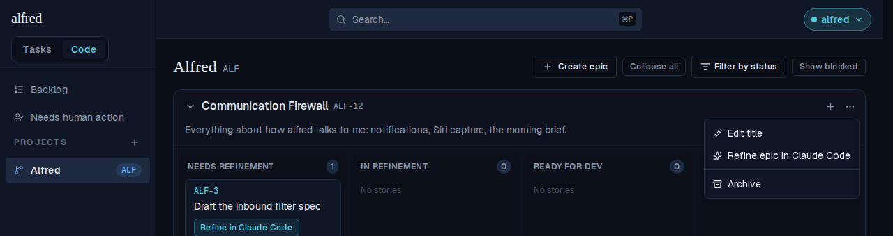
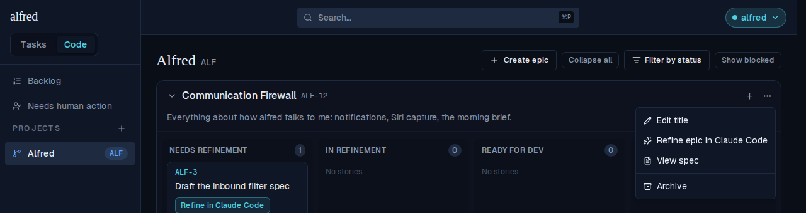
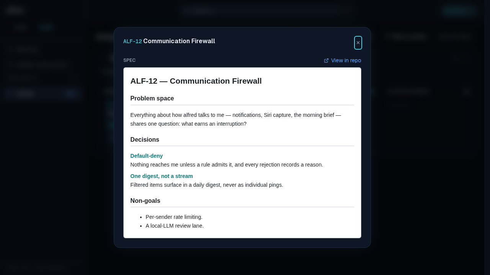

# Refine an epic in Claude Code (ALF-130)

*2026-07-25T20:55:47.934Z*

An epic used to be a naked bucket: a name, a one-line notes field, an archive flag. Every decision spanning the epic — the architecture it assumes, the constraints, what's deliberately deferred — got re-derived inside each story's refinement session. ALF-130 lends the story pipeline to epics: a **Refine epic in Claude Code** action in the epic's 3-dot menu, an epic-refinement skill and prompt aimed at brainstorming rather than a buildable change, the resulting spec snapshotted onto the `epics` row and readable in a **View spec** modal — and every story prompt in that epic pointing at the epic spec.

## 1. The epic menu, before and after refinement

Before any epic-refinement PR merges, the menu offers the launch and nothing else — **View spec** only appears once a spec exists (the item is absent when `epic.spec_path` is null).



Once the Worker has recorded a spec on the epic, the same menu carries **View spec** above the separator — Archive stays last.



## 2. The epic spec modal

**View spec** opens the snapshotted spec, rendered in a sandboxed `<iframe>` (no `allow-scripts`, so a committed spec's own CSS can't leak into the app and its scripts stay inert), with a *View in repo* link pinned to the recorded blob sha.



## 3. The prompt the launch prefills

Built by the real `buildEpicRefinementUrl`: ref + name lead so the new tab is scannable; it asks for an epic spec ONLY (no implementation, no per-story specs); it points at the epic-refinement skill rather than baking in a format; and it carries the `alfred` block with `phase: epic-refinement` and a placeholder `spec-path` for the agent to fill in. The epic's notes are inlined as context (clipped at 1000 chars with a truncation warning). Refine the same epic again and step 3 gains one sentence — update the existing spec in place, so an epic never accumulates rival documents.

```bash
node --no-warnings docs/demos/alf-130-epic-refinement/build-epic-prompt.mjs
```

````output
=== A never-refined epic ===
ALF-12: Communication Firewall

You are refining the EPIC ALF-12. Produce an EPIC SPEC ONLY — a high-level context and decisions document for the epic as a whole. Do NOT implement anything, and do NOT write per-story specs (individual stories are refined in their own sessions).

1. Ground yourself first: skim the repo and honor its own conventions — read any CONTRIBUTING or CLAUDE.md — and base the epic spec on the code that already exists.
2. If the epic name and context below don't pin down the problem space and the decisions worth recording, ASK ME HERE before writing — you don't need to guess, I'm in this tab. Brainstorming the epic with me is the point of this session.
3. Write the epic spec following the epic-refinement skill at `.claude/skills/epic-refinement/SKILL.md` (it auto-loads in an epic-refinement session) — it defines this repo's epic-spec format, structure, and where the spec lives. If the skill is absent, write it as a single self-contained HTML document under the repo's specs directory.
4. Open a pull request whose description carries this machine-readable block — the orchestrator (alfred) reads it to attach the spec to the epic and a CI check enforces it. Reproduce the `alfred-ticket` and `phase` lines exactly, and set `spec-path` to where you saved the spec:

```alfred
alfred-ticket: ALF-12
phase: epic-refinement
spec-path: <path-or-folder-of-the-spec>
```

5. Before opening the PR, confirm the spec is saved, `spec-path` above names that spec (not the placeholder), and the block is reproduced exactly.


Context (from the epic notes):
Everything about how alfred talks to me: notifications, Siri capture, the morning brief.

=== The same epic, already carrying a spec (only step 3 differs) ===
3. Write the epic spec following the epic-refinement skill at `.claude/skills/epic-refinement/SKILL.md` (it auto-loads in an epic-refinement session) — it defines this repo's epic-spec format, structure, and where the spec lives. If the skill is absent, write it as a single self-contained HTML document under the repo's specs directory. This epic already has a spec committed at `docs/specs/epics/ALF-12.html` — UPDATE that file in place rather than adding a second one.
````

## 4. Every story prompt in the epic points at that spec

The payoff: a story session starts from the epic's settled context instead of re-inventing it. All three launches (refine, implement, skip-to-dev) gain the same paragraph — placed after the opening line, before the numbered steps, so the existing step numbering is untouched — and it tells the agent the epic spec is background, NOT this story's spec: don't edit, archive, or move it. That last clause matters because the implementation prompt in the very same message tells the agent to git-move *its own* spec into the archive. When the epic has no spec, no line appears at all.

```bash
node --no-warnings docs/demos/alf-130-epic-refinement/story-prompts-epic-context.mjs
```

```output
--- Refine in Claude Code ---
epic HAS a spec  : Epic context: this story belongs to epic ALF-12 (Communication Firewall), whose epic spec is committed at `docs/specs/epics/ALF-12.html`. Read it first — it carries the high-level decisions and constraints for the whole epic. It is background, NOT this story's spec: don't edit, archive, or move it.
epic has NO spec : (no epic-context paragraph)
--- Implement in Claude Code ---
epic HAS a spec  : Epic context: this story belongs to epic ALF-12 (Communication Firewall), whose epic spec is committed at `docs/specs/epics/ALF-12.html`. Read it first — it carries the high-level decisions and constraints for the whole epic. It is background, NOT this story's spec: don't edit, archive, or move it.
epic has NO spec : (no epic-context paragraph)
--- Skip to Development ---
epic HAS a spec  : Epic context: this story belongs to epic ALF-12 (Communication Firewall), whose epic spec is committed at `docs/specs/epics/ALF-12.html`. Read it first — it carries the high-level decisions and constraints for the whole epic. It is background, NOT this story's spec: don't edit, archive, or move it.
epic has NO spec : (no epic-context paragraph)
```

## 5. The webhook Worker routes the epic phase at the epic

`phase: epic-refinement` is a third phase, parsed by the same regex (the longer alternative leads, or `refinement` would match the tail of `epic-refinement` and route an epic PR at a story). Its plan carries `target: 'epic'`, so the PATCH — and the background spec snapshot — hit `epics` instead of `code_items`. Epics have no lifecycle: the plan never sets `factory_state`, and a closed-unmerged epic PR is a no-op because there is nothing to revert. The story rows are unchanged and still target the story.

```bash
node --no-warnings docs/demos/alf-130-epic-refinement/epic-webhook-transitions.mjs
```

```output
parsed PR block : {"tickets":["ALF-12"],"phase":"epic-refinement","specPath":"docs/specs/epics/ALF-12.html"}

epic-refinement + opened               → {"target":"epic","updates":{"refinement_pr_url":"https://github.com/ac3charland/alfred/pull/12"},"snapshotSpec":false}
epic-refinement + closed & merged      → {"target":"epic","updates":{"spec_path":"docs/specs/epics/ALF-12.html"},"snapshotSpec":true}
epic-refinement + closed & NOT merged  → no-op
refinement + closed & merged           → {"target":"story","updates":{"factory_state":"ready_for_dev","spec_path":"docs/specs/epics/ALF-12.html"},"snapshotSpec":true}
implementation + opened                → {"target":"story","updates":{"factory_state":"ready_for_review","implementation_pr_url":"https://github.com/ac3charland/alfred/pull/12"},"snapshotSpec":false}
```

## 6. The enforcing CI check accepts the phase — and never archives an epic spec

The copy-ready `alfred-frontmatter.yml` each project repo installs now accepts `epic-refinement`, requires `spec-path` on it just like story refinement, and excludes `docs/specs/epics/` from the archive rule: an epic spec is long-lived context every later story session reads, so nothing may demand it be retired. The block below runs the check's actual script (lifted out of the workflow file) against four PR bodies, in a throwaway fixture tree so the archive rule sees a stable docs/specs.

```bash
node --no-warnings docs/demos/alf-130-epic-refinement/frontmatter-check.mjs
```

```output
epic-refinement with a spec-path                         PASS  ok: ALF-12 epic-refinement
epic-refinement MISSING spec-path                        FAIL  refinement PRs need spec-path
implementation pointing at an epic spec (never archived) PASS  ok: ALF-99 implementation
implementation leaving its STORY spec un-archived        FAIL  implementation PR must archive its spec: git-move docs/specs/ALF-42.html to docs/specs/archive/ALF-42.html
```

## 7. The epic-refinement skill the prompt points at

Dropped into each project repo at `.claude/skills/epic-refinement/SKILL.md` (a sibling of the story `refinement` skill, aimed one altitude higher), it defines what an epic spec is and isn't, where it lives, the sections to cover, that re-refining revises the same file, the PR contract, and that it is never archived. Its headings:

```bash
grep -E '^#{2,3} ' .claude/skills/epic-refinement/SKILL.md
```

```output
## What an epic spec is
## What to produce
## Refining again updates the same file
## The PR
## Never archived
## Rules
```

## 8. Where the spec is stored

`epics` gains `spec_path`, `spec_sha`, `spec_markdown` and `refinement_pr_url` — the *same names* `code_items` uses, so the Worker's snapshot writer and the frontend's spec renderer are shared rather than forked — and `v_code_stories` gains `epic_spec_path` (appended via `create or replace`, which preserves the view's SELECT grant). The columns are Worker-written only: no API route, request schema, or store action lets the browser set them. A merged snapshot reaches an already-open board over an `epics` realtime channel, so the **View spec** item appears without a reload.

```bash
sed -n '15,20p;28,44p' database/migrations/0020_epic_specs.sql
```

```output
  add column spec_sha          text,
  add column spec_markdown     text,
  add column refinement_pr_url text;

comment on column epics.spec_path is
  'Path the epic-refinement PR DECLARED for the epic spec; never inferred. Long-lived — unlike a '
create or replace view v_code_stories with (security_invoker = true) as
  select
    c.item_id, c.project_id, c.epic_id, c.ref_number, c.ref, c.factory_state, c.lane,
    c.spec_path, c.spec_sha, c.spec_markdown, c.refinement_pr_url, c.implementation_pr_url,
    c.blocked_reason, c.created_at as code_created_at, c.updated_at as code_updated_at,
    i.title, i.notes, i.source_url, i.created_at as item_created_at,
    p.key as project_key, p.name as project_name, p.repo_owner, p.repo_name,
    e.name as epic_name, e.ref as epic_ref, e.archived_at as epic_archived_at,
    c.priority,
    e.spec_path as epic_spec_path
  from code_items c
  join items i on i.id = c.item_id
  join projects p on p.id = c.project_id
  join epics e on e.id = c.epic_id;

-- Idempotent re-assert (grants survive `create or replace`, but 0017 is the cautionary tale).
grant select on v_code_stories to anon, authenticated, service_role;
```
