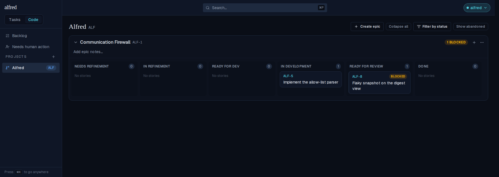
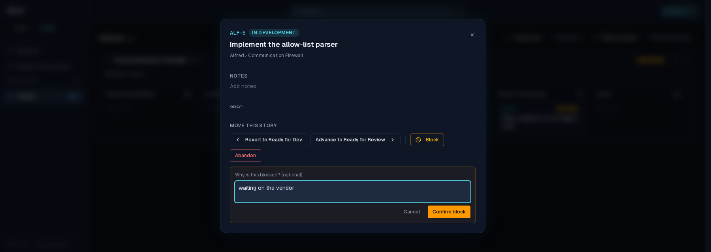
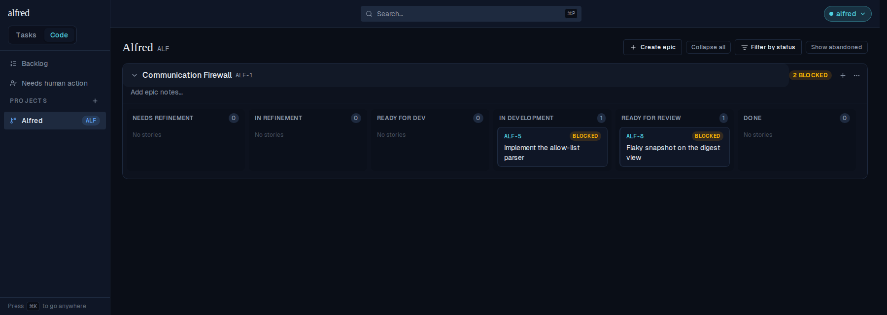
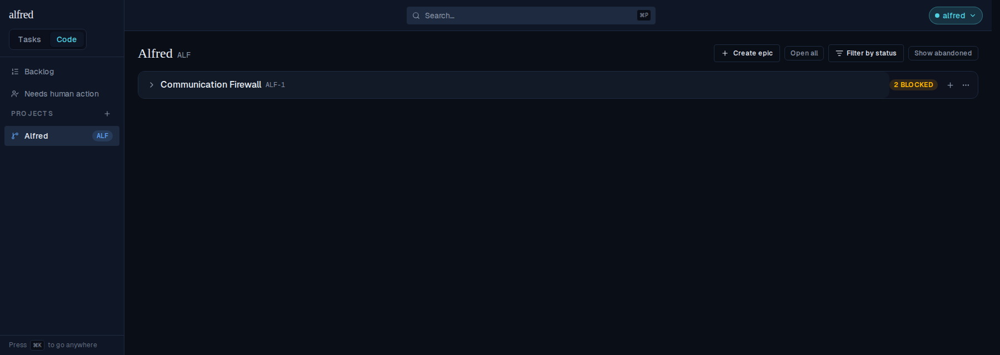
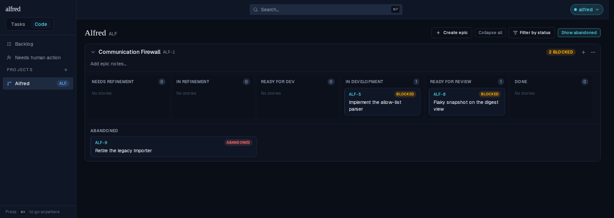
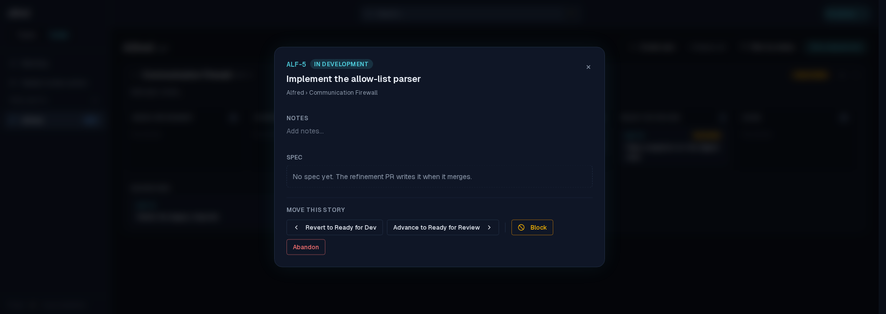
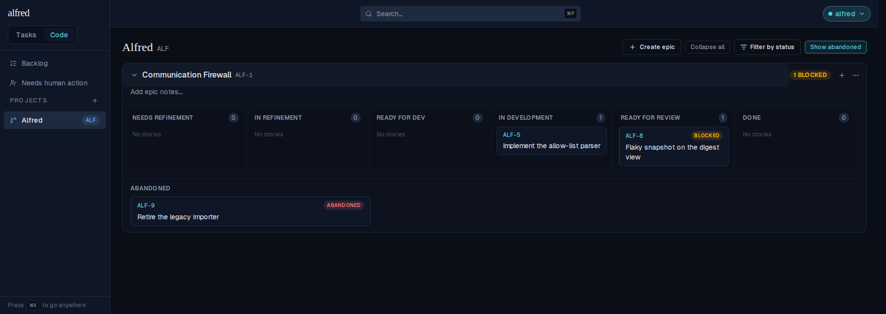
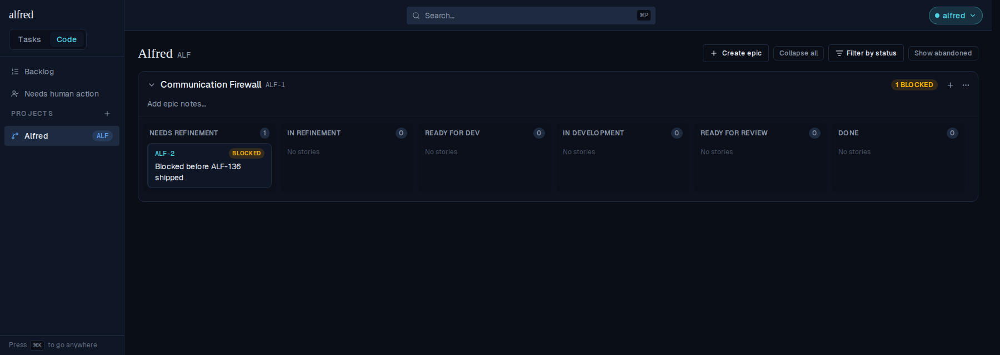

# ALF-136 — blocked stories stay in their lane, with a badge

*2026-07-26T04:16:50.882Z*

The board used to hide `blocked` stories behind a **Show blocked** toggle and, once revealed, pile them into a per-epic *Off track* bucket alongside abandoned ones. ALF-136 removes that toggle: blocked work is **always** on the board, in the swimlane it was blocked from, and each epic header badges how many blocked stories it holds.

Nothing recorded that origin lane — `factory_state` is simply overwritten with `blocked` and there is no transition history — so migration `0021` adds a nullable `blocked_from` column, written server-side by `PATCH /api/code/[ref]` on the way into `blocked` and cleared on the way out.

Every screenshot below is the live authenticated app, driven through the Playwright mock harness.

## 1. Blocked work is visible with no toggle

The board at rest. **ALF-8** is blocked and sits in **Ready for Review** — the lane it was blocked from — carrying its amber edge and `BLOCKED` pill. The epic header reads **1 BLOCKED**. The toolbar has *Create epic*, *Collapse all*, *Filter by status* and *Show abandoned* — the **Show blocked** toggle is gone.



## 2. Blocking a story in place

Open **ALF-5** (In Development) and hit *Block*, giving a reason.



It does **not** move to a bucket: ALF-5 stays put in **In Development**, now with the blocked treatment, and the epic badge ticks up to **2 BLOCKED**. The lane counts are unchanged — a blocked card still counts as work in that lane.



## 3. The badge survives collapse

This is what the badge is for. Collapsed, the lanes are hidden — but the epic still announces that it is holding two blocked stories, which is exactly the at-a-glance signal the old *Show blocked* toggle used to provide.



## 4. Abandoned keeps its own bucket

`abandoned` is the one state with no lane to return to, so it stays behind a toggle — now renamed **Show abandoned**. Toggled on, **ALF-9** appears under an *Abandoned* heading below the lanes. It is not blocked, so the badge still reads 2.



## 5. Unblock sends the story back to where it came from

Before ALF-136 a blocked story was a dead end: *Advance* and *Revert* have no neighbour off the happy path and *Block* hides itself, so the only exit was *Abandon*. `blocked_from` gives the story somewhere to return to, so the modal now offers **Unblock to In Development** — naming the exact lane.



ALF-5 is back to plain **In Development**, its reason cleared, and the badge drops to **1 BLOCKED** (ALF-8 is still blocked). The origin round-tripped through the real PATCH route and the database — the store never guessed it.



## 6. Rows blocked before the column existed

A story already `blocked` when migration `0021` ran has `blocked_from = null` — its origin lane is simply unrecoverable. Rather than drop it off the board, the derivation falls back to the first lane, so **ALF-2** still shows up (in *Needs Refinement*) with its blocked treatment and counts toward the badge.



## The schema change

`blocked_from` is a nullable `code_factory_state` on `code_items`, appended to `v_code_stories` **last** so `create or replace` stays legal and the view's grants survive (the 0017 lesson). It is derived on the SERVER from the stored row — a client-supplied `blocked_from` in the request body is ignored — so the column always describes where the story actually came from.

```bash
sed -n '/^alter table code_items/,/^  add column/p;/c.blocked_from$/p' database/migrations/0021_blocked_from.sql
```

```output
alter table code_items
  add column blocked_from code_factory_state;
    c.blocked_from
```
