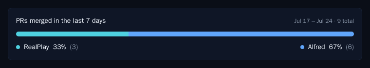

# ALF-144 — PR ratio over a rolling seven days

*2026-07-27T15:59:52.746Z*

The weekly review happens on a Friday afternoon — and under the recovery protocol sometimes on the Sunday after. The PR-ratio card and `GET /api/code/pr-ratio` measured a **Monday-anchored ISO week**, so a Friday review saw only Monday→Friday and silently dropped the weekend that had just passed; a slipped or rescheduled review saw a different, arbitrary slice.

ALF-144 makes the window **roll with the request**: always the seven days ending at the moment the ratio is asked for. Whenever the review is held, it sees a full week of merged PRs, and consecutive weekly reviews neither skip a day nor double-count one.

## The card on the Backlog

The card now names what it measures: **PRs merged in the last 7 days**, over a range whose two ends are both days the window actually covers (a Friday-afternoon request covers Jul 17 → Jul 24). This is the committed Storybook baseline, regenerated for the new copy:



A stretch with nothing merged says so in the same terms — no calendar week to reset on:


## The endpoint, asked at two different moments

Below, a real `next dev` server answers real HTTP requests through the real route — auth, config parsing, the window, the query builder and the largest-remainder math are all production code. Only two things are faked: the hop to `api.github.com` (nothing here may call GitHub) and the wall clock, pinned so the rolling window is reproducible.

The same code is asked the same question at the two moments the review actually happens — its Friday-afternoon slot, and the Sunday it slips to. Each answer is a full seven days (`spanHours: 168`) ending at the request, and the `merged:` qualifier GitHub receives is exactly the window the caller is told about. The Friday window reaches back to Jul 17, so the Jul 18–19 weekend — invisible to the old Monday-anchored week — is inside it.

```bash
cd frontend

# Answer GitHub's search API locally, record every query the route issues, and FREEZE the
# clock at $FAKE_NOW so a rolling window is reproducible. Everything downstream — auth, env
# parsing, the window, the query builder, the route — is the real code; only the hop to
# github.com and the reading of the wall clock are faked.
cat > /tmp/alf144-stub.mjs <<'STUB'
import { appendFileSync } from 'node:fs';

const FIXED = new Date(process.env.FAKE_NOW).getTime();
const RealDate = Date;
class FrozenDate extends RealDate {
  constructor(...args) {
    super(...(args.length === 0 ? [FIXED] : args));
  }
}
// Next copies globals into its own module context by OWN property, so the statics a
// subclass would normally inherit have to be re-attached by hand.
FrozenDate.now = () => FIXED;
FrozenDate.parse = RealDate.parse;
FrozenDate.UTC = RealDate.UTC;
globalThis.Date = FrozenDate;

const realFetch = globalThis.fetch;
globalThis.fetch = async (input, init) => {
  const url = typeof input === 'string' ? input : input.url;
  if (!url.startsWith('https://api.github.com/search/issues')) return realFetch(input, init);
  const q = new URL(url).searchParams.get('q') ?? '';
  appendFileSync(process.env.QUERY_LOG, q + '\n');
  return new Response(JSON.stringify({ total_count: q.includes('/realplay') ? 3 : 6 }), {
    status: 200,
    headers: { 'content-type': 'application/json' },
  });
};
STUB

export NEXT_PUBLIC_SUPABASE_URL=http://127.0.0.1:54411
export NEXT_PUBLIC_SUPABASE_ANON_KEY=sb_publishable_demo
export SUPABASE_SERVICE_ROLE_KEY=sb_secret_demo
export INGEST_API_KEY=demo-ingest-key
export NODE_OPTIONS=--import=file:///tmp/alf144-stub.mjs
export GITHUB_TOKEN=ghp_demo_token
export PR_RATIO_REPOS='ac3charland/realplay:RealPlay,ac3charland/alfred:Alfred'
export PR_RATIO_AUTHORS=ac3charland

MOCK_SUPABASE_PORT=54411 node scripts/mock-supabase.mjs >/dev/null 2>&1 &
MOCK=$!
trap 'kill $MOCK 2>/dev/null' EXIT

# One review, asked for at two different moments: the Friday afternoon it is normally held,
# and the Sunday it slips to under the recovery protocol.
ask_at() {
  local label="$1" now="$2" log=/tmp/alf144-queries.txt
  rm -f "$log"
  # The fetch cache is keyed on the search URL, which the window's timestamps are part of —
  # clear it (dev writes under .next/dev/) so each run reaches the stub, not a cached answer.
  rm -rf .next/cache/fetch-cache .next/dev/cache/fetch-cache

  FAKE_NOW="$now" QUERY_LOG="$log" node ../node_modules/.bin/next dev -p 3311 >/dev/null 2>&1 &
  local server=$!
  until curl -s -o /dev/null --max-time 240 http://127.0.0.1:3311/api/code/pr-ratio; do sleep 1; done

  echo "== $label =="
  curl -s -H 'x-api-key: demo-ingest-key' \
    'http://127.0.0.1:3311/api/code/pr-ratio?tz=America/New_York' | node -e '
      let raw = "";
      process.stdin.on("data", (c) => (raw += c)).on("end", () => {
        const body = JSON.parse(raw);
        const span = (new Date(body.week.end) - new Date(body.week.start)) / 3600000;
        console.log(JSON.stringify({ week: body.week, spanHours: span, total: body.total }, null, 2));
      });
    '
  echo '-- the window GitHub was asked for --'
  grep -o 'merged:[^ ]*' "$log" | sort -u

  kill $server 2>/dev/null
  wait $server 2>/dev/null
}

ask_at 'Friday 2026-07-24, 16:03 in New York — the usual review slot' 2026-07-24T20:03:20Z
echo
ask_at 'the same review slipped to Sunday 2026-07-26, 11:00' 2026-07-26T15:00:00Z
```

```output
== Friday 2026-07-24, 16:03 in New York — the usual review slot ==
{
  "week": {
    "start": "2026-07-17T16:00:00-04:00",
    "end": "2026-07-24T16:00:00-04:00",
    "timezone": "America/New_York"
  },
  "spanHours": 168,
  "total": 12
}
-- the window GitHub was asked for --
merged:2026-07-17T16:00:00-04:00..2026-07-24T16:00:00-04:00

== the same review slipped to Sunday 2026-07-26, 11:00 ==
{
  "week": {
    "start": "2026-07-19T11:00:00-04:00",
    "end": "2026-07-26T11:00:00-04:00",
    "timezone": "America/New_York"
  },
  "spanHours": 168,
  "total": 12
}
-- the window GitHub was asked for --
merged:2026-07-19T11:00:00-04:00..2026-07-26T11:00:00-04:00
```

Note the Friday window ends at **16:00**, not the 16:03 the request came in at. A window ending at an exact instant would put a unique timestamp in every search URL, so Next's fetch cache could never hit and each Backlog visit would spend fresh calls against GitHub's 30-req/min search quota. The window and the cache share one granularity constant, so the query is identical for exactly as long as the cached response is good for.
