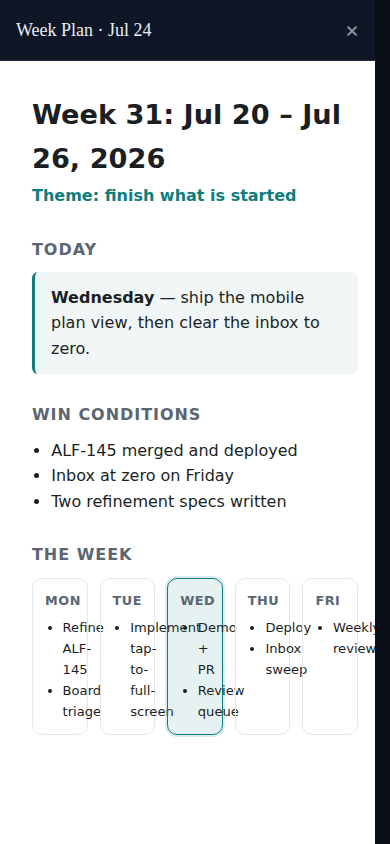
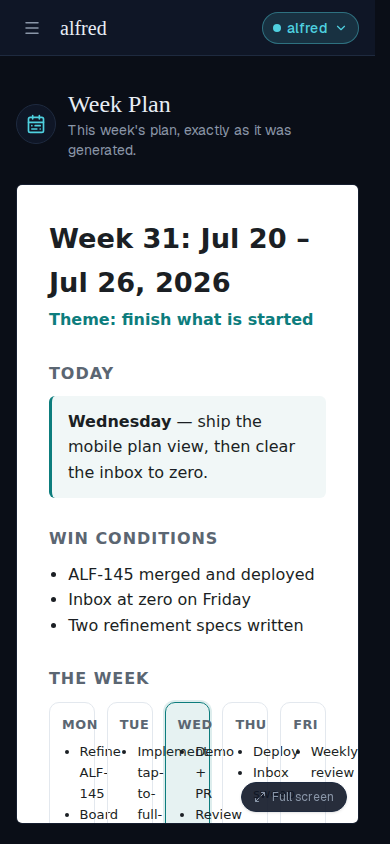
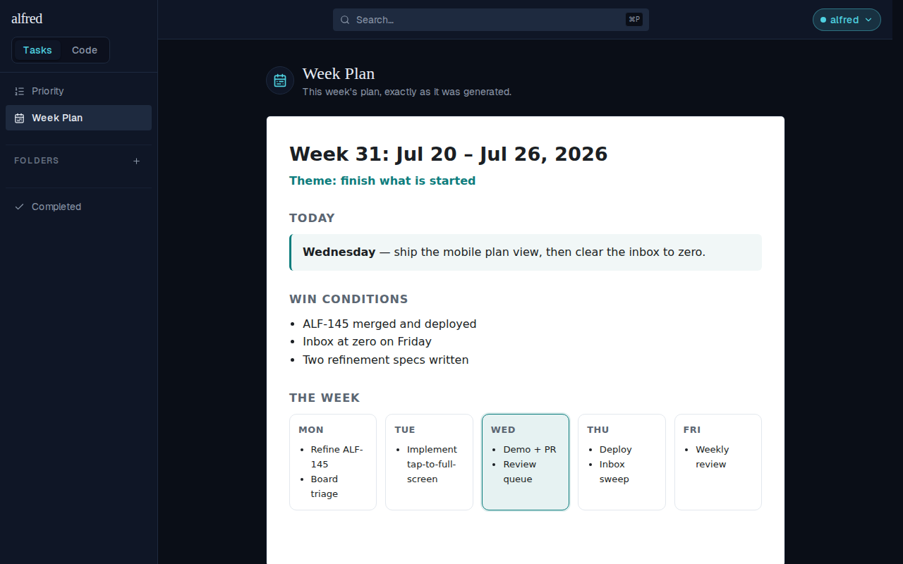
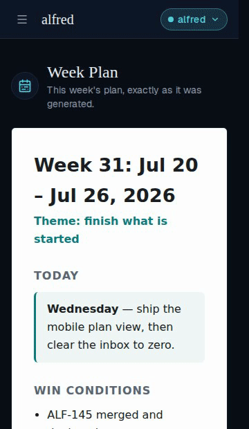

# Mobile: tap the week plan to view it full screen

*2026-07-27T16:14:28.765Z*

The Week Plan view renders the generated plan in a sandboxed `<iframe srcDoc>`. That document is drawn for desktop width, so on a phone it arrives squeezed into the shell's content column — the five-day grid below collapses into unreadable slivers. Tapping the plan now hands it the whole screen.

**A tap inside an iframe never reaches the app** — the frame swallows it — so the tap target is a transparent layer laid *over* the frame, carrying a visible "Full screen" chip so the affordance is discoverable. It is gated at `md:hidden`, so desktop keeps its directly-interactive inline frame.

### 1. Before the tap — the plan on a 390×844 phone

Cramped: the shell header, the view heading, and the page padding all take a bite out of the plan, and `THE WEEK` grid is reduced to five slivers. The "Full screen" chip sits in the corner of the plan.

### 2. After the tap — the plan owns the screen

Every bit of app chrome is gone but a compact title row (`Week Plan · Jul 24`, labelled with the same upload date the week picker uses) and the × dismiss. The frame takes all the leftover height at `100dvh`, so the whole plan is readable in one screen — and the plan's own script still ran inside it, highlighting Wednesday, because the full-screen frame carries the same `sandbox="allow-scripts"` contract as the inline one.

### 3. Dismissing returns to the inline plan

The × (Escape works too) drops back to the plan in place — still painted, still tappable. Dismissing is a return, not a dead end.

### 4. Desktop is untouched

At 1280px the inline frame is already roomy, so the tap layer is `display:none` — no chip, nothing covering the plan, and a click still reaches the frame itself.

### The whole interaction, in motion

Tap → the plan fades up to full screen; × → back to the inline plan, exactly where it was.

