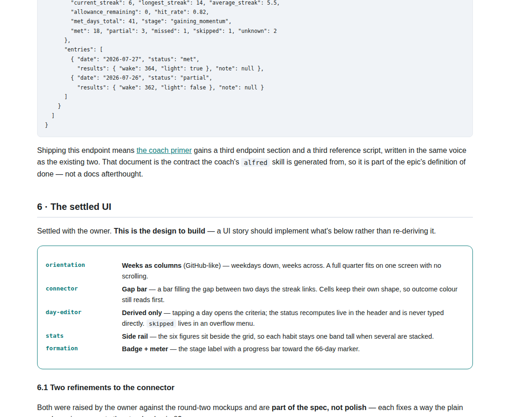
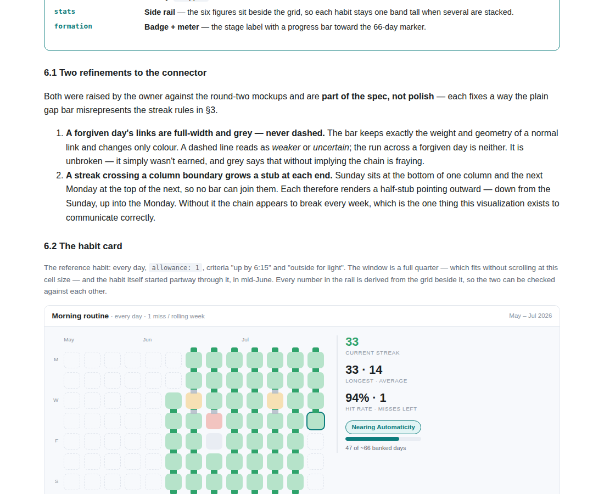
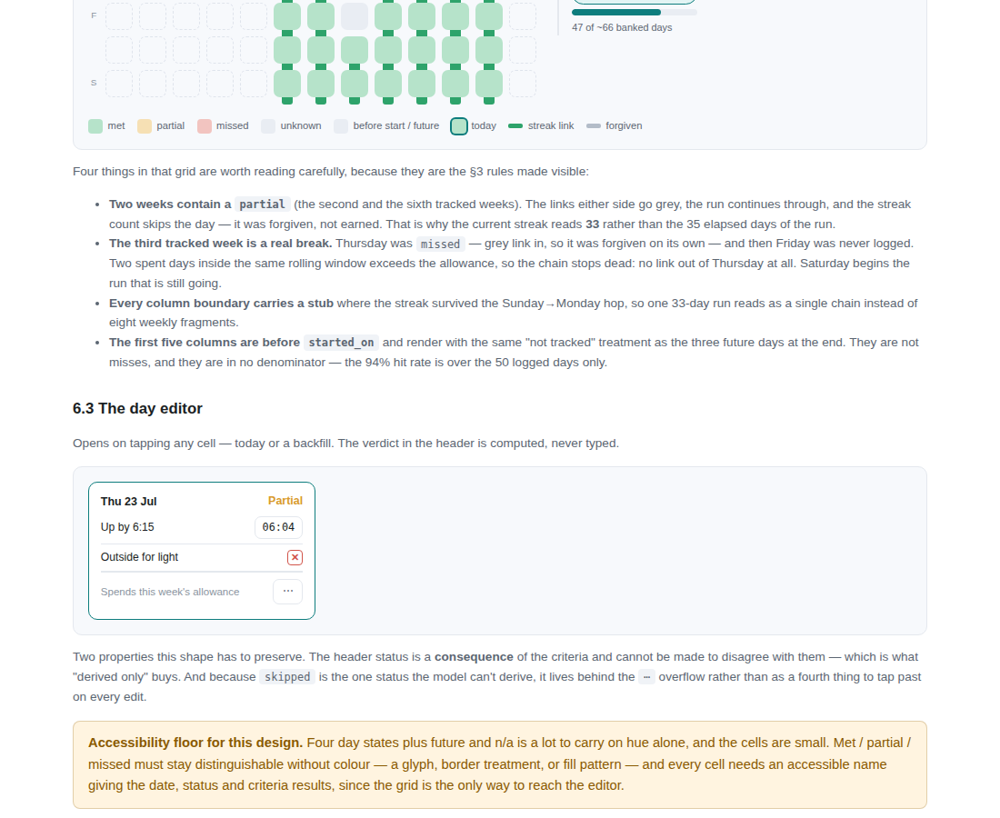
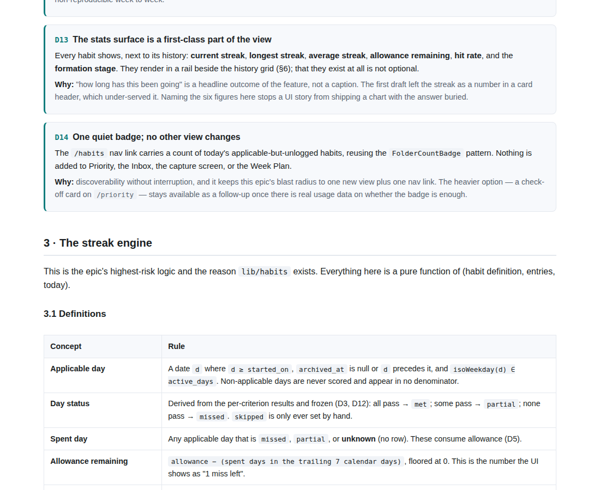

# ALF-146 — Habit Tracker epic spec

*2026-07-28T04:05:03.884Z*

This is an **epic-refinement** branch: the deliverable is the epic spec at `docs/specs/epics/ALF-146.html`, not app behavior. Nothing under `frontend/`, `workers/` or `database/` changed. The evidence below is that artifact — the self-contained HTML page a reviewer opens via the PR's htmlpreview link — rendered in a browser.

Three refinement rounds. Round two reopened four decisions (they carry a `revised` tag in the document); round three settled the UI, so the spec no longer asks a question — §6 is now the design to build.

## The settled UI

Five choices, plus two refinements the owner raised against the round-two mockups. Both refinements are behavioural, not cosmetic: they fix ways a plain gap-bar connector *misrepresents* the streak rules in §3.

## The habit card

The centrepiece: a full quarter of the reference habit, the stats rail beside it, and the formation meter. The habit started mid-June, so the first five columns render as "not tracked" — the same treatment as the three future days at the end.

The grid at full size. Every mark in it is derived from the §3 rules rather than drawn for looks:

- **Green links** join days the streak actually connects.
- **Grey links, same width** flank each forgiven day (the two amber `partial` cells) — full weight, colour-only difference, because the run across them is unbroken rather than uncertain.
- **A grey link in, and nothing out** at the red `missed` cell: that day was forgiven on its own, then the unlogged Friday below it spent the second unit of a 1-per-rolling-week allowance, so the chain stops dead.
- **Stubs above and below each column** where the streak survived the Sunday→Monday hop, so one 33-day run reads as a single chain rather than eight weekly fragments.

## The day editor and the rules behind it

Tapping any cell opens the criteria; the verdict in the header recomputes and is never typed, so it cannot disagree with the criteria beneath it. `skipped` — the one status the model cannot derive — sits behind the overflow.

§3 is where the design gets its meaning: the allowance-aware streak walk, the today exemption, and the single rule that anything which is not `met` or `skipped` spends allowance — so *forgetting* to log costs exactly what *failing* costs.

## What this branch does not contain

No migration, no route handler, no component — this is the epic spec plus this demo doc. The habit tables, the criterion evaluator, the streak engine, the API and the UI are the twelve story slices sketched in §8, each refined and built in its own session.
