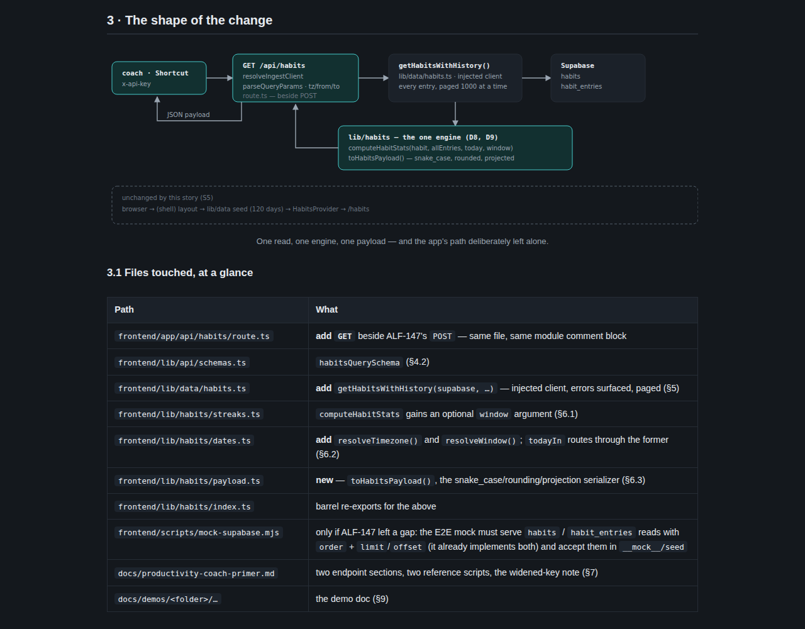
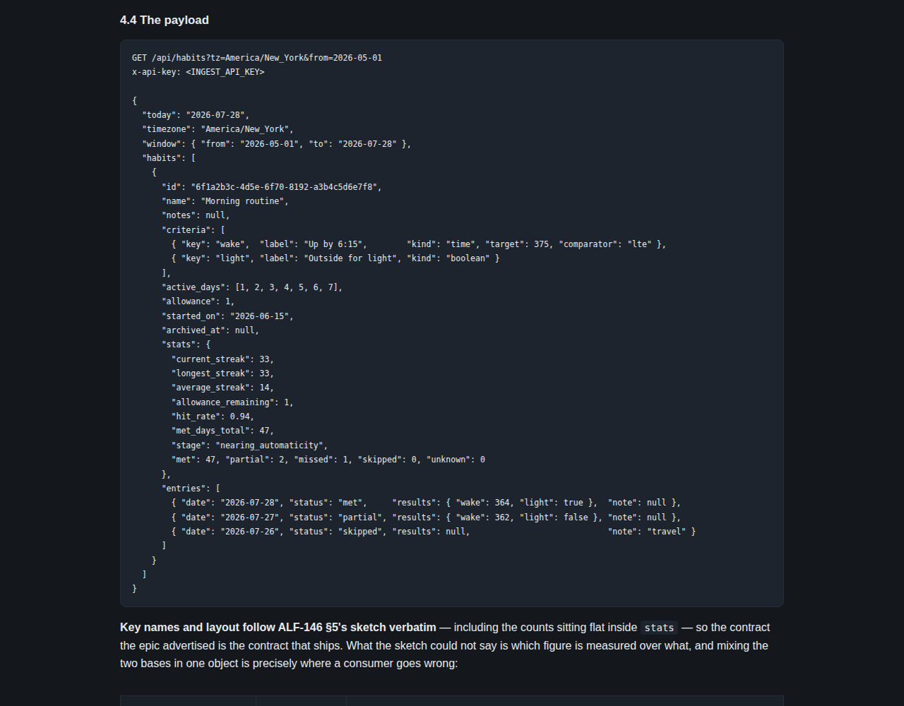
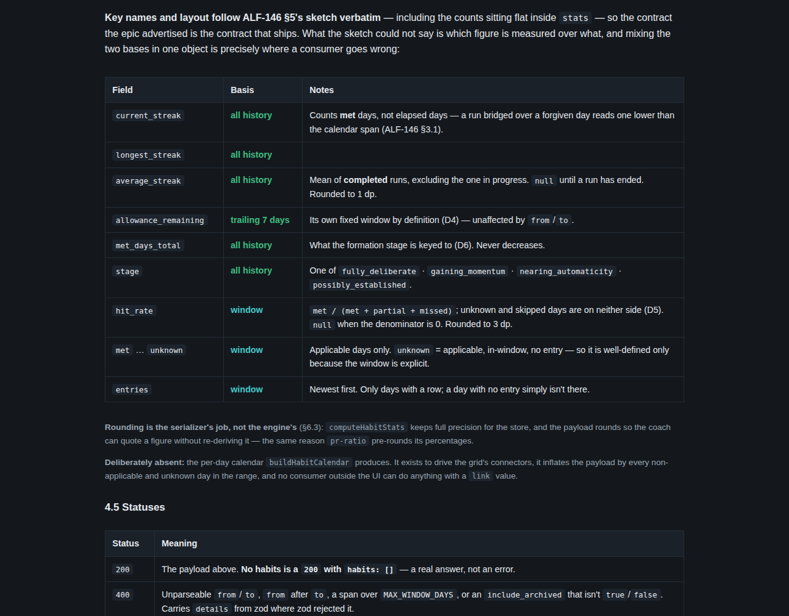
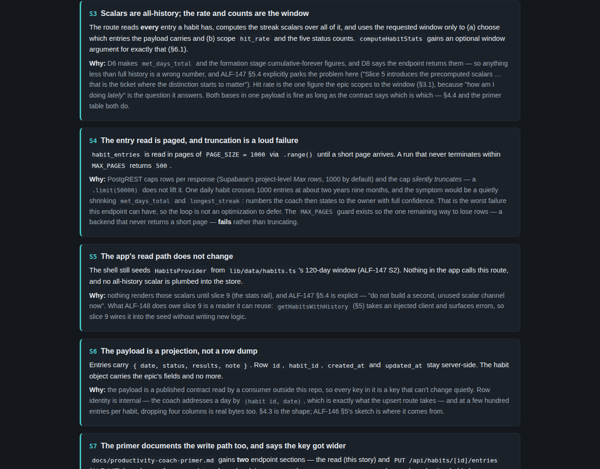
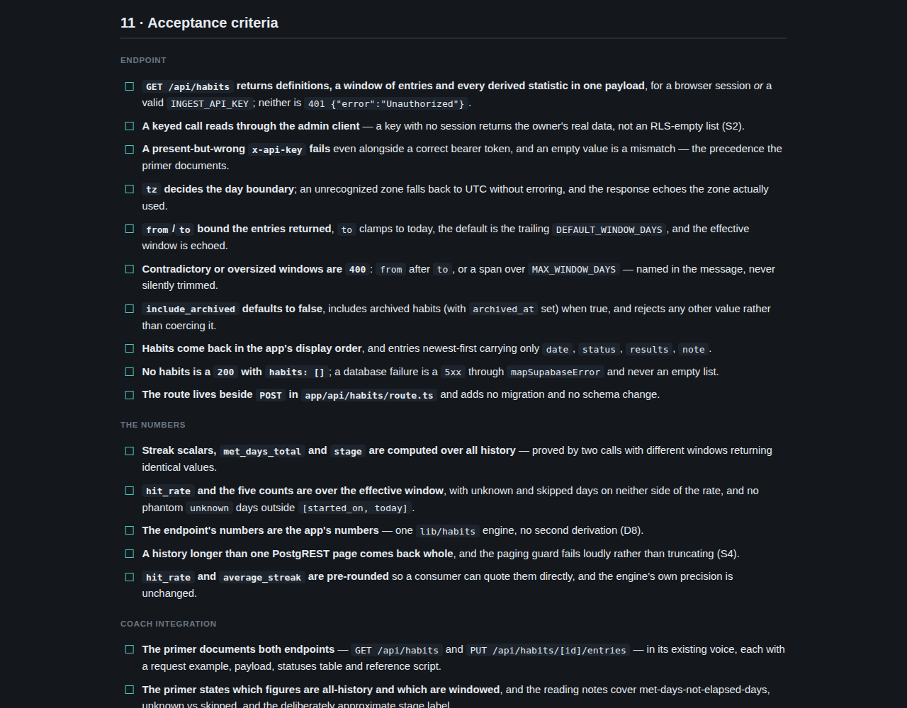

# ALF-148 — habit read API spec

*2026-07-28T17:24:27.670Z*

This is a **refinement** branch: the deliverable is the spec at `docs/specs/ALF-148.html`, not app behavior. Nothing under `frontend/`, `workers/` or `database/` changed. The evidence below is that artifact — the self-contained HTML page a reviewer opens through the PR's htmlpreview link — rendered in a browser.

ALF-148 takes two of the epic's twelve slices together: slice 5 (`GET /api/habits`) and slice 12 (the productivity-coach primer). Slice 5 alone would ship an endpoint nobody knows how to call.

## The shape of the change

One read, one engine, one payload — and the app's own read path deliberately left alone (the greyed lane), because nothing renders the all-history scalars until slice 9.



## The payload the coach reads

Key names follow the epic's own sketch verbatim, so the contract ALF-146 advertised is the contract that ships.



What that sketch could not say is **which figure is measured over what** — the streak scalars are all-history, the hit rate and counts are the requested window. Mixing both bases in one `stats` object is exactly where a consumer goes wrong, so the spec pins each field's basis and the primer restates it:



## The decisions that needed settling



## Acceptance criteria

A checklist the implementation session and a reviewer can both tick off, grouped by endpoint / numbers / coach integration / gates.



## Two environment gotchas recorded on the way

Both cost real discovery time in this session and both recur for every agent working in the cloud sandbox, so they land in the skill library rather than in this doc. The first is why a spec-only branch was told it owed a demo; the second is why the pre-push hook could not run Playwright at all until the pinned browser path was bridged to the pre-installed build.

```bash
grep -A4 'stale .origin/main. makes a docs-only branch' .claude/skills/demo-lint/SKILL.md
```

```output
- **A stale `origin/main` makes a docs-only branch owe a demo.** The docs-only exemption is
  computed from the diff against the remote trunk ref, so a fresh clone that only ever fetched
  its own branch diffs against a months-old `origin/main` and sweeps every already-merged code
  change into the branch's "changes" — `branch-folder` then fails a pure docs branch (a spec, a
  README). `git fetch origin main` and re-run.
```

```bash
grep -o 'That last step is what makes .*passes instead of needing a direct .npx playwright test.' .claude/skills/playwright/references/setup-and-wiring.md
```

```output
That last step is what makes `setup-chromium.mjs` report "already installed" and skip the download, so the repo's own `npm run test:e2e` — and therefore the **pre-push hook** — passes instead of needing a direct `npx playwright test`
```
