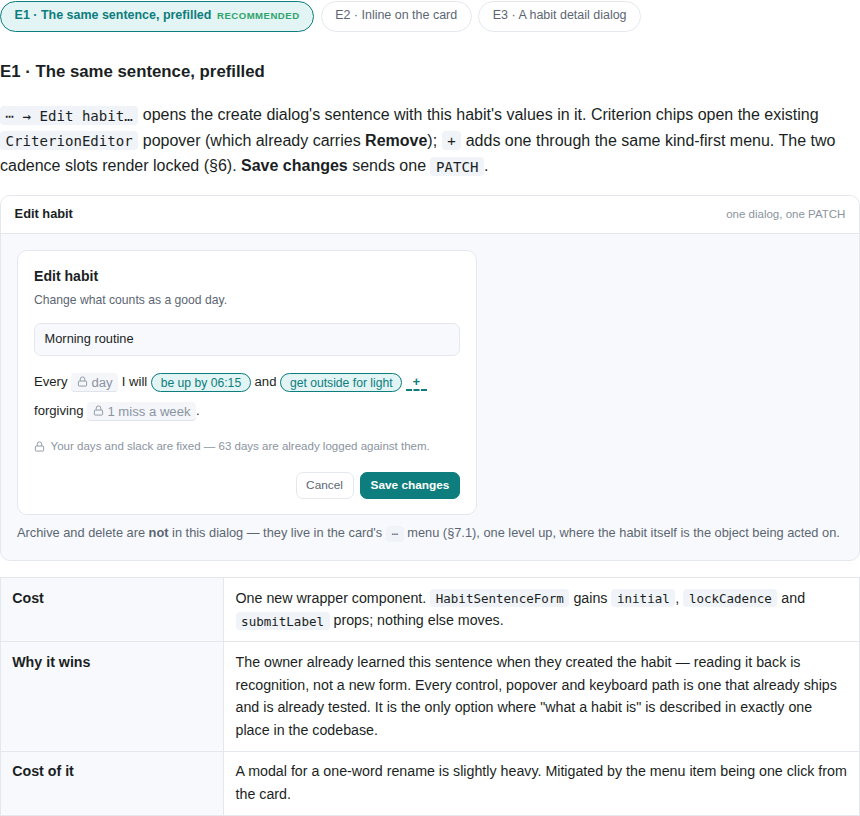
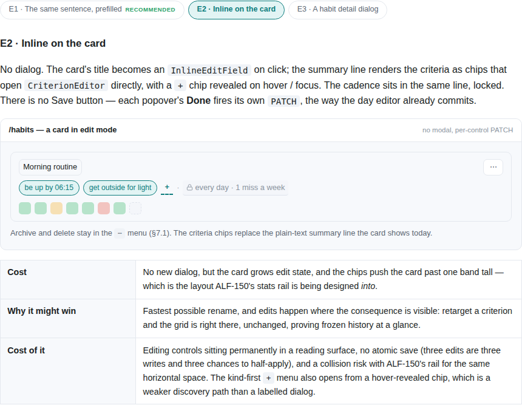
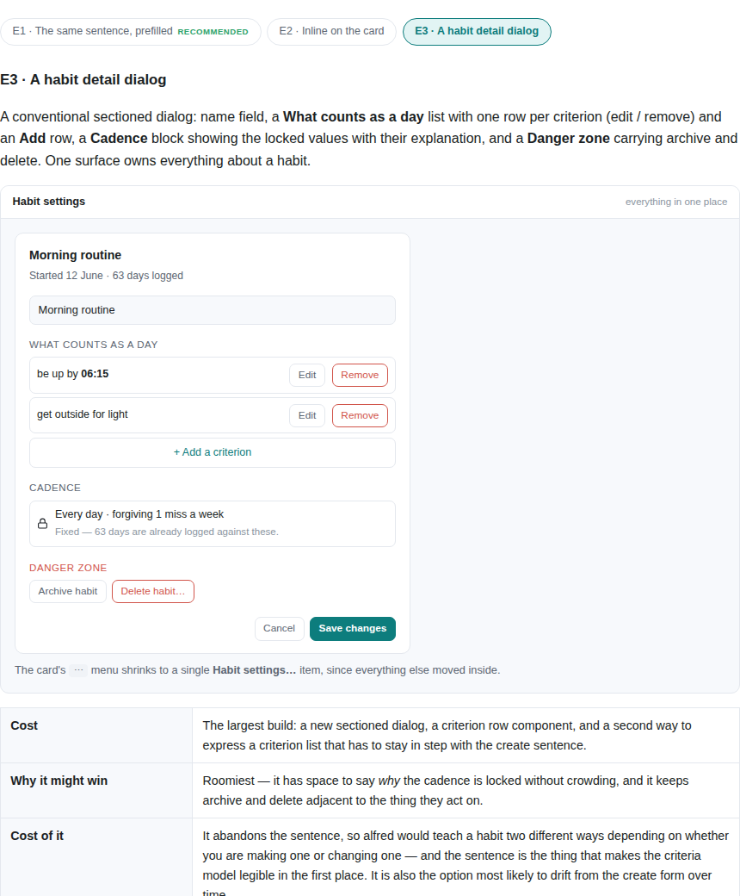
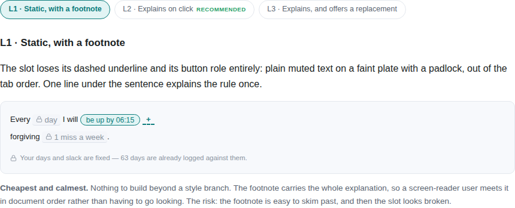
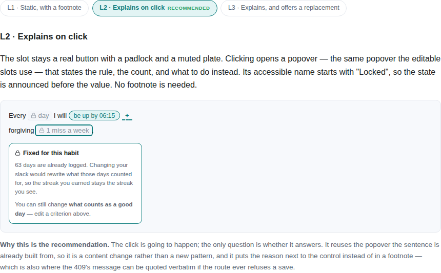
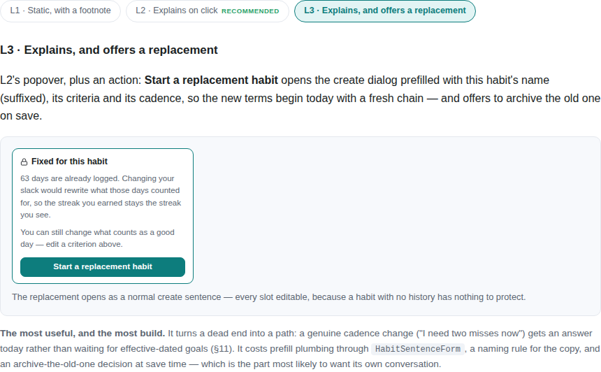

# ALF-151 — habit editing spec

*2026-07-29T18:18:28.127Z*

This is a **refinement** branch: its deliverable is the spec at `docs/specs/ALF-151.html`, not app behavior. That spec asks the owner to pick between options, so it carries two CSS-only tab strips — the evidence below is that those work in a plain browser, with every option's mockup drawn.

The interactivity is pure CSS — radio inputs plus `:checked ~` sibling rules — so the page needs no script and no network, which is what makes it render faithfully through the PR's htmlpreview link.

```bash
f=docs/specs/ALF-151.html; echo "script tags:        $(grep -c "<script" $f || true)"; echo "external refs:      $(grep -c "http" $f || true)"; echo "radio tab inputs:   $(grep -c 'type="radio"' $f || true)"
```

```output
script tags:        0
external refs:      0
radio tab inputs:   6
```

**§5 — the edit surface.** Clicking a tab swaps the drawn mockup; each option carries the same requirements (rename, add/edit/remove a criterion, the locked cadence, and where archive and delete live), because the pick is the sign-off.







**§6 — how a locked field reads.** The second strip, switching independently of the first.






