# Editing, archiving and deleting a habit

*2026-07-30T13:04:28.944Z*

A habit used to be write-once: a typo in the name was permanent, a criterion's target could never move, and a habit you'd finished with sat on `/habits` forever. This adds `PATCH` and `DELETE /api/habits/[id]`, an edit surface built out of the sentence the habit was written in, an Archived section, and a hard delete behind a confirm.

The habit below has been kept for eight days against a **07:00** wake target, every morning recorded at 06:50. That is the wind-down the tracker was built for: tighten the target and keep going.

## 1 · The card menu, and the sentence read back

The `⋯` is the only new thing on the card. It is always visible rather than hover-revealed — a card is a large surface with one menu on it, and a hover-only control is a dead end on touch.

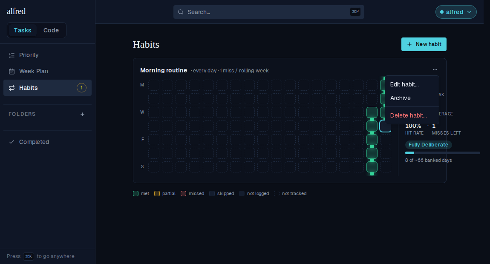

**Edit habit…** opens the same sentence the habit was created with, carrying its own values. Recognition rather than a new form: every control, popover and keyboard path is one the owner already met. Archive and delete are deliberately *not* in here — they act on the habit itself rather than on what it says, so they stay one level up in the menu.


## 2 · The locked cadence explains itself

`active_days`, `allowance` and `started_on` freeze once a habit has one logged day. They are the fields that are **not** stored per day, so scoring reads their current values on every render — dropping a weekday or raising the slack would silently restate months of chain already earned. The slot stays a real button and answers when clicked, because a control that simply does nothing gets clicked again and then reported as a bug.

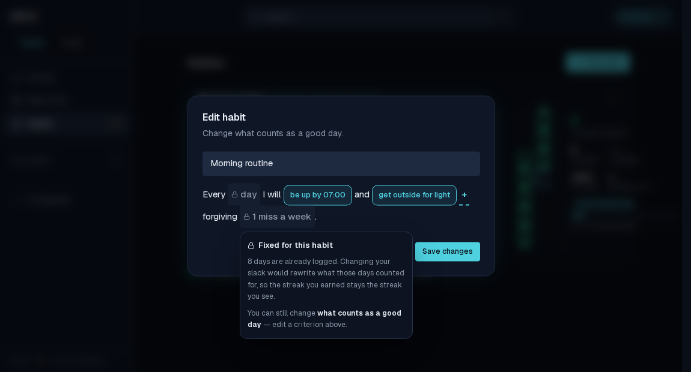

## 3 · Retargeting a criterion, with history left alone

Criteria stay fully editable, because each day's **status** is frozen when it is written. Below, 07:00 becomes 06:15.

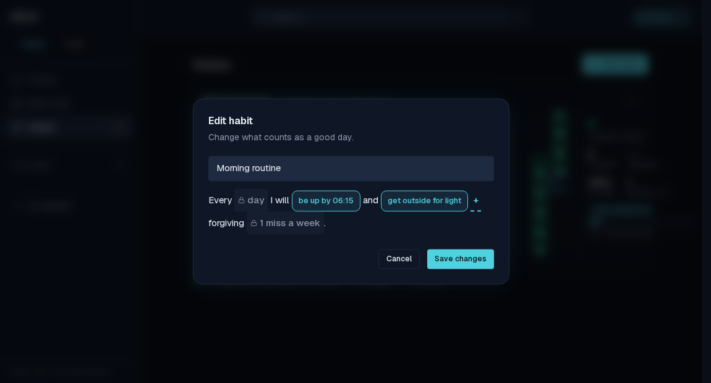

Here is the whole argument for that split — the same card before the retarget, and after it. Every one of those eight days recorded 06:50, which passes 07:00 and fails 06:15. Nothing moved: eight met days, an unbroken chain, 100% hit rate.


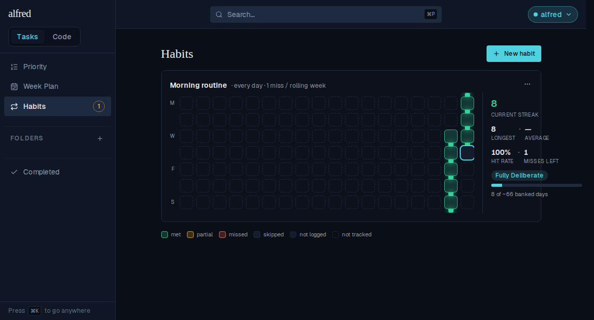

## 4 · A past day whose terms have moved

Editing criteria never rewrites a logged day — but re-logging one is a write, and the route re-scores it against whatever the definition says now. So a day whose frozen verdict no longer matches its own results says so. The re-score stays available; it just stops being silent.

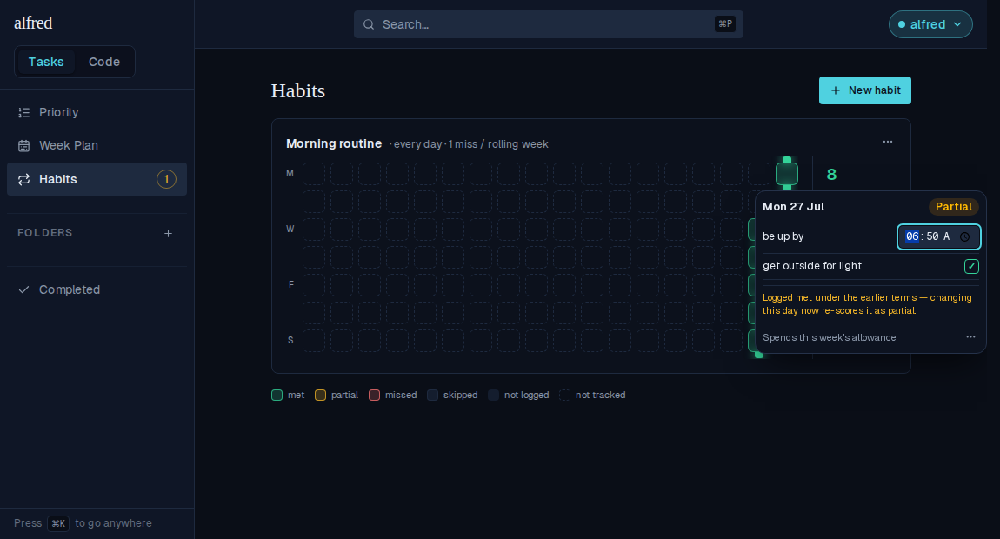

## 5 · Archive, the Archived section, and unarchive

Archive takes no confirm — it is the reversible action, and a dialog would charge the safe path the same friction as the destructive one. The way back rides on the toast, because by then the card the menu hung off has left the list.

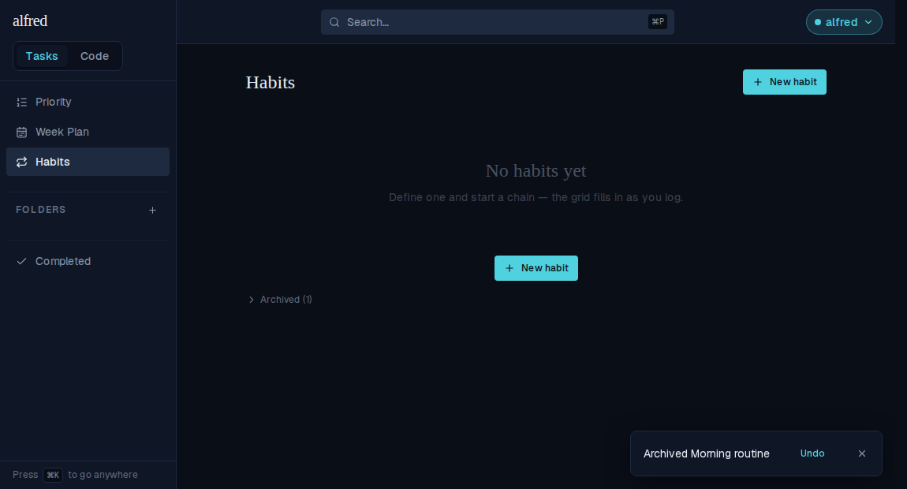

The Archived section is collapsed by default and absent entirely when nothing is archived. Each row carries the cadence, the span it ran, and the three all-history figures the habit finished on — longest, banked days, and the formation stage. Those are the seeder's whole-life numbers, not a walk over a window the habit has fallen out of, so a habit retired last February still reads its real longest streak rather than a zero. No grid: its entries are outside the seeded window, so there is nothing to draw.

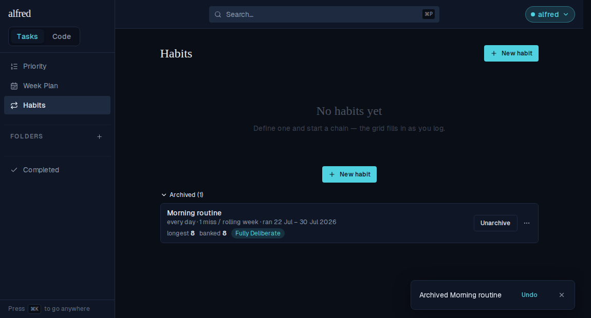

**Unarchive** is a first-class button, and the habit comes back with its history intact.

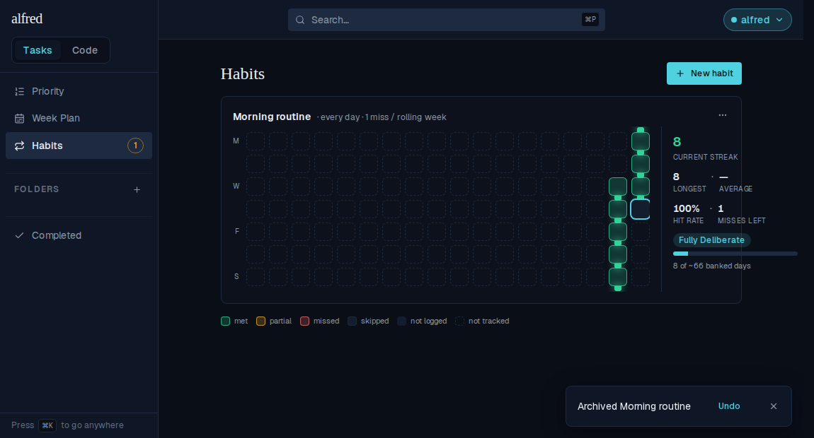

## 6 · Delete, behind a confirm that names the cost

The confirm names the habit and, accurately, how many days go with it. The store holds only a trailing 120-day window, so a habit older than that reads as a floor — "at least 118 days" — rather than a total the client cannot vouch for. Understating what is about to be destroyed is the one direction this sentence must not be wrong in. Focus opens on **Cancel**, so the destructive button is never what a stray Return finds.

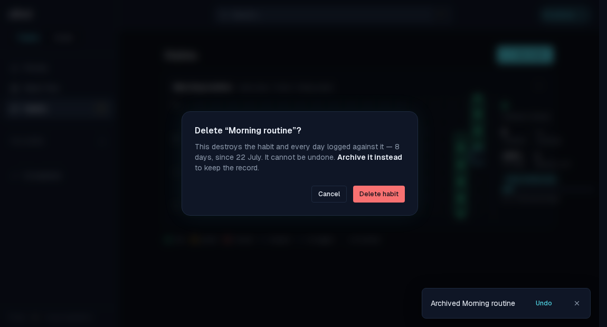

Confirmed, the habit and every day logged against it are gone — and still gone after a reload, because the entries cascade with the row.

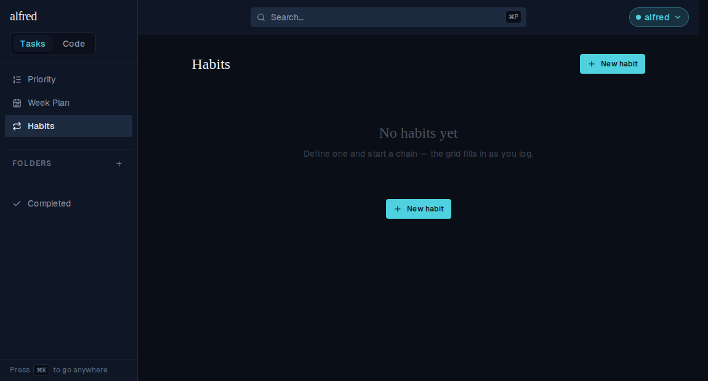

## 7 · When the route refuses, it says why

The lock is enforced by the route, not just the form — the invariant protects stored history, so it belongs where the write happens. There is exactly one way a user reaches that refusal: a habit whose logged days all fall **outside** the seeded window looks empty to the client, so the form offers its cadence open, and the route — which counts the real rows — turns it down. Its `409` is written to be read, so the dialog quotes it verbatim instead of a "try again" that could never work.

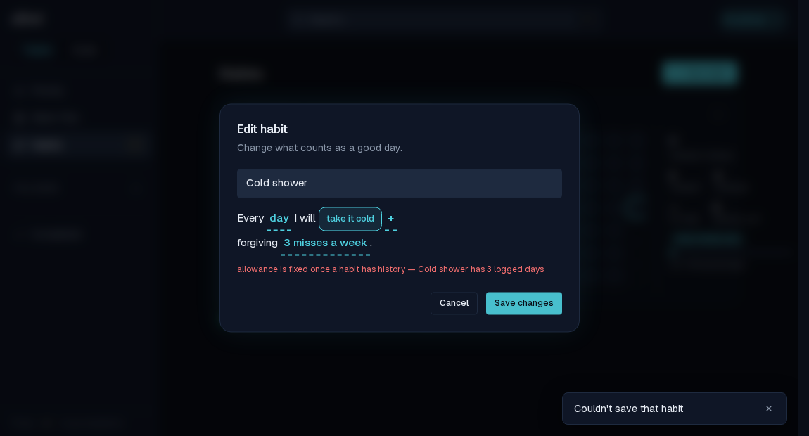

## 8 · Both routes are session-only

The ingest key logs days; it does not define or destroy things. Below, the app runs against the in-memory Supabase backend the E2E suite wires up — real route handlers, real Supabase client, no live database — and a request carrying a **valid** `x-api-key` is refused on both verbs.

```bash
cd frontend
export MOCK_SUPABASE_PORT=54334 INGEST_API_KEY=demo-ingest-key
export NEXT_PUBLIC_SUPABASE_URL=http://localhost:54334 \
       NEXT_PUBLIC_SUPABASE_ANON_KEY=sb_publishable_mock \
       SUPABASE_SERVICE_ROLE_KEY=sb_secret_mock
# Build unconditionally: Next inlines NEXT_PUBLIC_* at build time, so reusing a .next built
# against another port would point every route at a mock that is not running.
npm run build >/dev/null 2>&1
node scripts/mock-supabase.mjs >/dev/null 2>&1 & MOCK=$!
npm run start -- -p 3013 >/dev/null 2>&1 & APP=$!
# `npm run start` spawns next-server as a child, so kill the child too or it holds the port.
cleanup() { pkill -P "$APP" 2>/dev/null; kill "$APP" "$MOCK" 2>/dev/null; }
trap cleanup EXIT
until curl -sf localhost:54334/__mock__/health >/dev/null 2>&1; do sleep 0.2; done
until curl -s -o /dev/null localhost:3013/login 2>/dev/null; do sleep 0.5; done

ID=6f1a2b3c-4d5e-6f70-8192-a3b4c5d6e7f8
code() { curl -s -o /dev/null -w "%{http_code}" "$@"; }
echo "PATCH with a valid ingest key:  $(code -X PATCH -H "Content-Type: application/json" -H "x-api-key: demo-ingest-key" -d "{\"name\":\"Renamed\"}" "localhost:3013/api/habits/$ID")"
echo "DELETE with a valid ingest key: $(code -X DELETE -H "x-api-key: demo-ingest-key" "localhost:3013/api/habits/$ID")"
echo "PATCH with no credentials:      $(code -X PATCH -H "Content-Type: application/json" -d "{\"name\":\"Renamed\"}" "localhost:3013/api/habits/$ID")"
```

```output
PATCH with a valid ingest key:  401
DELETE with a valid ingest key: 401
PATCH with no credentials:      401
```

Every other status the routes answer with — the `409` above, `404` for an unknown id, `400` for a malformed one or an empty body, `200` for an unchanged locked field resent — is pinned by `app/api/habits/[id]/route.test.ts`, and the frozen-cadence comparison itself is table-tested in `lib/habits/edits.test.ts`.
