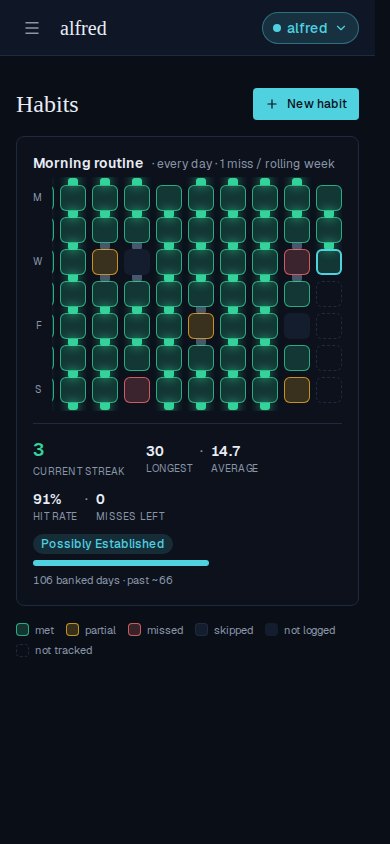
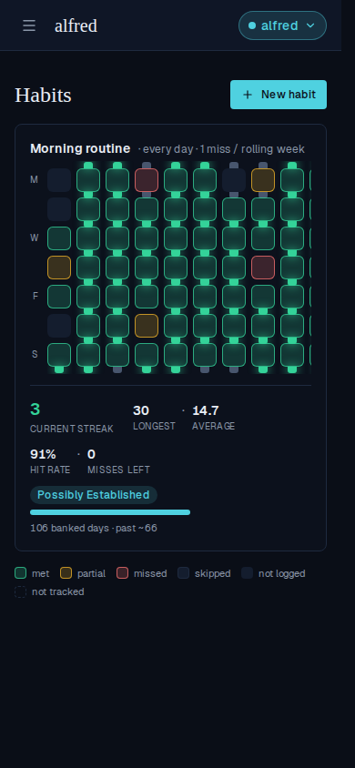
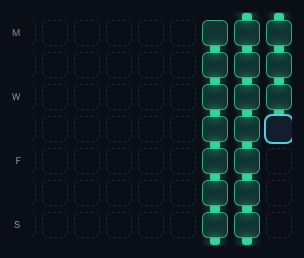

# The habit grid opens on the most recent squares

*2026-07-29T19:17:49.514Z*

A quarter of squares is wider than a phone, so the history grid has always scrolled. It just scrolled from the wrong end: the strip opened at the OLDEST week of the window, which is the one nobody came to look at. Today — the square you tap to log the morning — sat about fifteen columns off the right edge, behind a swipe you had to know to make.

**Before** — /habits on a 390px viewport, a habit with a full quarter of logged days. Every square on screen is from May; today's teal ring is nowhere in the card.

**After** — the same page, the same data. The strip now opens on its newest end: today's teal-ringed square sits against the right edge of the grid, with the run that leads up to it beside it. Nothing was scrolled to get here — this is the landing state.

**Still a scroll, not a crop** — swiping back through the quarter reaches every week the window covers, right back to the first Monday. Note the M / W / F / S legend: it has not moved a pixel between these two shots, because it now sits outside the scrolling strip rather than travelling with the columns.

**Given room to spare, it hugs the right edge too.** The app's window is a fixed 120 days, so in the card the strip is always the one that's short of width — but the anchoring is a layout rule, not a scroll trick, and the two committed Storybook baselines below pin both halves of it. First, a three-week grid in a 420px box: pushed to the right rather than the left. Then a quarter in a 280px box: opening on the lit run and today's ring, with the untracked weeks before the habit began cut off on the left. A strip that opened at the oldest week would be a wall of dashed squares.

