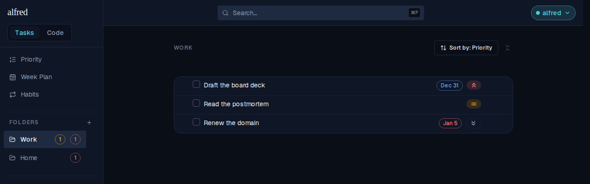
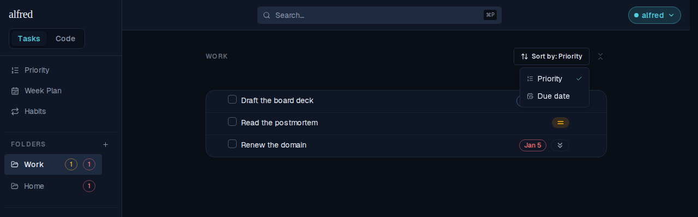
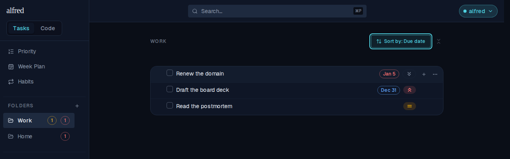
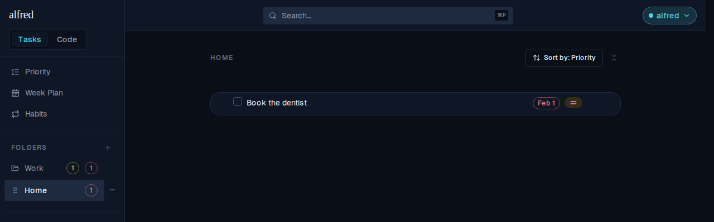
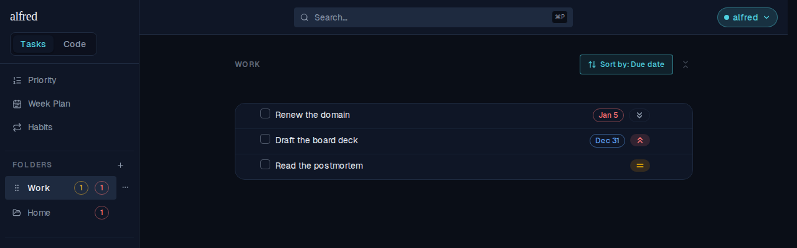

# Sort a folder's tasks by priority or by due date

*2026-08-06T18:50:41.072Z*

A folder has always ranked its tasks one way: priority first, due date as the tiebreak. That is the right lens when you are picking what matters most, and the wrong one when a deadline is what you are working against — a Low-priority task due tomorrow sits below every High-priority task with no date at all.

The folder header now carries a Sort by control. This is the Work folder as it opens — still ranked by priority: High (Draft the board deck) → Medium (Read the postmortem) → Low (Renew the domain), even though Renew the domain is the only overdue one.

The control offers the two orderings and check-marks the active one.

Picking Due date re-ranks the list in place: the overdue Jan 5 task climbs to the top past the High-priority one due Dec 31, and the task with no due date sinks to the bottom. The trigger names the ordering and turns teal, so a folder that is off the default ordering says so without being opened.

The choice is per folder, not global — Home is still on its own default ordering.

…and Work still remembers the due-date ordering when you come back to it.

