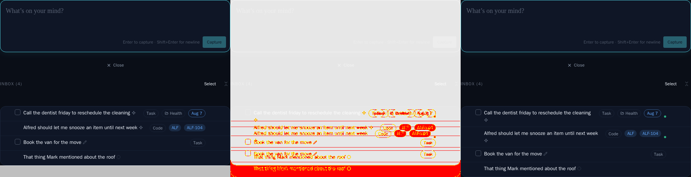
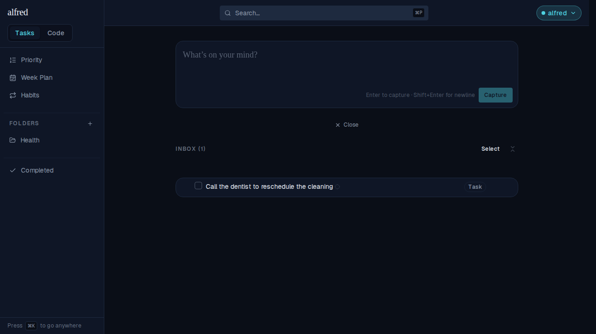
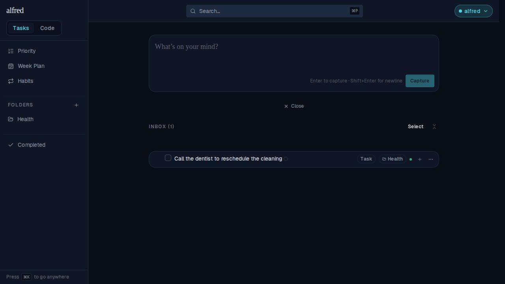
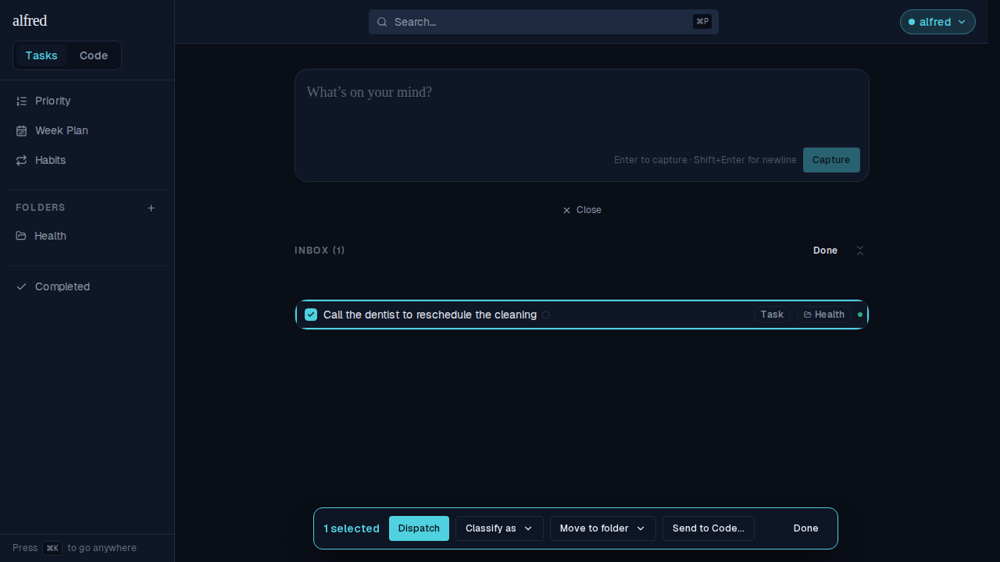

# Dispatch-ready pip on the Inbox row

*2026-08-30T14:41:09.239Z*

ALF-178: the Inbox row now carries a small green dot — the last chip in its metadata cluster — on any row `dispatchReadiness` calls ready. It's derived per render from the same pure predicate the bulk bar and the Dispatch press already call, so the cue and the press can never disagree. The chosen treatment (option 2, the ready pip) is drawn in the merged spec at `docs/specs/archive/ALF-178.html`.

The Storybook snapshot gate catches the new baselines: `InboxScreen · MidTriage` grows by one wrapped title line once its two ready rows gain the pip (row 1 also gets the Health folder chip's neighbour), and `InboxScreen · UndispatchedFolderedItem` — whose store now seeds the Health folder so the row's own chip actually resolves — is rebaselined for the same reason. Diff for MidTriage (baseline | changed pixels | received):

The live authenticated app, not just Storybook — the cue derived per render and flipping live (D8). One task Inbox row, no folder yet: no cue.

Labelling it with a folder from its own Folder chip (no per-row Dispatch affordance was added — labelling stays the row's, Dispatch stays the bulk bar's) makes the cue appear the instant the PATCH reconciles — no reload, no remount:

And in select mode — the state the cue has to survive intact — it coexists with the selected row's teal ring, and Dispatch is enabled because the selection has a ready item:

Fix: the pip sat flush with the row's top edge rather than centred with the badges next to it — the ordinary row's dissolved metadata cluster top-aligns at md+ (rowBaseClass's md:items-start), which a text-bearing badge absorbs in its own padding but a bare 6px dot does not. dispatchReadyPipClass now carries self-center (a no-op in select mode, where the row is a <Button> that already centers). All four screenshots above are the corrected render.
