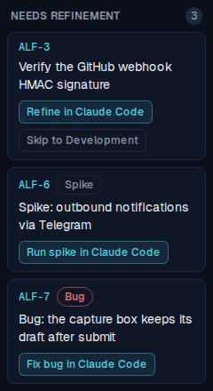
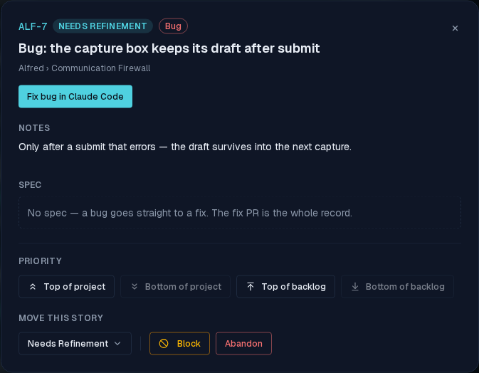
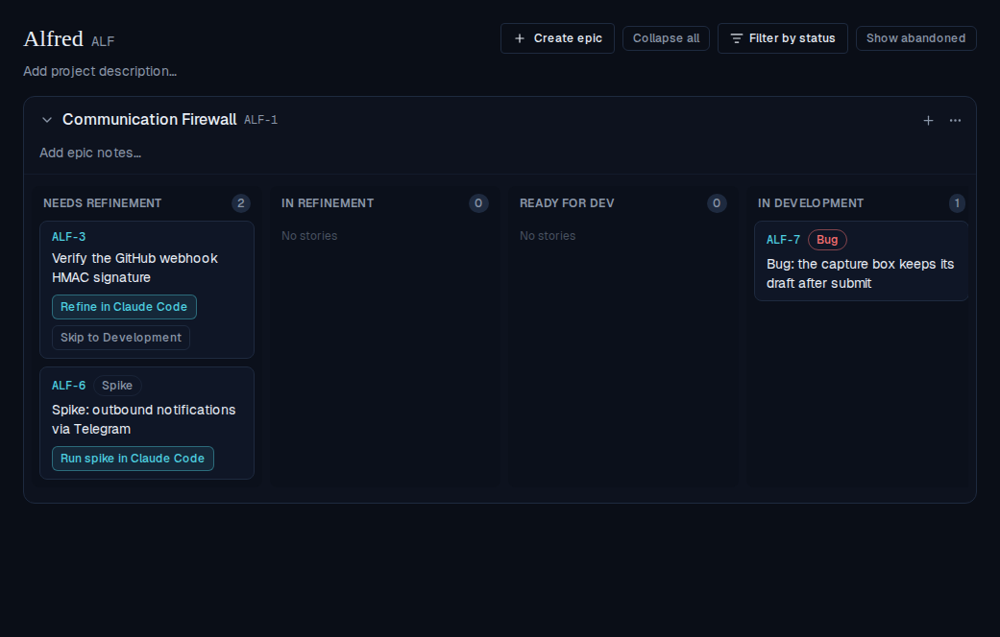

# Bugs are their own kind of ticket

*2026-09-06T01:56:45.536Z*

A story titled `Bug: …` is now its own kind of ticket and, like a spike, skips refinement entirely: one badged card, one launch, one session that reproduces the defect and fixes it. Unlike a spike it costs the Worker nothing new — a bug's PR **is** an implementation PR, so `phase: implementation` carries it through the transitions that already exist. No new phase, no schema change, no CI change.

## 1 · The board: two kinds, one family

Kind is derived from the title prefix alone — nothing is persisted, so renaming a story re-classifies it instantly. In one Needs Refinement lane: the ordinary card (ALF-3) still offers *Refine* plus the subordinate *Skip to Development*; the spike (ALF-6) wears the muted badge and offers only *Run spike in Claude Code*; the bug (ALF-7) wears the muted **red** badge and offers only *Fix bug in Claude Code*. The two kind badges share the outline chip and differ only in hue, so they read as one family rather than two unrelated labels.



## 2 · The bug's detail modal

The badge repeats beside the state chip; the header offers the single solid *Fix bug in Claude Code* button; the **Needs refinement** checkbox is gone (a bug is never refined, so a toggle promising refinement could only mislead); and the document section says plainly that **no spec is coming** — rather than the ordinary story's "the refinement PR writes it when it merges", which on a bug would leave the reader waiting for a PR that never opens.



## 3 · Launching lands the card in In Development

One session reproduces and fixes, so there is no separate build phase to wait for. Clicking the chip awaits the state write — which also records `requires_refinement: false`, the same honest mark a spike or a *Skip to Development* launch leaves — and then opens the prefilled tab. ALF-7 lands in **In Development**, still badged, with nothing left to launch; the other two cards are untouched.



## 4 · The prompt the launch actually builds

Captured from the live launch URL in step 3. Structurally it is the skip-refinement prompt — nothing to read, nothing to write, nothing to archive — plus the two steps a defect needs and a feature doesn't: **reproduce before changing anything**, then a **failing test before the fix**. The clarification gate is keyed to reproduction rather than to scope, because an unreproducible bug is exactly where guessing is most tempting. It points at the bug skill with a no-skill fallback, carries `phase: implementation` with **no `spec-path`**, and inlines the ticket's notes as the bug report.

```bash
cat docs/demos/alf-198-bug-ticket-type/launch-prompt.txt
```

````output
ALF-7: Bug: the capture box keeps its draft after submit

You are fixing the BUG ALF-7. This is a BUG-FIX session: there is no plan to read and no spec to write — reproduce the defect, prove it with a failing test, then fix it, all in this one session.

1. Ground yourself first: skim the repo and honor its own conventions — read any CONTRIBUTING or CLAUDE.md — and work from the code that already exists.
2. REPRODUCE the bug before you change anything, and tell me what you found: the behaviour you actually see, the behaviour you expected, and the code responsible. If you cannot reproduce it, or the report below doesn't pin down what's broken, ASK ME HERE rather than guessing at a fix — you don't need to guess, I'm in this tab.
3. Follow the bug skill at `.claude/skills/bug/SKILL.md` (it auto-loads in a bug-fix session) — it owns this repo's conventions for reproducing, pinning and fixing a defect. If the skill is absent, follow the repo's own testing conventions.
4. Pin the bug with a FAILING test first: one that fails for the reason the bug exists, and passes once it's fixed. A test written after the fix proves only that the code does what it now does.
5. Fix the ROOT CAUSE, not the symptom, and keep the fix minimal — this defect and whatever else is broken for the same reason, nothing more. If you find adjacent bugs, tell me rather than folding them in.
6. When done, open a pull request whose description carries this machine-readable block verbatim — a CI check enforces it, so reproduce the fence exactly:

```alfred
alfred-ticket: ALF-7
phase: implementation
```

7. Before opening the PR, confirm the test you wrote now passes, the rest of the suite is green, and the block above is reproduced exactly.


Context (from the ticket):
Only after a submit that errors — the draft survives into the next capture.
````

## 5 · The PR contract is untouched

This is the part that costs nothing. A bug PR carries `phase: implementation`, so the enforcing GitHub check — lifted verbatim out of the committed workflow below and run against three PR bodies — accepts it with no change: an `implementation` block needs no `spec-path`, and the archive rule only fires when a `spec-path` is named and left sitting in the active specs directory. A bug names none, so there is nothing to archive and nothing to snapshot.

```bash
set -e
# Lift the enforcing check's script verbatim out of the committed workflow and run it.
sed -n '/^        run: |$/,$p' docs/code-module/repo-setup/alfred-frontmatter.yml \
  | tail -n +2 | sed 's/^          //' > /tmp/alfred-frontmatter-check.sh
block() { printf 'Body.\n\n```alfred\nalfred-ticket: %s\nphase: %s\n%s```\n' "$1" "$2" "$3"; }
run() { BODY="$1" sh /tmp/alfred-frontmatter-check.sh 2>&1 || echo "(check failed)"; }

echo '— a bug PR: phase implementation, no spec-path —'
run "$(block ALF-7 implementation '')"

echo '— an ordinary implementation PR that left its spec un-archived —'
mkdir -p docs/specs && touch docs/specs/ALF-99.html
run "$(block ALF-99 implementation 'spec-path: docs/specs/ALF-99.html
')"
rm -f docs/specs/ALF-99.html

echo '— a PR with no alfred block at all —'
BODY='Just a description.' sh /tmp/alfred-frontmatter-check.sh 2>&1 || echo '(check failed)'
```

```output
— a bug PR: phase implementation, no spec-path —
ok: ALF-7 implementation
— an ordinary implementation PR that left its spec un-archived —
implementation PR must archive its spec: git-move docs/specs/ALF-99.html to docs/specs/archive/ALF-99.html
(check failed)
— a PR with no alfred block at all —
missing ```alfred block
(check failed)
```

## 6 · Where the conventions live

The session-side conventions are a committed skill, `.claude/skills/bug/SKILL.md`, dropped into each project repo alongside the refinement, epic-refinement and spike skills — so a repo can own how it reproduces and pins a defect while still hooking into alfred through the one shared contract, the `alfred` block. It carries the loop (reproduce → pin it red → fix the cause → check the blast radius → open the PR) and the rules that keep a fix a fix: the failing test is not optional, the root cause is not the symptom, an adjacent bug is a new story, and a story that turns out not to be a bug gets said out loud rather than papered over with an invented defect.
