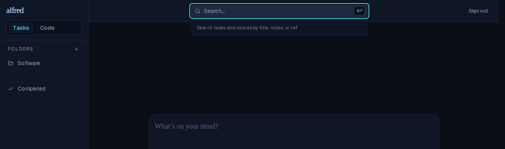
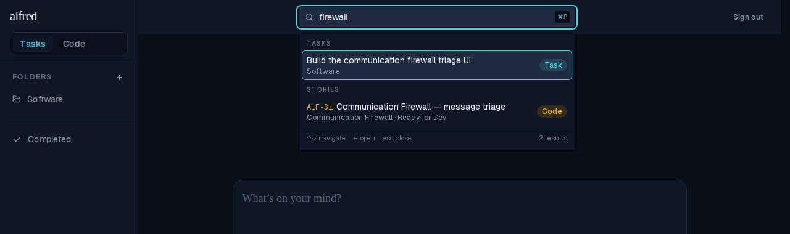
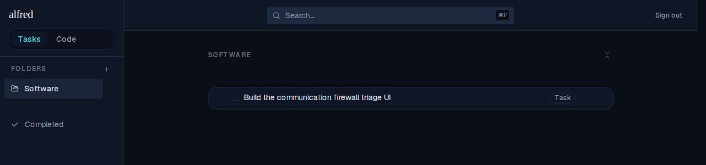
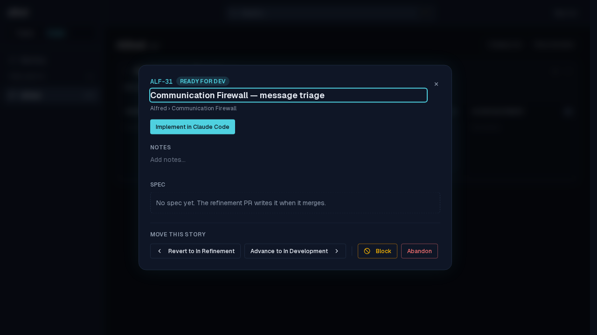

# ALF-2 — global search from the top bar (⌘P)

*2026-06-24T05:44:25.081Z*

A search field in the top bar, focused with ⌘P / Ctrl P, searches across both tasks and code stories at once and jumps to whatever you pick — a keyboard-first "go to anything" for the two-module shell. It reads the already-seeded stores and filters client-side: no new API, route, or query.

### 1. ⌘P focuses the top-bar field and opens its dropdown
Pressing ⌘P from anywhere claims the key from the browser's Print dialog and focuses the real top-bar input (not a separate modal). The empty state shows a one-line hint.

### 2. Typing filters across both modules
Matches drop down in a popover anchored beneath the field, grouped under **Tasks** and **Stories**, each row badged by type. Tasks match on title + notes; stories also match on `ref` (so `ALF-31` finds it). The active row carries an accent ring; the footer surfaces the result count and key hints.

### 3. Selecting a task jumps to its view and highlights the row
Choosing a task routes to its containing view (here the Software folder) via a client-side history push, then scrolls the row in and rings it briefly (a static, reduced-motion-aware highlight).

### 4. Selecting a story opens the board with its detail modal
Choosing a code story routes to `/code/[projectId]?story=<ref>`; the board reads the param and opens that story's detail modal (switching projects first if needed). Closing it clears the param.

