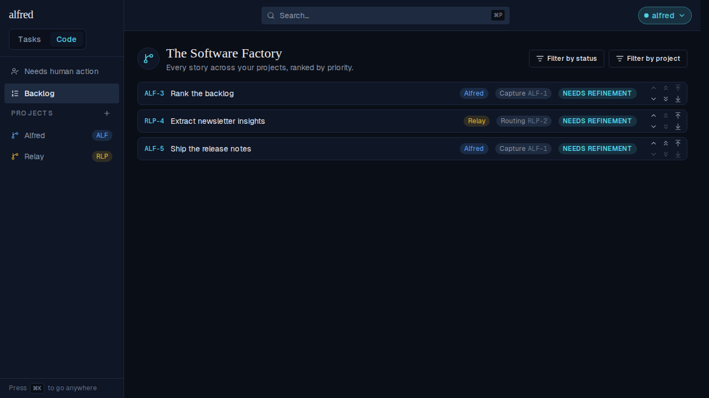
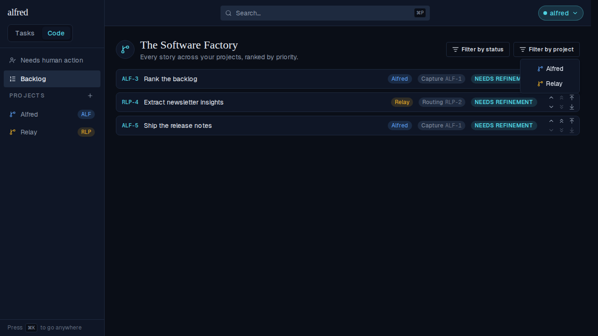
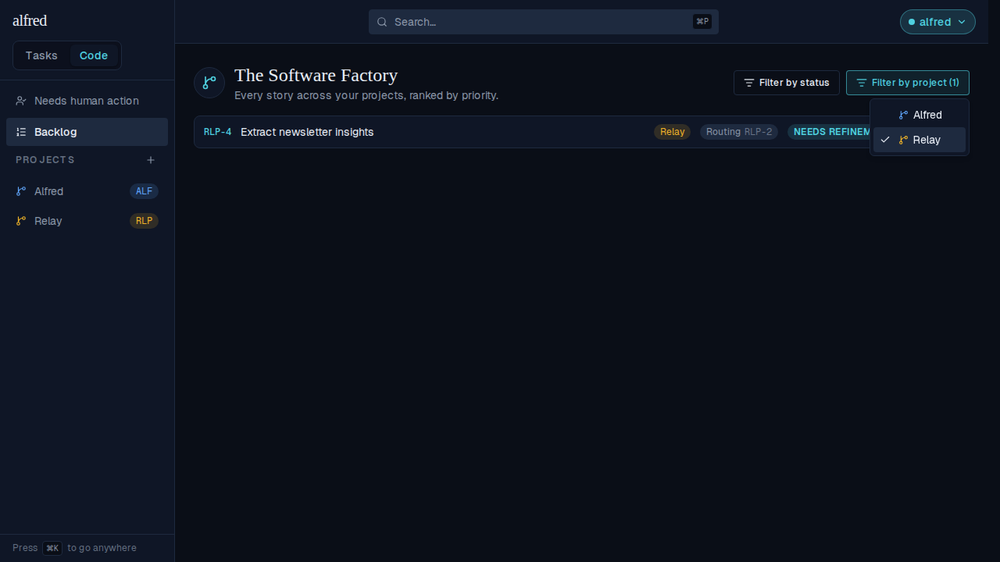
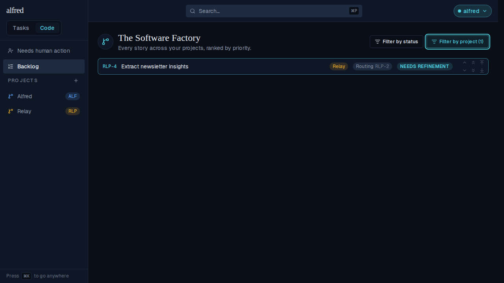
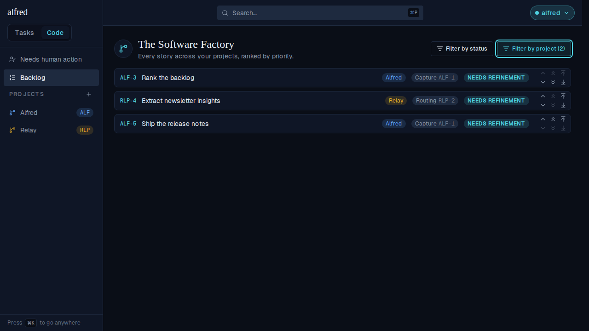
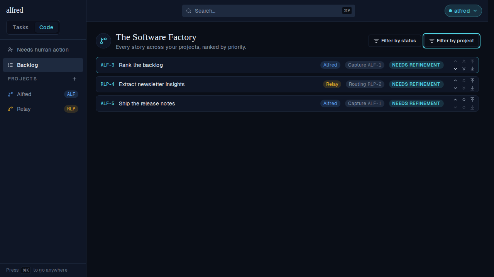

# Backlog project filter rests empty, and one tap includes one project (ALF-201)

*2026-09-03T17:52:28.140Z*

The Backlog's "Filter by project" menu used to rest with EVERY project checked, so seeing one project meant unchecking all the others. It now rests with NOTHING checked — an empty selection means "no project filter", so the Backlog still opens cross-project — and each checked project is one the list is narrowed TO.

Captured against the live app (Playwright + the in-memory Supabase mock) with two projects: **Alfred** (ALF-3, ALF-5) and **Relay** (RLP-4), interleaved by global priority.

## 1. At rest: every story, no count on the trigger

`/code/backlog` on load. All three stories are listed across both projects, and the trigger is in its plain outline state — the resting selection is not a filter.

## 2. Opening the menu: nothing is checked

This is the change in one frame. Both projects are offered and **neither is checked** — previously both carried a tick, and narrowing to Relay meant unticking Alfred (and every other project you'd ever created).

## 3. One tap on Relay — the list is narrowed to Relay

A single click on *Relay* leaves only RLP-4 listed and the trigger teal with **(1)**. Under the old default this same result took a tap on every other project.

With the menu closed:

## 4. It is still a multi-select: checking Alfred widens the view

Checking *Alfred* as well shows both projects' stories — **(2)** on the trigger — and the rows keep their global priority ranking (ALF-3, RLP-4, ALF-5). The filter chooses what is shown; it never re-ranks it.

## 5. Unchecking everything returns to the resting, unfiltered Backlog

Both boxes cleared: the same three stories, and the trigger drops its count and its teal highlight — an empty selection is "no filter", never "show nothing".

