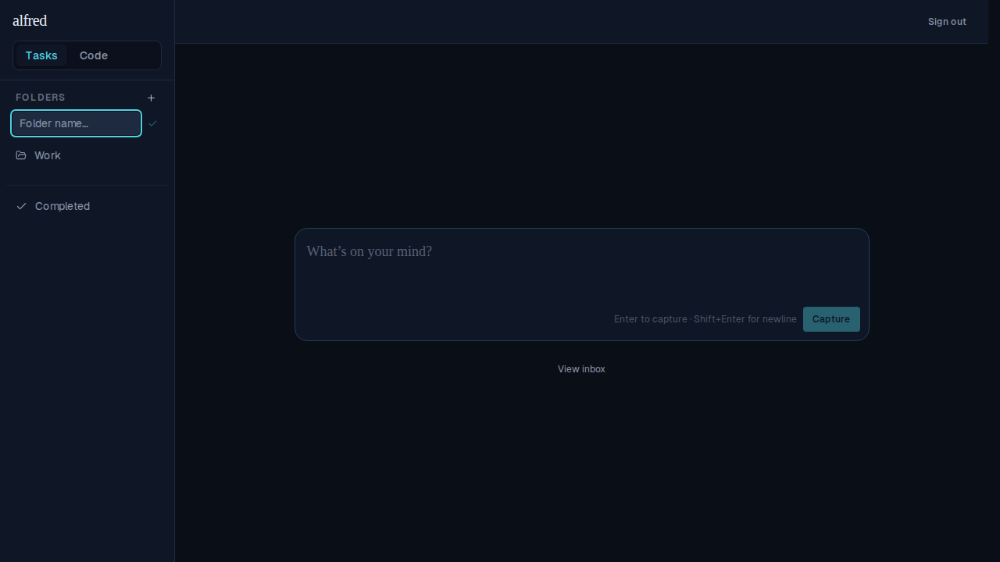
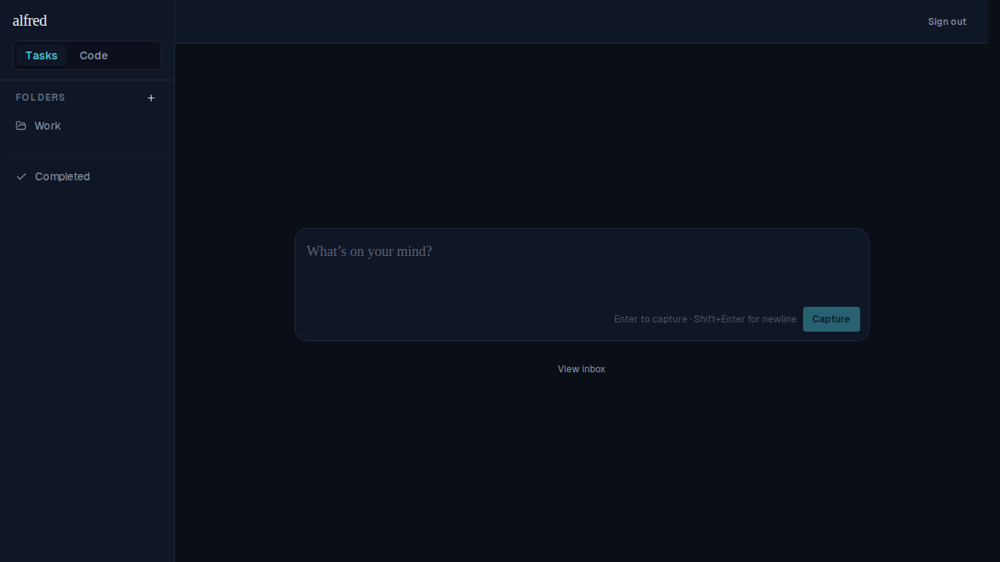
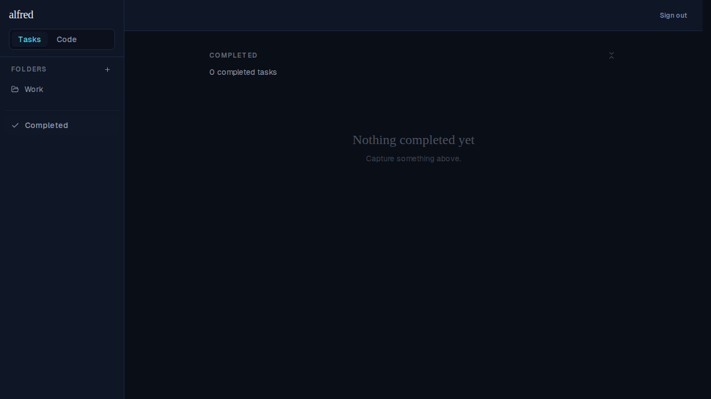

# ALF-21: auto-focus and click-outside dismiss for folder create/rename forms

*2026-06-22T19:23:48.513Z*

FolderNameForm now auto-focuses its text input on mount via useEffect+ref (sidestepping jsx-a11y/no-autofocus), and dismisses on any pointerdown outside the form element. Both the create-folder form and the rename-folder form share the same component, so both behaviors apply to both.

Create-folder form: clicking the + button opens the form. The teal focus ring confirms the input received focus immediately — no click required.

Clicking the Completed link (outside the form) dismisses it; the Work folder link is restored and no folder is created.

Rename-folder form: selecting Edit from the folder options menu opens the rename input pre-filled with the folder name. The teal focus ring confirms auto-focus.

Clicking outside (the Completed link) dismisses the rename form without saving; the Work link is restored.

