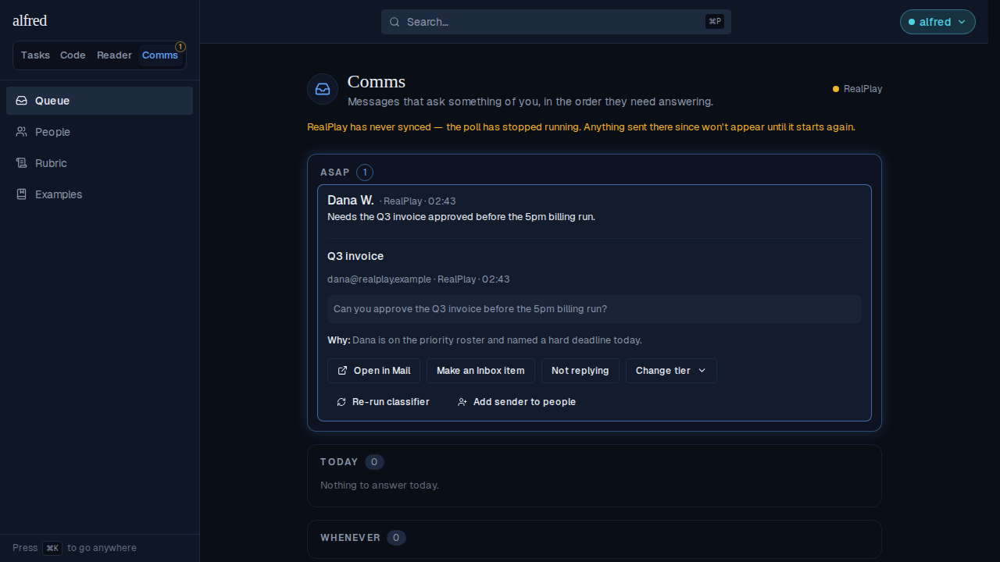
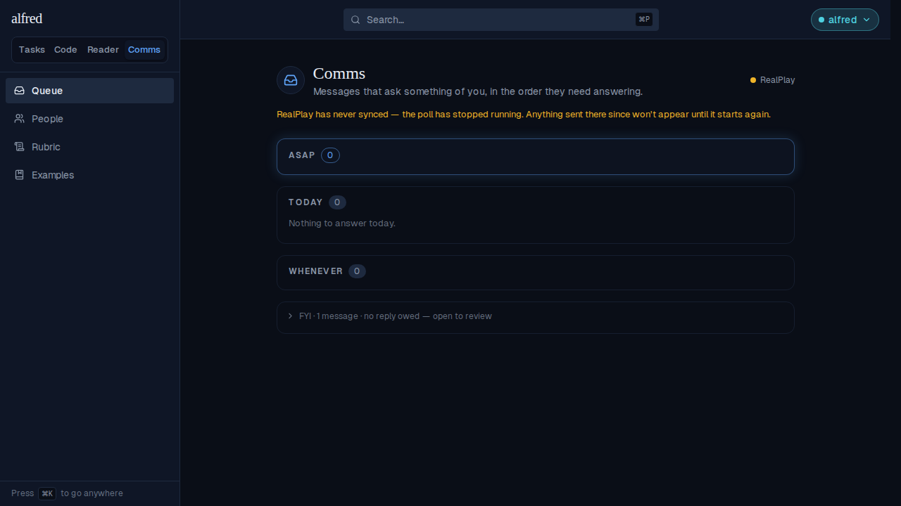

# Remove the "Nothing to answer" row verb

*2026-09-21T03:41:44.135Z*

ALF-220: the "Nothing to answer" row verb was confusing next to "Not replying" — a quick demotion to FYI reads too much like a decision to not reply. The owner now demotes a wrongly-queued row to FYI through the tier dropdown instead, which already records the same correction. The row verbs go from five to four, and the row's `n` hotkey is retired along with the button.

The ASAP row expanded: four verbs — Open in Mail, Make an Inbox item, Not replying, Change tier. No "Nothing to answer" button.

Same row, demoted to FYI through the tier dropdown instead: ASAP drops to 0, and the shelf now holds the message — the same demotion "Nothing to answer" used to do, plus the correction the dropdown records for the classifier.

