# Re-run classifier now says what happened

*2026-09-30T03:24:29.260Z*

Pressing **Re-run classifier** used to do nothing you could see. The request was sent, a Worker picked it up a minute or three later, and the row either moved sections without a word or sat exactly as before. If the model kept answering badly it never ended at all: the Worker re-sent the call, and billed it, on every tick forever.

This change gives every re-run a visible beginning and a stated end: the row says it is waiting, a toast says how it ended, and the Worker now gives up on a re-run that can't succeed.

## 1. The journey in the live app

Everything in this section is the real Next app running against the in-memory Supabase the E2E suite uses, driven by Playwright. The Worker is not part of that stack, so the capture plays its part the way it really acts: it writes the answer straight to the backend, and the tab notices on its next re-read.

**Before.** Dana's row on Today, expanded. The verbs are the usual ones, with a plain **Re-run classifier** at the bottom.

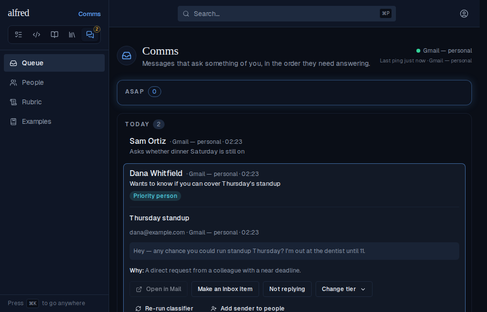

**After the click, at once.** The button becomes a disabled **Re-run requested** with a spinner, and a **Re-run pending** chip appears on the row, first in the chip order. It is disabled because a second request while one is pending would only reset the attempt count.

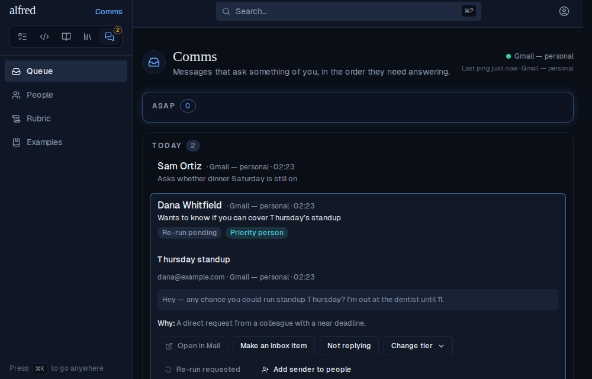

**The same wait from the collapsed queue.** The chip is on the row itself, so the wait is visible without opening it. Both the chip and the button are derived from the row's own request stamp, so a reload or a second tab shows them too.

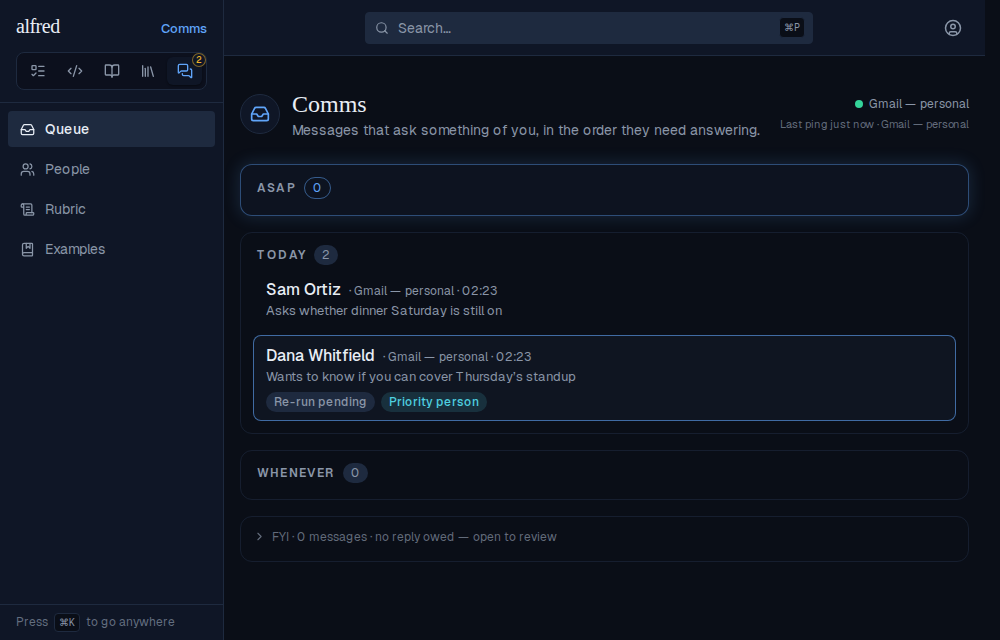

### The five ways a re-run ends

Each is one toast, shown once, naming the sender so two re-runs landing on the same poll can be told apart. Checked top-down, first match wins.

**The verdict changed.** The Worker re-judged the row Today → ASAP; the row has moved sections and the toast says why.

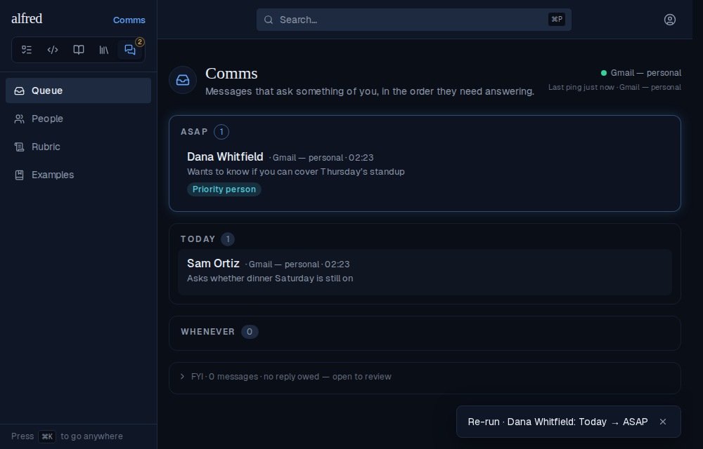

**The verdict held.** Nothing visibly moves, which is exactly the case that used to leave the owner wondering whether anything had happened.

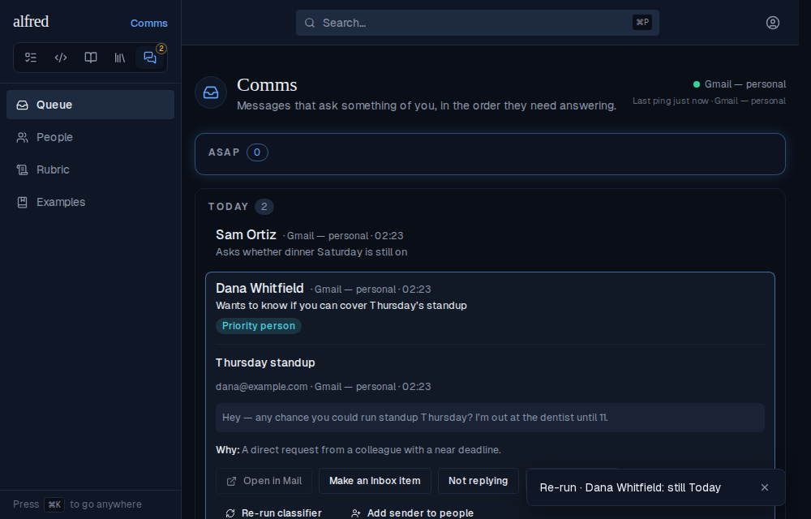

**The model declined.** The row is filed on the FYI shelf (the Today count dropped from 2 to 1) and the toast says so.

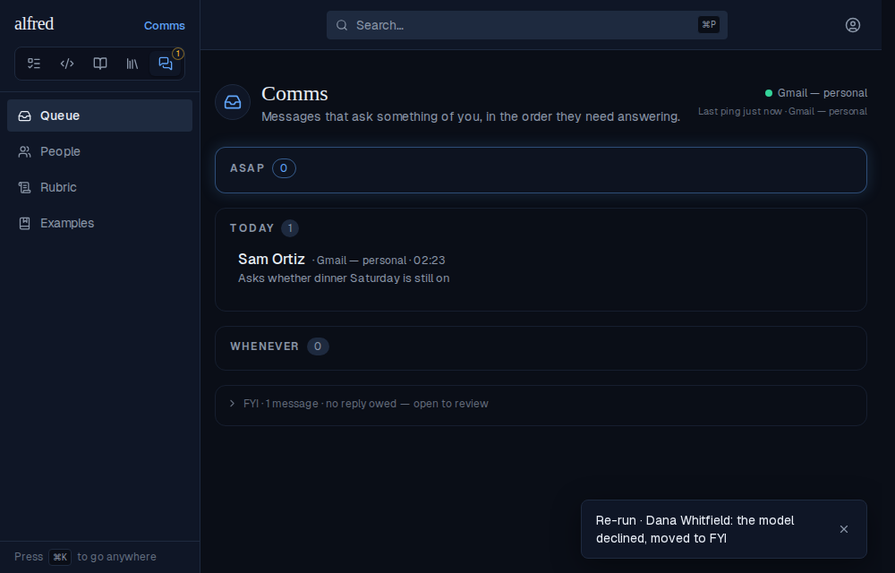

**Still could not be judged.** The row keeps its **Unjudged** chip and the toast says it stayed on Today.

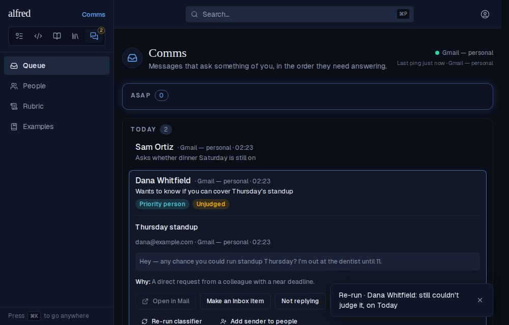

**The Worker gave up.** After five failed attempts the old verdict stands. The toast says the re-run failed, and the detail panel carries an amber **Re-run failed** line right after *Why:*.

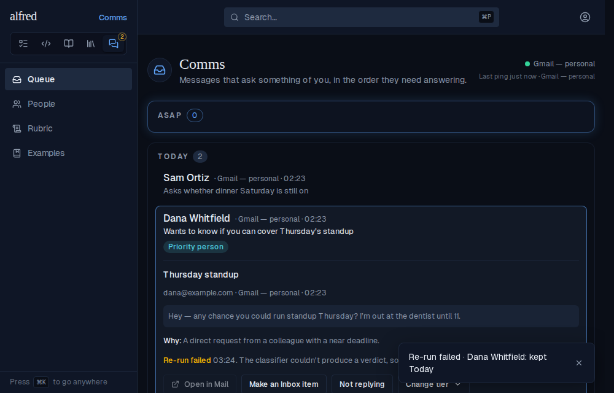

### The failure survives a reload, and asking again clears it

The toast is gone after a reload, but the row still says why nothing changed. There is deliberately no chip on the collapsed row: the verdict still stands, so a failed re-run is not a way the module is wrong about it.

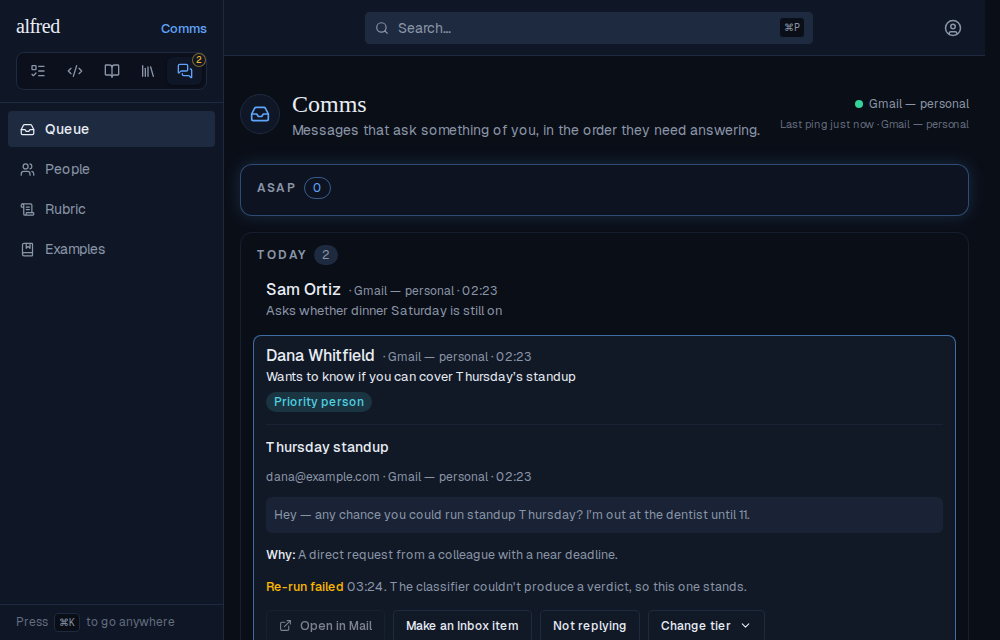

The button is enabled again so the owner can retry. Asking again clears the old failure at once, and the row goes back to pending.

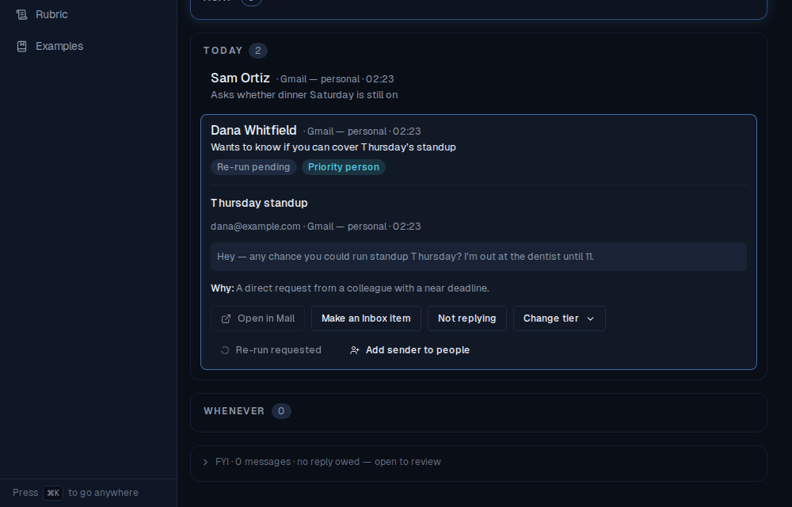

### A row that moved somewhere the tab never loaded

A demotion files the row on the FYI shelf, which is paged newest-first. Here Dana's message is older than a full page of newer shelf mail, so the snapshot no longer contains it at all. The toast still arrives, because the tab asked the snapshot to `watch` the row by id (section 3 shows that route).

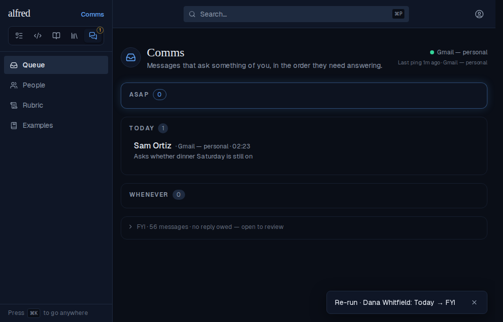

### If the request itself fails

The existing rollback still applies: the row goes back to normal and the existing `Couldn't ask for a re-run` toast appears. Nothing is left pending.

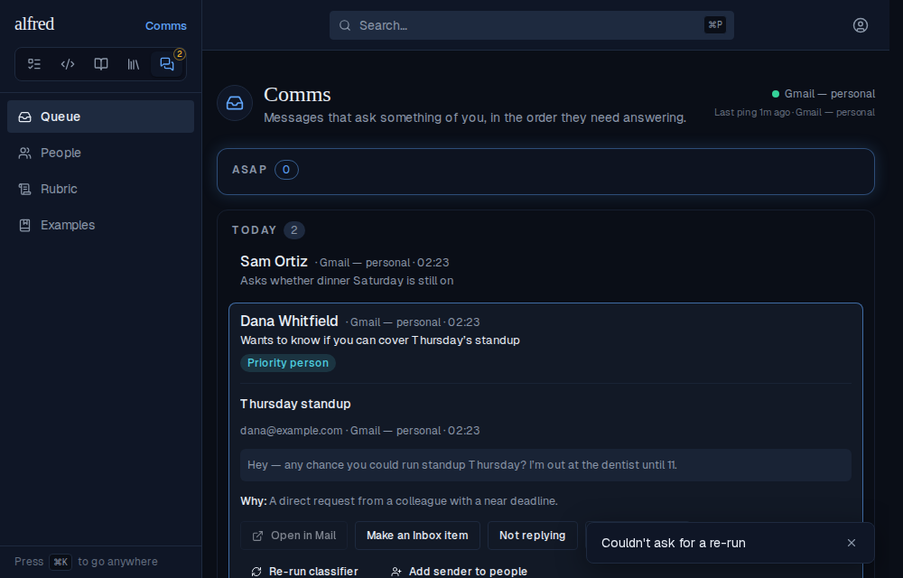

## 2. The Worker: a re-run that can't succeed now ends

Before this change `fetchReclassifyRequests` did not look at `classify_attempts`, and the at-ceiling park only picks up rows with no tier. A re-run of an already-judged row that kept failing with a bad model response was therefore re-sent on every tick, billed each time, and never cleared.

The Worker is headless, so its real output is the evidence. Each block below runs the real `runCommsSweep`, bundled straight from `workers/src/comms/sweep.ts` and imported unmodified. The database is a few-line in-memory `comm_messages` table that applies PostgREST filters the way the database does, and there is no live model: any call to it is recorded and refused, which is how "no model call" is shown rather than claimed. The real-Postgres behaviour of the conditional write is pinned separately in the `database` integration suite.

**The row.** A judged row on Today whose re-run has spent all five attempts.

```bash
node docs/demos/alf-221-rerun-feedback/worker-harness.mjs before
```

```output
the row before the sweep:
  tier                     today
  judged_by                model
  ask                      Wants you to cover Thursday’s standup.
  classify_attempts        5
  reclassify_requested_at  2026-09-09T14:50:00.123456+00:00
  reclassify_failed_at     none
```

**One tick.** The stalled re-run is read first, then given up on with a single write that clears the request and stamps the failure. That write only matches the request it read. The tier, verdict and ask are untouched, the re-run worklist read (`classify_attempts=lt.5`) is now the one that skips it, and no model call is made.

```bash
node docs/demos/alf-221-rerun-feedback/worker-harness.mjs abandon
```

```output
the row before the sweep:
  tier                     today
  judged_by                model
  ask                      Wants you to cover Thursday’s standup.
  classify_attempts        5
  reclassify_requested_at  2026-09-09T14:50:00.123456+00:00
  reclassify_failed_at     none

one sweep tick at 2026-09-09T15:00:00.000Z (abandon cap per tick: 1)
  read   reclassify_requested_at=not.is.null&direction=eq.inbound&classify_attempts=gte.5&limit=1  -> 1 row(s)
  WRITE  id=eq.b0000000-0000-4000-8000-000000000001&reclassify_requested_at=eq.2026-09-09T14:50:00.123456+00:00
         {"reclassify_requested_at":null,"reclassify_failed_at":"2026-09-09T15:00:00.000Z"}  -> 1 row(s) matched
  read   direction=eq.inbound&tier=is.null&cleared_at=is.null&classify_attempts=gte.5&limit=6  -> 0 row(s)
  read   reclassify_requested_at=not.is.null&direction=eq.inbound&classify_attempts=lt.5&limit=6  -> 0 row(s)
  read   direction=eq.inbound&tier=is.null&cleared_at=is.null&classify_attempts=lt.5&limit=6  -> 0 row(s)

model calls made: 0
summary: {"eligible":0,"classified":0,"failed":0,"parked":0,"aborted":false}
log: comms classifier: abandoned the re-run of message b0000000-0000-4000-8000-000000000001 after 5 failed attempts

the row after the sweep:
  tier                     today
  judged_by                model
  ask                      Wants you to cover Thursday’s standup.
  classify_attempts        5
  reclassify_requested_at  none
  reclassify_failed_at     2026-09-09T15:00:00.000Z
```

**A row that never had a tier.** The abandon step runs before the at-ceiling park, so a tier-less row is abandoned and then parked in the same tick, exactly as it would have been without the request.

```bash
node docs/demos/alf-221-rerun-feedback/worker-harness.mjs no-tier
```

```output
the row before the sweep:
  tier                     none
  judged_by                none
  ask                      none
  classify_attempts        5
  reclassify_requested_at  2026-09-09T14:50:00.123456+00:00
  reclassify_failed_at     none

one sweep tick at 2026-09-09T15:00:00.000Z (abandon cap per tick: 1)
  read   reclassify_requested_at=not.is.null&direction=eq.inbound&classify_attempts=gte.5&limit=1  -> 1 row(s)
  WRITE  id=eq.b0000000-0000-4000-8000-000000000001&reclassify_requested_at=eq.2026-09-09T14:50:00.123456+00:00
         {"reclassify_requested_at":null,"reclassify_failed_at":"2026-09-09T15:00:00.000Z"}  -> 1 row(s) matched
  read   direction=eq.inbound&tier=is.null&cleared_at=is.null&classify_attempts=gte.5&limit=6  -> 1 row(s)
  WRITE  id=eq.b0000000-0000-4000-8000-000000000001&tier=is.null
         {"tier":"today","judged_by":"unjudged","ask":"Not judged — five attempts, none of them usable. Treated as owed until it can be read.","classified_at":"2026-09-09T15:00:00.000Z"}  -> 1 row(s) matched
  read   reclassify_requested_at=not.is.null&direction=eq.inbound&classify_attempts=lt.5&limit=6  -> 0 row(s)
  read   direction=eq.inbound&tier=is.null&cleared_at=is.null&classify_attempts=lt.5&limit=6  -> 0 row(s)

model calls made: 0
summary: {"eligible":0,"classified":0,"failed":0,"parked":1,"aborted":false}
log: comms classifier: abandoned the re-run of message b0000000-0000-4000-8000-000000000001 after 5 failed attempts

the row after the sweep:
  tier                     today
  judged_by                unjudged
  ask                      Not judged — five attempts, none of them usable. Treated as owed until it can be read.
  classify_attempts        5
  reclassify_requested_at  none
  reclassify_failed_at     2026-09-09T15:00:00.000Z
```

**The owner asks again mid-tick.** The stall is read, then a newer request lands before the write. The write is conditional on the request it read, so it matches zero rows and the newer request survives.

```bash
node docs/demos/alf-221-rerun-feedback/worker-harness.mjs newer
```

```output
the row before the sweep:
  tier                     today
  judged_by                model
  ask                      Wants you to cover Thursday’s standup.
  classify_attempts        5
  reclassify_requested_at  2026-09-09T14:50:00.123456+00:00
  reclassify_failed_at     none

one sweep tick at 2026-09-09T15:00:00.000Z (abandon cap per tick: 1)
  read   reclassify_requested_at=not.is.null&direction=eq.inbound&classify_attempts=gte.5&limit=1  -> 1 row(s)
  WRITE  id=eq.b0000000-0000-4000-8000-000000000001&reclassify_requested_at=eq.2026-09-09T14:50:00.123456+00:00
         {"reclassify_requested_at":null,"reclassify_failed_at":"2026-09-09T15:00:00.000Z"}  -> 0 row(s) matched
  read   direction=eq.inbound&tier=is.null&cleared_at=is.null&classify_attempts=gte.5&limit=6  -> 0 row(s)
  read   reclassify_requested_at=not.is.null&direction=eq.inbound&classify_attempts=lt.5&limit=6  -> 0 row(s)
  read   direction=eq.inbound&tier=is.null&cleared_at=is.null&classify_attempts=lt.5&limit=6  -> 0 row(s)

model calls made: 0
summary: {"eligible":0,"classified":0,"failed":0,"parked":0,"aborted":false}

the row after the sweep:
  tier                     today
  judged_by                model
  ask                      Wants you to cover Thursday’s standup.
  classify_attempts        5
  reclassify_requested_at  2026-09-09T14:59:00+00:00
  reclassify_failed_at     none
```

**A refused write never bills the request again.** If the write that would give up on the row is refused, the request stays pending, but the re-run worklist read (`classify_attempts=lt.5`) returns nothing and no model call is made. The next tick simply tries again.

```bash
node docs/demos/alf-221-rerun-feedback/worker-harness.mjs worklist
```

```output
the row before the sweep:
  tier                     today
  judged_by                model
  ask                      Wants you to cover Thursday’s standup.
  classify_attempts        5
  reclassify_requested_at  2026-09-09T14:50:00.123456+00:00
  reclassify_failed_at     none

one sweep tick at 2026-09-09T15:00:00.000Z (abandon cap per tick: 1)
  read   reclassify_requested_at=not.is.null&direction=eq.inbound&classify_attempts=gte.5&limit=1  -> 1 row(s)
  WRITE  id=eq.b0000000-0000-4000-8000-000000000001&reclassify_requested_at=eq.2026-09-09T14:50:00.123456+00:00  -> refused by the database (403)
  read   direction=eq.inbound&tier=is.null&cleared_at=is.null&classify_attempts=gte.5&limit=6  -> 0 row(s)
  read   reclassify_requested_at=not.is.null&direction=eq.inbound&classify_attempts=lt.5&limit=6  -> 0 row(s)
  read   direction=eq.inbound&tier=is.null&cleared_at=is.null&classify_attempts=lt.5&limit=6  -> 0 row(s)

model calls made: 0
summary: {"eligible":0,"classified":0,"failed":0,"parked":0,"aborted":false}
log: comms classifier: could not abandon the re-run of b0000000-0000-4000-8000-000000000001

the row after the sweep:
  tier                     today
  judged_by                model
  ask                      Wants you to cover Thursday’s standup.
  classify_attempts        5
  reclassify_requested_at  2026-09-09T14:50:00.123456+00:00
  reclassify_failed_at     none
```

## 3. The two routes

These run the real route handlers and read layer behind them: the real Next app, booted against the in-memory Supabase, signed in through `@supabase/ssr` so the session cookie is the library's own.

**`GET /api/comms/snapshot?watch=…`.** The shelf page held is one row, and Dana's row is not on it. Watching her id returns her row in `watched`, and `messages` is unchanged, because watched rows are only ever read and never merged in. An empty `watch` reads nothing. A malformed id, or a 21st id, is a 400 rather than quietly dropped.

```bash
bash docs/demos/alf-221-rerun-feedback/with-app.sh snapshot
```

```output
GET /api/comms/snapshot?shelf=1
  status         200
  messages held  ["02"]   (Dana is 01: not among them)
  watched        []

GET /api/comms/snapshot?shelf=1&watch=00000000-0000-4000-8000-000000000001
  status         200
  messages held  ["02"]   (unchanged: watched is never merged in)
  watched        [{"id":"00000000-0000-4000-8000-000000000001","tier":"fyi","reclassify_requested_at":null,"reclassify_failed_at":null}]

GET /api/comms/snapshot?watch= (empty)
  status 200, watched []

GET /api/comms/snapshot?watch=00000000-0000-4000-8000-000000000001,not-an-id
  status 400, error "Invalid query parameters"

GET /api/comms/snapshot?watch=<20 ids>
  status 200, watched []   (ids that match no row are simply absent)
GET /api/comms/snapshot?watch=<21 ids>
  status 400, error "Invalid query parameters"
```

**`POST /api/comms/messages/:id/reclassify`.** Asking again clears the failure an earlier re-run left, so a stamp that is set always describes the latest request. The request itself only asks: the tier is untouched.

```bash
bash docs/demos/alf-221-rerun-feedback/with-app.sh reclassify
```

```output
the row, after a re-run the Worker gave up on
  classify_attempts        5
  reclassify_requested_at  null
  reclassify_failed_at     2098-12-31T09:58:00.000Z

POST /api/comms/messages/00000000-0000-4000-8000-000000000001/reclassify
  status 200
  classify_attempts        0
  reclassify_requested_at  <now>
  reclassify_failed_at     null
  tier                     today   (the request only asks; the Worker judges)

the mock database, read back
  reclassify_failed_at     null
  request pending          true
```

## 4. The committed Storybook baselines

The three new `MessageRow` stories, as the pinned Docker renderer wrote them. They add new baselines rather than moving existing ones, so there is no diff image; all 253 existing baselines still pass unchanged. These are secondary evidence: the journey above is the proof the transitions happen.

**Re-run pending (expanded).**

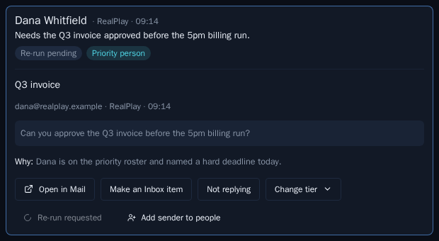

**Re-run pending (collapsed).**


**Re-run failed.**

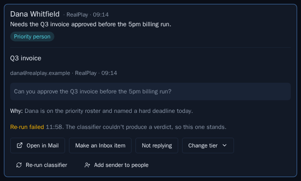
