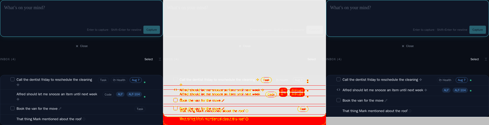
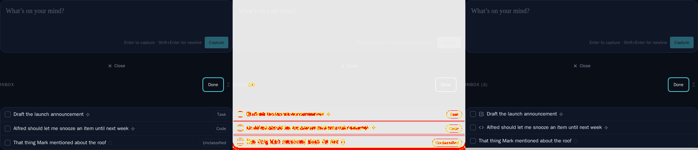
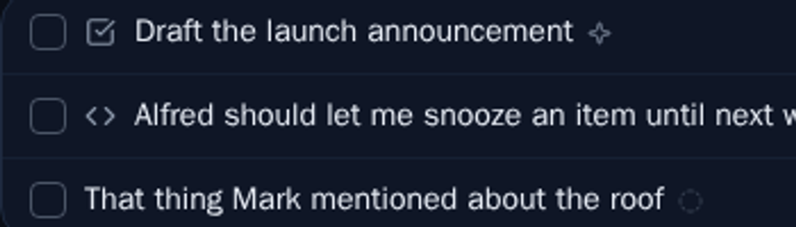

# Type glyph replaces inbox row badges

*2026-09-12T03:03:37.473Z*

ALF-224: the inbox row's "Task"/"Code" text badges are gone. In the regular (non-select) view, a code row shows a lucide `code` icon in the slot its checkbox would occupy (it has none); a task row keeps its real completion checkbox and shows no icon; an unclassified row shows neither. In multi-select view, every row already carries a selection tick box, so the type instead shows as a small icon to its right: `code` for code items, `square-check-big` for tasks, nothing for unclassified.

## Regular (non-select) view — MidTriage story

Baseline (left) vs. new render (right) from the Storybook visual-regression diff. The task row (top) drops its old "Task" badge and now shows nothing extra beyond its folder/due-date chips; the code row (second) drops its "Code" badge and shows the `code` icon where its checkbox would be; the bare task (third) loses its badge entirely, so its footer collapses; the unclassified row (bottom) is unchanged.

Zoomed on the code row's checkbox slot in the new render — the `code` icon (`</>`) replaces the old "Code" badge, sitting exactly where a task's checkbox would go:

## Multi-select view — SelectMode story

This is the ticket's core ask: since every row already has a tick box in select mode, the badges are gone and each type gets a small icon beside its tick box instead — `square-check-big` for the task, `code` for the code item — while the unclassified capture stays bare (no icon is defined for that type):

Zoomed on the three tick boxes in the new render — task, code, unclassified, left to right:

## Coverage

- `components/tasks/type-glyph.tsx` (new) — the shared glyph component, unit-tested in `type-glyph.test.tsx` and covered by its own Storybook stories.
- `task-row.tsx` — wires the glyph into both branches; `task-row.test.tsx` pins the checkbox-slot icon (regular view) and the tick-box-adjacent icon (select mode) for task/code/unclassified across Inbox roots, subtasks, and folder-filed items.
- `row-meta-cluster.tsx` — the `showTypeBadge` prop and the `TypeBadge` render are gone; `row-meta-cluster.test.tsx` updated.
- E2E specs (`classify.spec.ts`, `inbox-epic.spec.ts`, `inbox-live-classify.spec.ts`, `inbox-project-suggest.spec.ts`, `code-gate.spec.ts`, `inbox-multi-edit.spec.ts`) updated to assert the icon instead of the old badge text.
- Storybook baselines regenerated: `InboxScreen` (MidTriage, SelectMode, MobileInbox) and `TaskRow` (MobileCards, MobileColumnCollapse, MobileNotesTruncate) all shrink slightly now that the removed badge no longer reserves a footer line; three new `TypeGlyph` story baselines captured.
