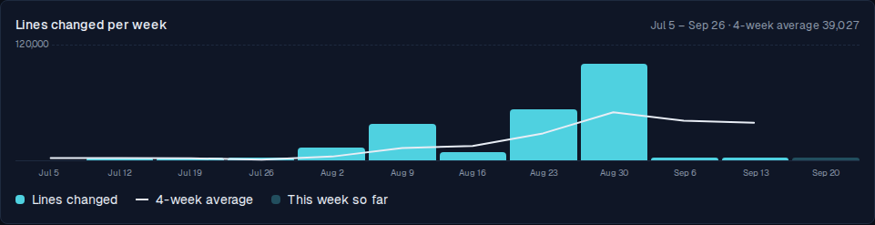
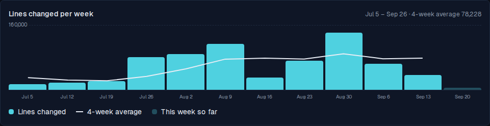

# Lines-changed chart counts the agent that authors the commits

*2026-09-21T03:30:03.009Z*

ALF-245: the Code dashboard's lines-changed chart showed churn collapsing to near-nothing through September. It hadn't. The card scoped GitHub's contributor statistics through `PR_RATIO_AUTHORS` — the allowlist that names who OPENS a pull request. `GET /repos/{o}/{r}/stats/contributors` keys on who AUTHORED the commits, and in this workflow those are different accounts: `ac3charland` opens and merges every PR, the login `claude` authors nearly every commit inside it. Every agent-authored line was filtered out.

Both screenshots below are the real `/code/dashboard` card, driven through the Playwright harness, rendering the payload that `fetchLocVelocity` actually produces from GitHub's live contributor statistics for `ac3charland/realplay` and `ac3charland/alfred` (committed beside this doc) — the first from the code before the fix, the second from the code after it. Nothing about the two runs differs except the filter.

Before — September falls off a cliff. Sep 6 reads 3,051, Sep 13 reads **34**, and the four-week average lands at 39,027.



After — the same twelve weeks of the same GitHub data, with commit authorship no longer filtered through the PR-opener allowlist. September carries 64,141 and 36,598; the four-week average is 78,228.



The sanity check the ticket asked for, straight from GitHub's own answers (both committed beside this doc, so it re-runs offline). For the week the chart drew as 34 lines:

```bash
node docs/demos/alf-245-loc-churn-author-scope/cross-check.mjs
```

```output
alfred    commit author ac3charland  +     1 -    1 =      2 lines
alfred    commit author claude       + 32076 - 4488 =  36564 lines
realplay  commit author ac3charland  +    16 -   16 =     32 lines

bar drawn BEFORE the fix (allowlisted PR openers only): 34
bar drawn AFTER  the fix (every non-bot commit author): 36598

Pull requests actually merged into those repos that week:
  alfred    #333  opened by ac3charland  +   615 -   12  fix(comms): re-read source health after a 
  realplay  #378  opened by ac3charland  +    16 -   16  chore(data): update founding members promo
  realplay  #377  opened by ac3charland  +  2062 -  492  RLP-110: Ship three screen switchers behin
  alfred    #334  opened by ac3charland  +   238 -    0  feat(workers): add a gmail refresh-token a
  alfred    #335  opened by ac3charland  +  1114 -    0  docs(specs): ALF-232 Reader Module epic sp
  alfred    #336  opened by ac3charland  +  1421 -    0  docs(specs): ALF-233 reader module story 1
  alfred    #338  opened by ac3charland  +   223 -    0  ALF-231: forbid a scheduled check-in once 
  alfred    #337  opened by ac3charland  +  1043 -    1  ALF-234: spec — Reader module: publication
  alfred    #339  opened by ac3charland  + 12176 -  111  feat(reader): add the reader module's pipe
   9 merged PRs, 19540 lines of net diff — one of them alone is 12,287.
```

Every one of those nine PRs was opened by `ac3charland` — which is exactly why the PR-ratio bar beside the chart looked healthy all along while the chart flatlined. The commits inside them were authored by `claude`, so the chart threw them away. A single PR that week carries 12,287 lines; the chart drew 34 for the whole week across both repos.

(The corrected bar, 36,598, is larger than the 19,540 of net PR diff, and should be: contributor statistics count each commit's own diff, so a branch that rewrites the same file across twenty commits contributes all twenty rewrites, while the merged PR contributes one net diff. The bar is churn, which is the metric the card set out to show. The two numbers are a magnitude check on each other, not an identity.)

Regression coverage: `frontend/lib/github/loc.test.ts` gains a case that feeds `fetchLocVelocity` an allowlisted human with 2 lines alongside an agent with 12,000, under a configured allowlist, and pins the week at 12,002. It fails on the old code with `Received: 2`. The dependency bots are still excluded by name, and the allowlist still scopes the PR ratio — it just no longer touches commit authorship.
