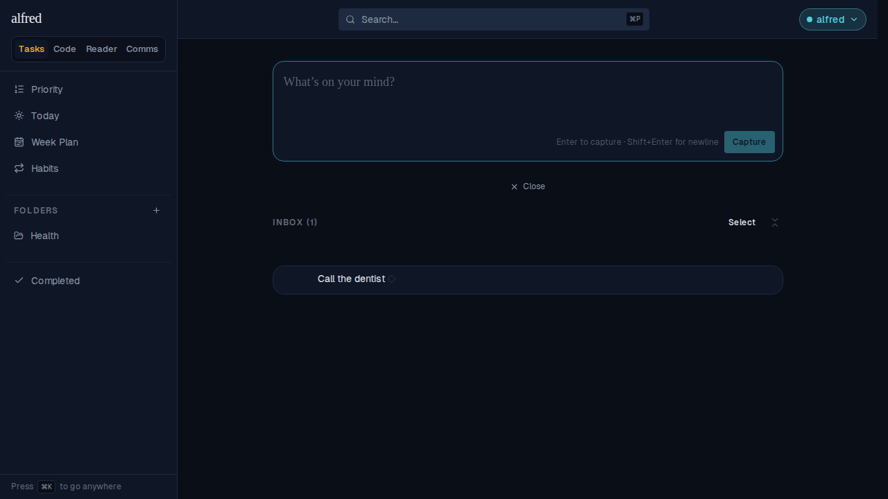
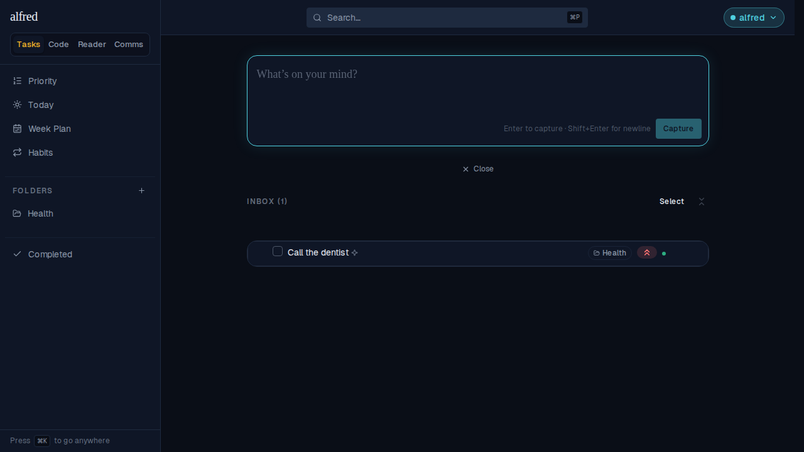

# Refetch when navigating to each screen

*2026-09-23T03:52:50.390Z*

ALF-246: every module's data was seeded once at the shell layout and never refetched on an in-app navigation. Comms and Reader already re-read on the tab returning to the foreground (visibilitychange/focus), and Code already refetches on every navigation within it (ALF-69) — but none of the three fired on an ordinary in-app module switch, since that never hides or blurs the document. This adds the same navigation-keyed reconcile to Tasks/Inbox, Comms, and Reader, mirroring Code's existing pattern: each module's view-router fires a lightweight refetch on every pathname change within it (entry to the module included).

The clearest case is the Inbox: the classifier sweep Worker writes a verdict onto a captured item minutes later. A live realtime channel usually catches that, but a dropped connection (or, as here, this test's mock backend, which has no websocket at all) leaves the row stuck exactly as captured — until now, only a hard reload would have picked it up. Below: an unjudged capture, a verdict written straight to the database (simulating the sweep, with no realtime push behind it), then an ordinary switch away to Comms and back to the Inbox via the command palette — a client-side navigation, not a reload.



Verdict written server-side (simulating the sweep), then Comms → command palette → Inbox — a client-side pushState, not a reload. The row now carries the Health folder chip and the high-priority mark, and the 'Not yet classified' glyph is gone:



That's Tasks/Inbox specifically. The same mechanism covers Code, Comms, and Reader — each module's own view-router fires its refetch on entry, and Tasks fires again on the return trip. One pass through Tasks → Code → Comms → Reader → Tasks, with every /api/* request logged:

```bash
cat docs/demos/alf-246-navigation-refetch/requests.txt
```

```output
GET /api/items
GET /api/code/loc-velocity
GET /api/code/pr-ratio
GET /api/code
GET /api/comms/snapshot
GET /api/reader/posts
GET /api/reader/health
GET /api/items
```

GET /api/items opens and closes the trip — the same endpoint fires again on the return to Tasks, proving it's a per-navigation reconcile and not a one-time mount effect. Code's /api/code/loc-velocity and /api/code/pr-ratio are that module's own Dashboard widgets, unrelated to this ticket; /api/code is refreshStatuses (ALF-69, unchanged by this ticket — the precedent this work generalizes). /api/comms/snapshot and the two /api/reader/* reads are this ticket's new Comms and Reader triggers.
