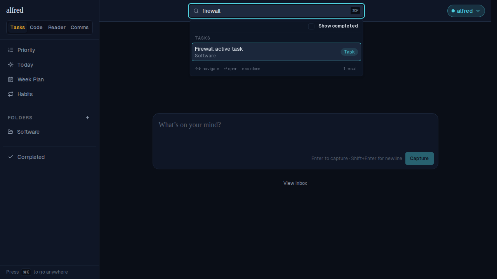
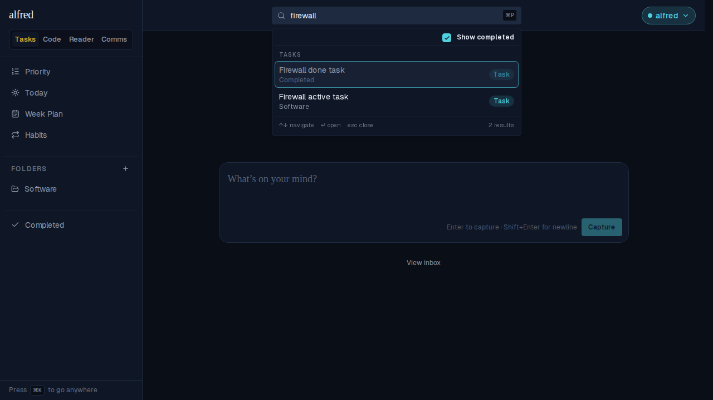

# ALF-248 — hide completed items from search by default

*2026-09-23T03:51:12.344Z*

The top-bar global search (⌘P) used to include completed tasks and terminal (done/abandoned) code stories in results, just de-emphasized with lower opacity. Now they're excluded by default — a search is usually chasing something still live — and a new "Show completed" checkbox in the results dropdown reveals them on demand.

### Searching "firewall" with a matching completed task in the seed data — hidden by default

### Checking "Show completed" reveals it, de-emphasized and labeled Completed

### Storybook baseline diff — the new checkbox row added to the results popover
This moves the `Shell/SearchBox` committed visual snapshot; approved with `npm run test:storybook:update -w frontend` (baseline | changed pixels | new render):

