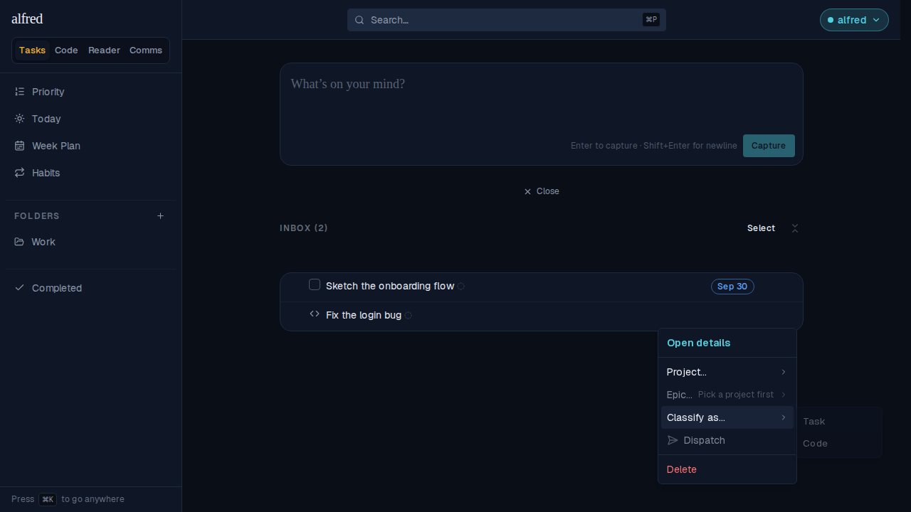
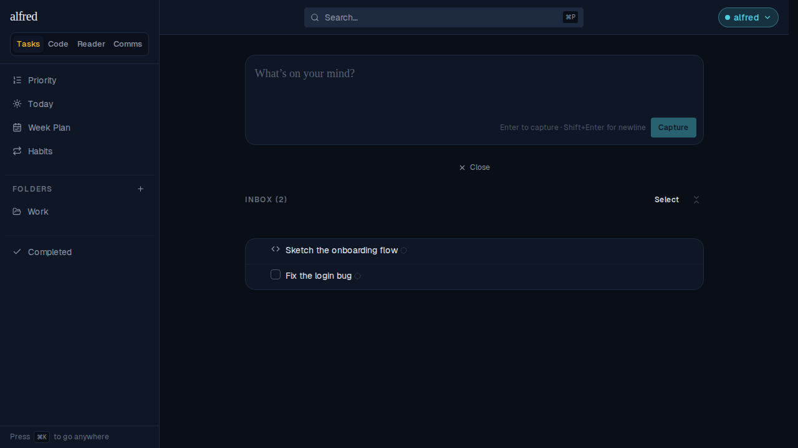
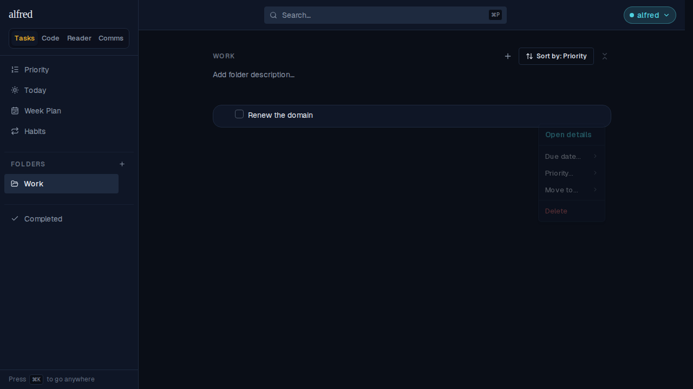

# Restore code-item ⇄ task reclassification (ALF-253)

*2026-09-23T03:56:46.604Z*

The LLM inbox classifier sometimes guesses wrong — a bug report gets classified `code`, a research task gets classified `task` when it should have been `code`. Until now there was no way to fix that from the Inbox: **Classify as…** disappeared the moment a row had a type, so the only way back was Delete and re-capture. ALF-253 restores the correction, in both directions, for as long as the row sits in the Inbox — once it leaves (filed to a folder, sent to the Code module), its type is settled like everything else about it. Converting drops exactly the fields the new type can't hold (a task's due date/recurrence, a code row's project/epic hints) in the same write — nothing is silently stranded. Driven through the running app against the in-memory Supabase mock (the Playwright harness), so this is the real route handlers, stores, and menu.

**1 · Two misclassified rows.** "Fix the login bug" landed as `code` (the `<>` glyph, no checkbox); "Sketch the onboarding flow" landed as `task` with a due date — both wrong.

**2 · Classify as… is still offered.** Opening "Fix the login bug"'s ⋯ menu shows **Classify as…** sitting alongside its code-only labels (Project…, Epic…) — not replaced by them. `Task` is highlighted, one Enter away.

**3 · Corrected to Task.** The checkbox is back and the code glyph is gone — the same single `classifyItem` write the original classification used, just run again in the other direction.

**4 · The reverse direction, with fields to drop.** "Sketch the onboarding flow" carried a due date as a (wrongly-classified) task. Reclassifying it to Code in one menu action both flips the type **and drops the due date in the same write** — the code glyph appears and the `Sep 30` chip is simply gone, not stranded on a row that can no longer hold it.

**5 · Once dispatched, the window closes.** "Renew the domain" already lives in the Work folder. Its ⋯ menu carries Due date…, Priority…, Move to… and Delete — but no **Classify as…**: a row's type is only fixable while it is still sitting in the Inbox, per the ticket's scope.

**Under the hood.** The write itself (`classifyPatch` in `lib/stores/tasks-store.tsx`) already dropped the right fields per direction — it just wasn't reachable from a typed row's menu. The fix widens the row menu's and bulk bar's `Classify as…` gate back open for a `task`/`code` row (previously `unclassified`-only), adding an explicit **Inbox-only** gate (`isInboxRow`) so a dispatched or Completed-view row never offers it. No schema or API change: the PATCH route and the `items_task_only_fields` / `items_intended_project_code_only` CHECK constraints already accepted exactly this shape.
