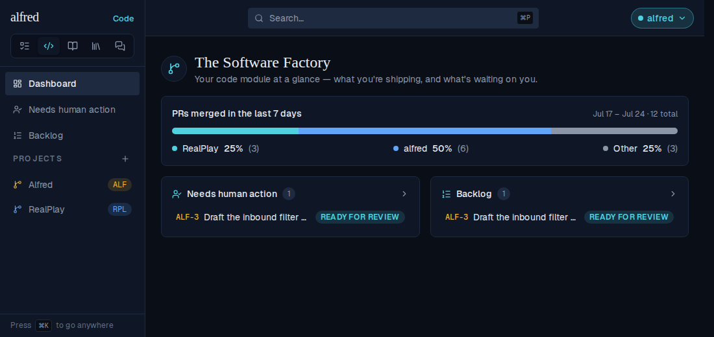
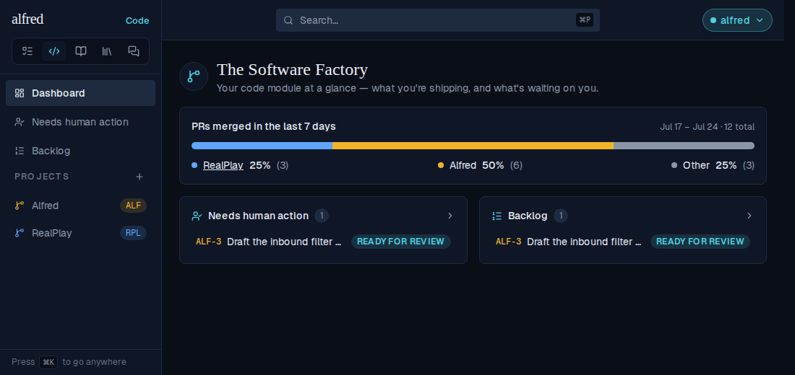
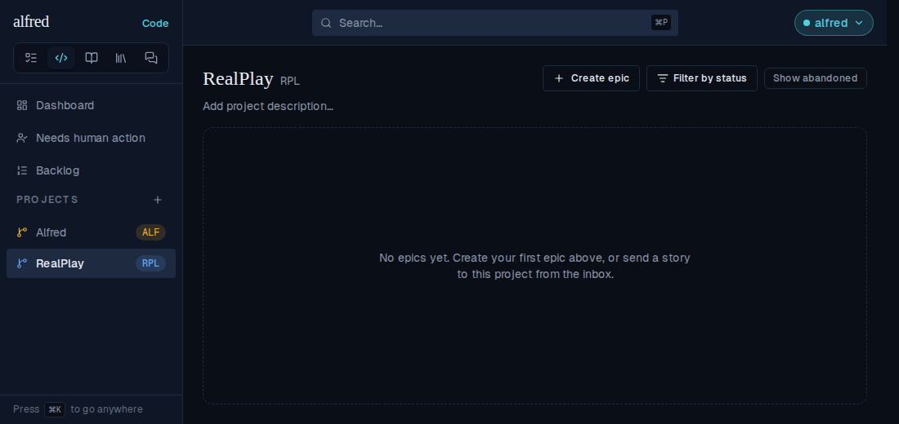
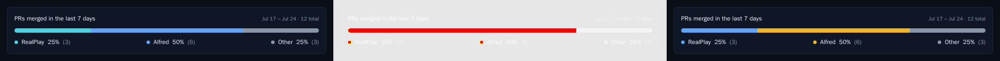
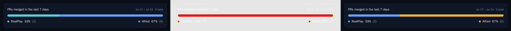
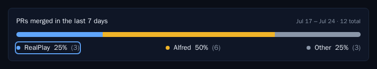
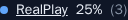

# PR ratio measures the Code module's projects, in their own names and colours

*2026-09-28T04:17:44.148Z*

Before this change the Dashboard's two GitHub cards measured the repos listed in the `PR_RATIO_REPOS` env var, labelled by its `:Label` suffix and coloured teal → blue → amber → green in env order. The rest of the Code module colours each project blue → amber → green → red → teal by creation order. So one screen could show the same repo in two names and two colours. Now the `projects` table is the only list: both routes measure exactly the project repos, oldest first, each labelled with the project's name, and the card colours each segment with the same `projectColorFor` rule ProjectNav uses. Each project's legend row also links to its board.

## 1 · The Dashboard, before and after

Two projects: **RealPlay** (created first, so blue, `RPL`) and **Alfred** (created second, so amber, `ALF`). Alfred holds the only open story, so the sidebar ranks it first. `PR_RATIO_AUTHORS` is set, so Other is measured. The GitHub counts are stubbed at the network boundary (`page.route`), exactly as the E2E suite does, because no demo may reach GitHub. **Before:** the deployment's `PR_RATIO_REPOS=ac3charland/realplay:RealPlay,ac3charland/alfred` drives the bar. Alfred is amber in the sidebar but blue in the bar, RealPlay is blue in the sidebar but teal in the bar, and the bar says `alfred` (the repo name, since the env entry had no `:Label`) where the sidebar says `Alfred`.



**After:** the same deployment, with `PR_RATIO_REPOS` gone. The bar and its dots now run blue then amber, the colours RealPlay and Alfred wear in the sidebar beside them, and the label is the project's own name, `Alfred`. The bar keeps creation order (RealPlay first) while the sidebar ranks by open work (Alfred first); colour is keyed to creation order, so the bar reads the same week to week. Other is unchanged: muted, last.


Each project's legend row is now a link. Hovering RealPlay underlines its name:



…and a plain click opens RealPlay's board client-side, at `/code/p-realplay`, with RealPlay selected in the sidebar. Other stays plain text, since it isn't one place to go.



## 2 · The moved visual baselines

The `Code/PrRatio` stories now render inside a `CodeProvider` seeded with the two projects whose repos the stubbed payloads name (RealPlay first, Alfred second). The snapshot gate flagged exactly the three baselines whose segments changed colour. Each diff below reads baseline | changed pixels (red) | new render: only the bar segments and legend dots move (teal/blue → blue/amber), and Other and every text pixel stay put. The new renders were approved with `npm run test:storybook:update -w frontend`.

`code-prratio--ready`:


`code-prratio--with-other`:



`code-prratio--other-empty`:



## 3 · The endpoints read the repo set from `projects`

Below, the real Next app runs against the in-memory Supabase mock the E2E suite uses. Real route handlers, a real Supabase client and the real config all run; only `api.github.com` is stubbed, by a preload (`github-stub.mjs`) that answers inside the Next server with fixed counts (realplay 3, alfred 6, lumen 1, Other 2) and logs every search query. The deployment still carries a leftover `PR_RATIO_REPOS` naming two repos that are **not** projects, and nothing reads it. The script calls with the ingest API key, so each read goes through the admin client, and it reseeds `projects` between steps. The week window and weekly buckets move with the clock, so only the fields that don't are printed. Order of gates: 401 without credentials; with no projects, both endpoints are unconfigured (501); one project is a velocity series but not a split; with three projects seeded newest-first, both endpoints answer in `created_at` order, each repo labelled with its project's name, and the Other sweep subtracts every project repo.

```bash
docs/demos/alf-268-project-sourced-pr-ratio/with-app.sh
```

```output
--- no session, no key
pr-ratio     401
loc-velocity 401

--- ingest key, NO projects (PR_RATIO_REPOS is still set, and ignored)
pr-ratio     501  {"error":"PR ratio is not configured"}
loc-velocity 501  {"error":"Lines-changed velocity is not configured"}

--- ingest key, ONE project: a series, but not a split
pr-ratio     501  {"error":"PR ratio is not configured"}
loc-velocity 200  {"repos":["ac3charland/alfred"]}

--- ingest key, three projects, seeded as [Lumen, Alfred, RealPlay]
pr-ratio     200  total 12
                   {"repo":"ac3charland/realplay","label":"RealPlay","count":3,"percentage":25}
                   {"repo":"ac3charland/alfred","label":"Alfred","count":6,"percentage":50}
                   {"repo":"ac3charland/lumen","label":"Lumen","count":1,"percentage":8}
                   other {"count":2,"percentage":17}
loc-velocity 200  {"repos":["ac3charland/realplay","ac3charland/alfred","ac3charland/lumen"]}

--- what GitHub was asked for that split
search repo:ac3charland/alfred
search repo:ac3charland/lumen
search repo:ac3charland/realplay
search Other: author:ac3charland -repo:ac3charland/realplay -repo:ac3charland/alfred -repo:ac3charland/lumen
```

## 4 · New baselines for the legend link's states

Two new `Code/PrRatio` stories pin the link cues visually. Keyboard focus (`code-prratio--legend-keyboard-focus`): Tab lands on RealPlay's row and draws the app's blue focus ring, and Other, not being a link, can't take it:



Hover (`code-prratio--legend-hover`, cropped to the link): the name underlines:


