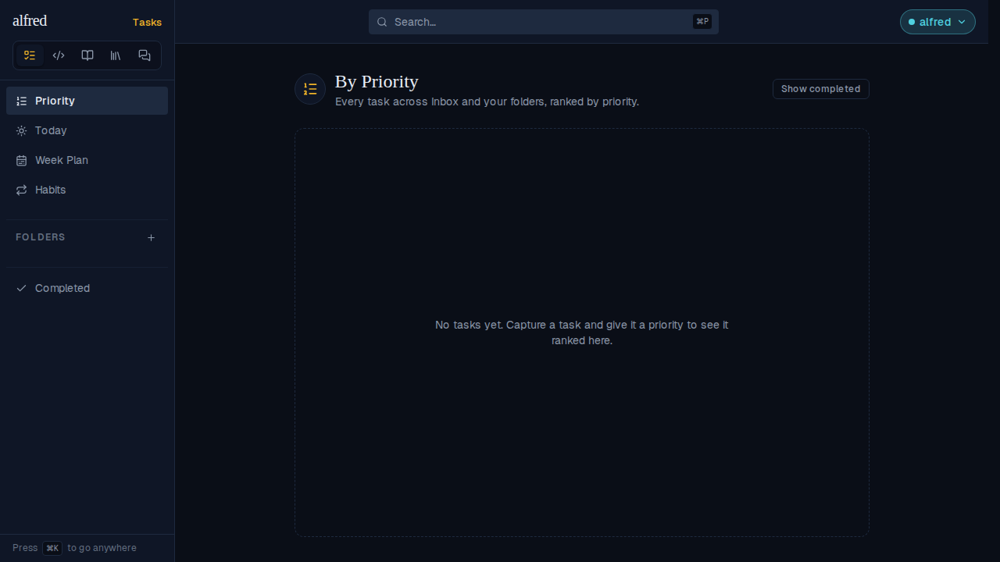
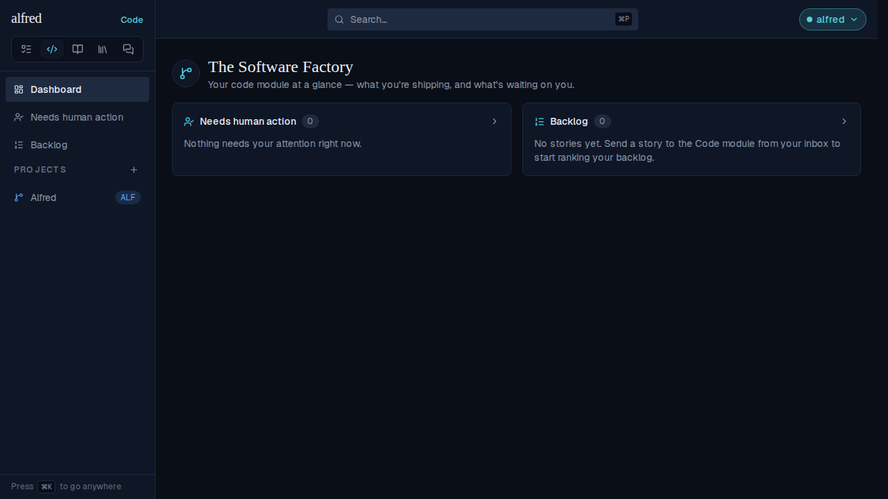
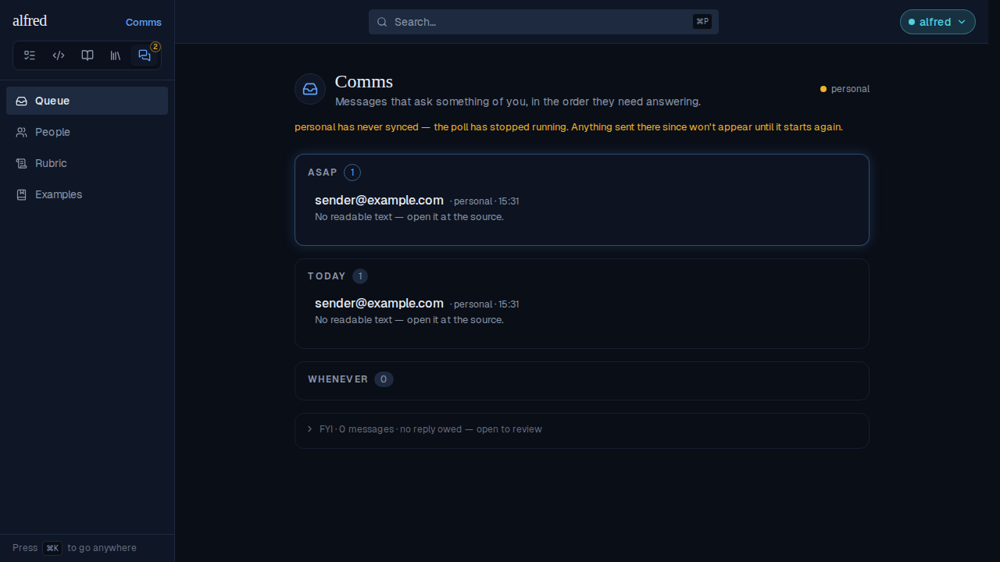
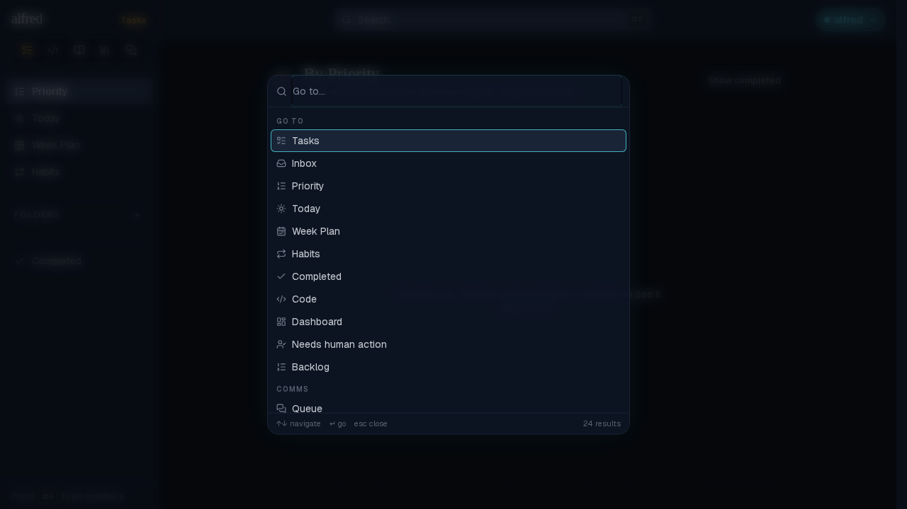
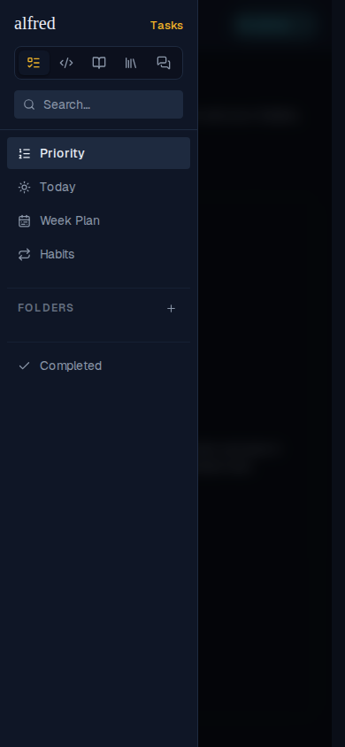
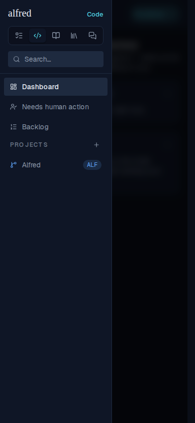

# ALF-270 — icon-only module switcher

*2026-09-26T16:28:59.061Z*

ALF-270 replaces the five-word segmented module switcher with five equal-width icon segments, and gives the sidebar its width back: 280px (`md:w-70`) down to 224px (`md:w-56`). The open module's name moved to the sidebar's wordmark row instead, right-aligned opposite `alfred`, in that module's accent colour.

Storybook baselines for the five `Shell/ViewSwitcher` stories moved — this is the auto-generated 3-panel diff (baseline | changed pixels | received) for each, proving the old 280px wordy control became the new 224px icon-only one, with each active module keeping its own accent.

Live app — desktop sidebar at 224px, Tasks active. The switcher shows five equal-width icon segments (Priority, Code, Reader, Wiki, Comms order), and the wordmark row names the open module ("Tasks", amber) at its right edge, aligned with the switcher's own right edge.

Clicking the Code icon switches modules: the icon that was clicked stays in the same place (equal-width cells never reflow), it now wears the Code teal, and the wordmark-row name follows to "Code" in the same teal.

The Comms queue badge still overlaps the Comms icon's top-right corner when messages are waiting for a reply.

`MODULE_ICON` is the single source of a module's icon: the ⌘K command palette's Go-to destinations still show the same Tasks/Code/… icons after the refactor.

Mobile drawer at 224px, Tasks active — the wordmark row names the module here too.

Tapping Code in the drawer's switcher keeps the drawer open (ALF-157, unchanged) and swaps in the Code nav, with the wordmark-row name now reading "Code" in teal.

The desktop sidebar and mobile drawer measure exactly 224px in Playwright (`e2e/module-switcher.spec.ts`), the switcher's icon-only geometry never crosses the sidebar border, and "Needs human action" — ProjectNav's longest label — was checked in the running app and does not clip at 224px, so no fallback to 240px was needed.
