# ALF-271: Evidence bullets to the wiki, beside Novel ideas

*2026-09-27T19:16:12.948Z*

A Reader post's **Evidence** section is now a checklist like **Novel ideas**. Both sections share one selection, so ideas and their evidence go to the wiki together: one **Send to wiki** press is one request, one commit and one `inbox/` folder. Each section's heading row has **Select all**, which ticks that section's unsent bullets and sends nothing — the bar's **Send to wiki** is the only send. In the wiki, the picks file is now headed `## Novel ideas` / `## Evidence`, and sent evidence is recorded in its own column, `reader_posts.wiki_sent_evidence`.

## 1. The journey, in the running app

The real app against the E2E harness's mock Supabase and mock GitHub, driven by Playwright. The post has three ideas (one sent earlier) and three pieces of evidence.

**Nothing ticked.** Evidence is a checklist now, with its own **Select all**; the violet **Send all to wiki** is gone from both heading rows.

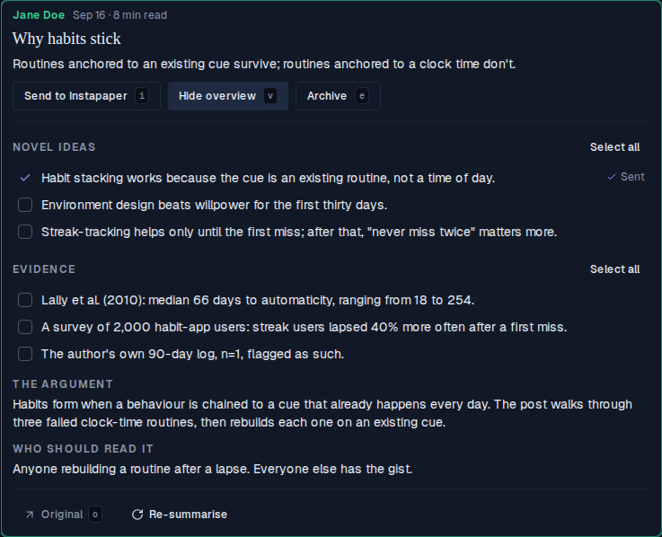

**One idea and one piece of evidence ticked.** One selection across both sections, counted in one bar that sits under the last checklist section — Evidence. "2 selected" and **Clear** sit the same 16 px either side of **Send to wiki**.

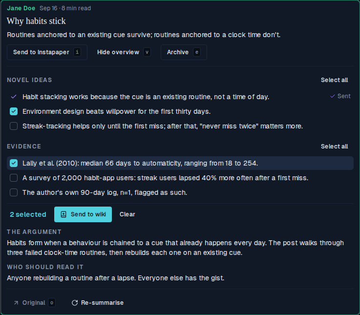

**Send to wiki**, held in flight for two seconds so it can be shot: every control in both sections is disabled — both **Select all** buttons, every tick box, **Send to wiki** and **Clear** — and the pressed button reads **Sending…**. Bullet text stays at full strength; only the tick boxes dim.

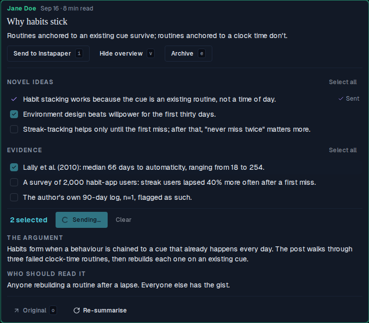

**Sent.** The idea and the evidence bullet both flip to the violet sent state, the selection empties and the bar folds away.

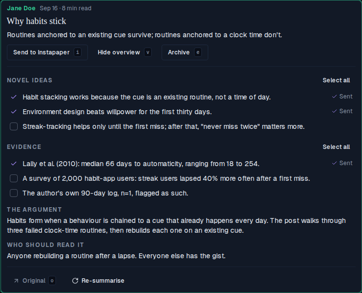

**Tick the streaks idea by hand, then press Evidence's Select all.** Select all ticks every unsent evidence bullet and sends nothing (the bar now counts 3). Both sections read **Deselect all**, because every unsent bullet in each is ticked — Novel ideas' one unsent idea was ticked by hand. Sent bullets never count.

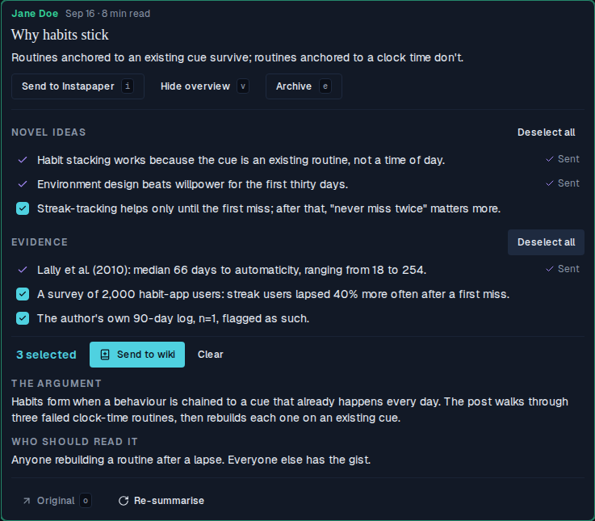

**Send to wiki** — one press, three bullets, one commit. Every bullet in both sections is sent, so each heading row reads **All sent to wiki** and there is no bar.

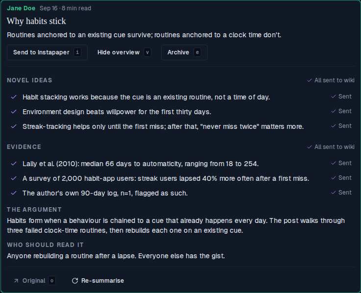

**The bar revealing under Evidence** (motion, so a GIF): the first tick opens it through `AnimatedHeightCollapse`, a second tick in the other section updates the one counter, and **Clear** folds it away.


## 2. Storybook baselines

Four `Reader/PostRow` baselines moved, each on purpose; each diff is baseline | changed pixels | new render. `WikiNotConnected` (the Work instance, `writable: false`) did **not** move: with no wiki writer, both sections are the same plain lists, pixel for pixel.

**WikiNothingTicked** — Evidence becomes a checklist; both heading rows carry a plain ghost **Select all** instead of the violet **Send all to wiki**.

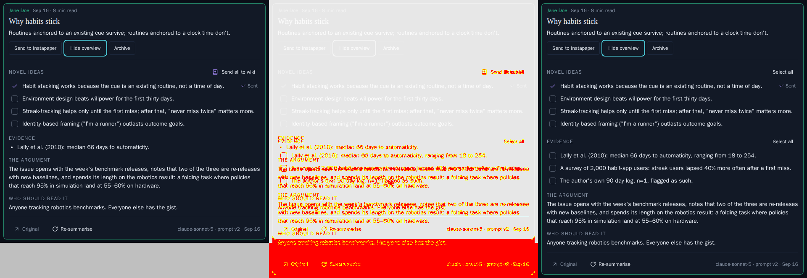

**WikiTwoTicked** — the bar moves down under Evidence (the last checklist section), with the counter and **Clear** evenly spaced about **Send to wiki**.

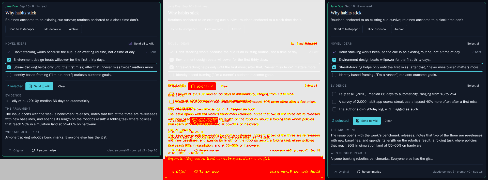

**WikiSending** — the same, mid-send: every control in both sections disabled.

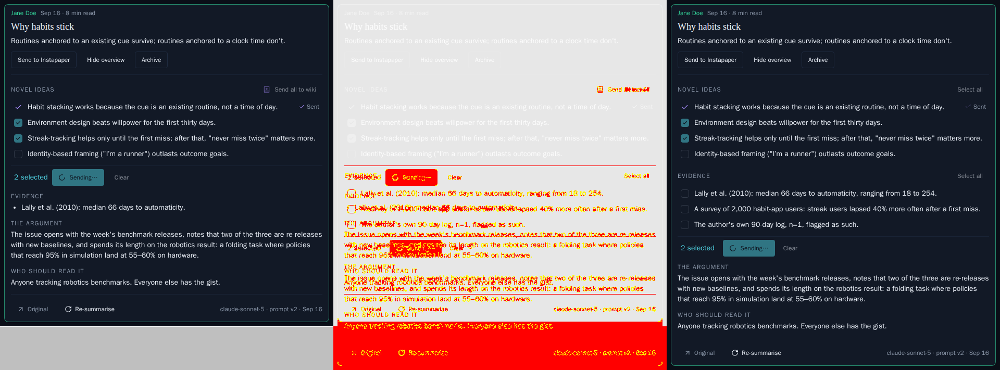

**WikiAllSent** — both lists sent: **All sent to wiki** on both heading rows.

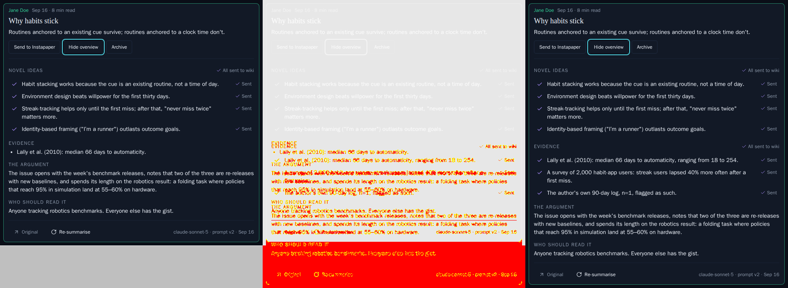

Three new stories. **WikiPickedAcrossSections** — one idea and one piece of evidence ticked, one bar counting both:

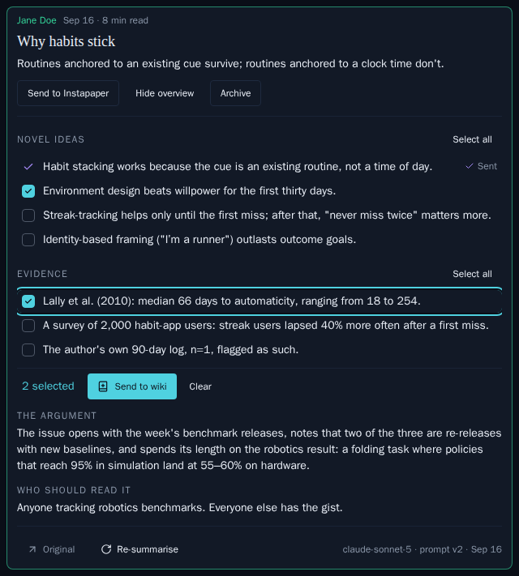

**WikiSelectAllEvidence** — the streaks idea ticked by hand, then Evidence's **Select all**: both sections read **Deselect all**, three selected, nothing sent yet:

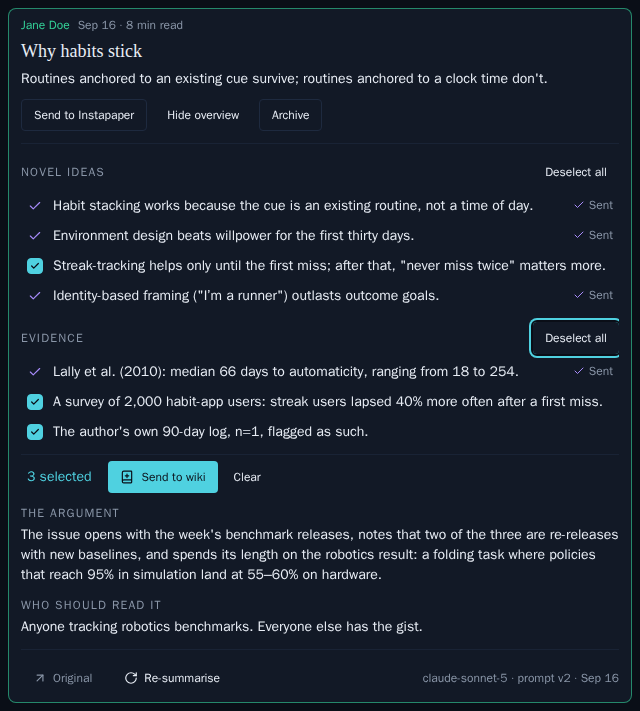

**WikiEvidenceOnly** — a post with no novel ideas: Novel ideas keeps its honest empty line at its normal height, and Evidence alone is a checklist, with the bar under it:

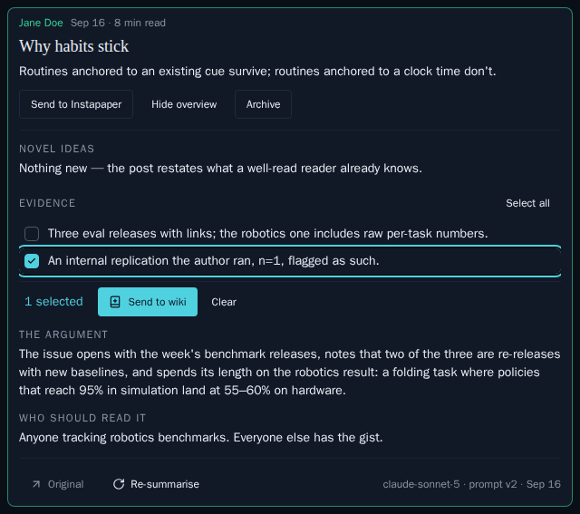

## 3. The send route's contract, against the mock GitHub

`with-app.sh` builds the app against the E2E harness's mock Supabase + mock GitHub, boots both on this demo's own ports, signs in with `@supabase/ssr`, and runs sections of `picks-contract.mjs` — each on a freshly reset mock. Today's UTC date is masked as `<today>`; the mock numbers its shas in sequence.

**A mixed send** — one idea and one piece of evidence in one request: one commit, one new `inbox/` folder, and one picks file headed `## Novel ideas` then `## Evidence`. The response is the list row: both sent columns extended, and no `text` key.

```bash
docs/demos/alf-271-evidence-to-wiki/with-app.sh mixed 2>/dev/null
```

```output
════ mixed ════
One idea and one piece of evidence, one request:

POST /api/reader/posts/55555555-5555-4555-8555-555555555561/wiki
{
  "ideas": [
    "Environment design beats willpower for the first thirty days."
  ],
  "evidence": [
    "Lally et al. (2010): median 66 days to automaticity, ranging from 18 to 254."
  ]
}

→ 200  (the row, as the list shows it)
wiki_sent_ideas    ["Environment design beats willpower for the first thirty days."]
wiki_sent_evidence ["Lally et al. (2010): median 66 days to automaticity, ranging from 18 to 254."]
has "text" key     false

main moved c000012000000000000000000000000000000000 → c000018000000000000000000000000000000000, parents ["c000012000000000000000000000000000000000"]
commits on main 2 (the mock's init commit + this one)
  inbox/<today>-why-habits-stick/picks-<today>.md
  inbox/<today>-why-habits-stick/source.md

── inbox/<today>-why-habits-stick/picks-<today>.md ──
---
source_type: "reader-post"
origin: "model-derived"
title: "Why habits stick"
author: "Jane Doe"
source_url: "https://janedoe.substack.com/p/why-habits-stick"
published: "2026-09-16"
captured: "<today>"
via: "alfred-reader"
external_id: "alfred:reader-post:55555555-5555-4555-8555-555555555561"
---

## Novel ideas

- Environment design beats willpower for the first thirty days.

## Evidence

- Lally et al. (2010): median 66 days to automaticity, ranging from 18 to 254.
```

**Evidence alone**, then **today's `{ ideas }` body** — what a tab still running the previous bundle posts during the deploy. Both still make one commit; a picks file only carries the headings its send has bullets for, and an ideas-only send is now headed too, so every picks file has one shape. Then the **refusals**: a stale evidence bullet is a 409 with its own sentence, a stale idea is reported first when both lists are stale, each list is checked against its own section (an idea sent as evidence is stale), and a bad body is a 400. None of them commits, and a send with nothing fresh answers 200 without moving `main`.

```bash
docs/demos/alf-271-evidence-to-wiki/with-app.sh evidence-only ideas-only refused 2>/dev/null
```

```output
════ evidence-only ════
Evidence alone:

POST /api/reader/posts/55555555-5555-4555-8555-555555555561/wiki
{
  "evidence": [
    "Lally et al. (2010): median 66 days to automaticity, ranging from 18 to 254.",
    "A survey of 2,000 habit-app users: streak users lapsed 40% more often after a first miss."
  ]
}

→ 200  (the row, as the list shows it)
wiki_sent_ideas    []
wiki_sent_evidence ["Lally et al. (2010): median 66 days to automaticity, ranging from 18 to 254.","A survey of 2,000 habit-app users: streak users lapsed 40% more often after a first miss."]
has "text" key     false

main moved c000012000000000000000000000000000000000 → c000018000000000000000000000000000000000, parents ["c000012000000000000000000000000000000000"]
commits on main 2 (the mock's init commit + this one)
  inbox/<today>-why-habits-stick/picks-<today>.md
  inbox/<today>-why-habits-stick/source.md

── inbox/<today>-why-habits-stick/picks-<today>.md ──
---
source_type: "reader-post"
origin: "model-derived"
title: "Why habits stick"
author: "Jane Doe"
source_url: "https://janedoe.substack.com/p/why-habits-stick"
published: "2026-09-16"
captured: "<today>"
via: "alfred-reader"
external_id: "alfred:reader-post:55555555-5555-4555-8555-555555555561"
---

## Evidence

- Lally et al. (2010): median 66 days to automaticity, ranging from 18 to 254.
- A survey of 2,000 habit-app users: streak users lapsed 40% more often after a first miss.

════ ideas-only ════
Today's `{ ideas }` body, as a tab still on the previous bundle posts it:

POST /api/reader/posts/55555555-5555-4555-8555-555555555561/wiki
{
  "ideas": [
    "Habit stacking works because the cue is an existing routine, not a time of day."
  ]
}

→ 200  (the row, as the list shows it)
wiki_sent_ideas    ["Habit stacking works because the cue is an existing routine, not a time of day."]
wiki_sent_evidence []
has "text" key     false

main moved c000026000000000000000000000000000000000 → c000032000000000000000000000000000000000, parents ["c000026000000000000000000000000000000000"]
commits on main 2 (the mock's init commit + this one)
  inbox/<today>-why-habits-stick/picks-<today>.md
  inbox/<today>-why-habits-stick/source.md

── inbox/<today>-why-habits-stick/picks-<today>.md ──
---
source_type: "reader-post"
origin: "model-derived"
title: "Why habits stick"
author: "Jane Doe"
source_url: "https://janedoe.substack.com/p/why-habits-stick"
published: "2026-09-16"
captured: "<today>"
via: "alfred-reader"
external_id: "alfred:reader-post:55555555-5555-4555-8555-555555555561"
---

## Novel ideas

- Habit stacking works because the cue is an existing routine, not a time of day.

════ refused ════
an evidence bullet the overview no longer offers: {"evidence":["Reworded evidence."]}
  → 409  {"error":"That evidence isn't in this post's overview any more"}
a stale idea AND stale evidence: {"ideas":["A reworded idea."],"evidence":["Reworded."]}
  → 409  {"error":"That idea isn't in this post's overview any more"}
an idea sent as evidence: {"evidence":["Habit stacking works because the cue is an existing routine, not a time of day."]}
  → 409  {"error":"That evidence isn't in this post's overview any more"}
neither list: {}
  → 400  {"error":"Invalid request body","details":[{"code":"custom","path":[],"message":"Pick at least one bullet"}]}
a blank evidence bullet: {"evidence":["  "]}
  → 400  {"error":"Invalid request body","details":[{"code":"custom","path":["evidence",0],"message":"A bullet must not be blank"}]}

Sending one piece of evidence, then the same one again: the second has nothing fresh.
  → 200  main still at c000046000000000000000000000000000000000 (was c000046000000000000000000000000000000000)
  wiki_sent_evidence ["Lally et al. (2010): median 66 days to automaticity, ranging from 18 to 254."]
  every refusal above committed nothing: main went c000040000000000000000000000000000000000 → c000046000000000000000000000000000000000 once
```

## 4. The column and the RPC, on real Postgres

`append-picks.ts` stands up the throwaway cluster the database suite uses, applies every committed migration, and calls `append_wiki_sent_picks` as `authenticated`, the way the route does. One UPDATE appends to both columns, each with `append_wiki_sent_ideas`'s rules: only strings not already present, duplicates collapsed, first-occurrence order. Each list is checked against its own column, so the same text in the other section is a different bullet. An empty list leaves its column untouched.

```bash
node docs/demos/alf-271-evidence-to-wiki/append-picks.ts 2>/dev/null
```

```output
reader_posts:
  wiki_sent_evidence  ARRAY  not null  default '{}'::text[]
  wiki_sent_ideas  ARRAY  not null  default '{}'::text[]
functions (the ideas-only original stays, expand-then-contract):
  append_wiki_sent_ideas(p_post uuid, p_ideas text[])
  append_wiki_sent_picks(p_post uuid, p_ideas text[], p_evidence text[])

append ideas ["Cue beats clock","Streaks mislead","Cue beats clock"], evidence ["Lally 2010","Lally 2010"]
  → wiki_sent_ideas    ["Cue beats clock","Streaks mislead"]
  → wiki_sent_evidence ["Lally 2010"]
append ideas ["Lally 2010","Streaks mislead"], evidence ["Cue beats clock"]
  → wiki_sent_ideas    ["Cue beats clock","Streaks mislead","Lally 2010"]
  → wiki_sent_evidence ["Lally 2010","Cue beats clock"]
append ideas [], evidence ["A 2,000-user survey"]
  → wiki_sent_ideas    ["Cue beats clock","Streaks mislead","Lally 2010"]
  → wiki_sent_evidence ["Lally 2010","Cue beats clock","A 2,000-user survey"]
```

## 5. The cross-repo contract check, against the wiki repo

Run by hand against a read-only clone of `ac3charland/knowledge` (at `95118bd`), which CI doesn't have — so this section is notes, not `exec` blocks. Nothing was pushed to the wiki repo.

- **Golden folders.** Alfred's own `readerEnvelope` and `folderName` wrote two sends into the clone's `inbox/`, with distinct `external_id`s and URLs: `2026-09-27-why-habits-stick` (full text + a mixed picks file, `## Novel ideas` then `## Evidence`) and `2026-09-27-evidence-only-swept` (a swept post's pointer + an evidence-only picks file).
- **Wiki lint** (`npm run lint`): exit 0 — **0 errors**, and **no findings of any severity** on either golden folder. The 6 warnings are all on the wiki's own existing pages. The lint's one heading rule (`record-heading-mismatch`) only reads bodies whose frontmatter carries `quotes` / `entries` records, which a picks file never does, so headed picks bodies are accepted as they are.
- **File-batch dry run** (`npm run file-batch -- --dry-run --json`): both golden folders come back `"action": "new"`, each filing `picks-2026-09-27.md` + `source.md` into its own `raw/2026/` folder.

The wiki needs no registry or ingest change for this story. What stays for after merge is the behavioural half: whether the ingest session uses a `## Evidence` bullet as support for the idea beside it rather than as a free-standing claim.
