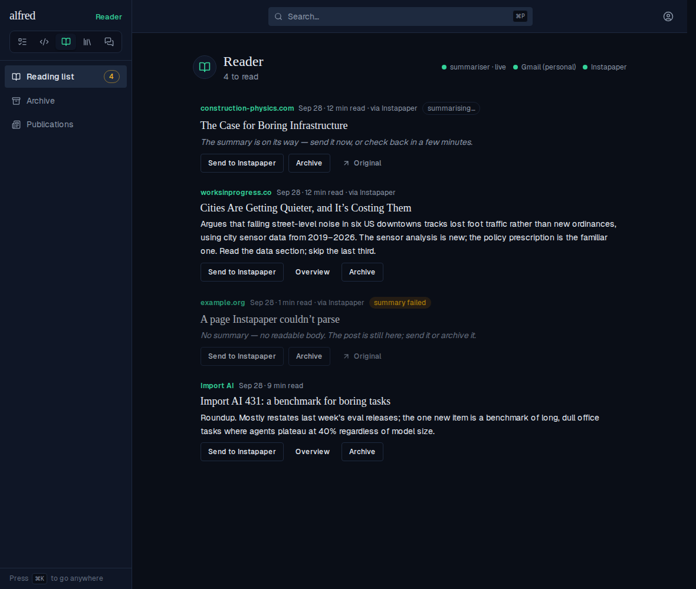
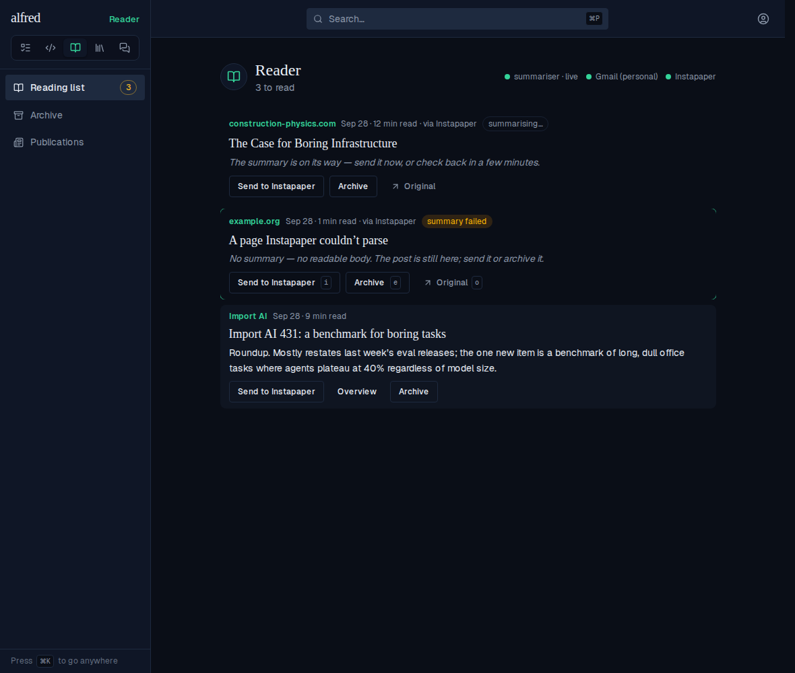
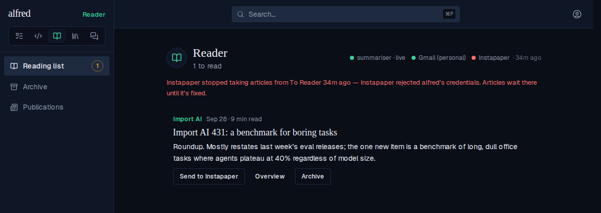
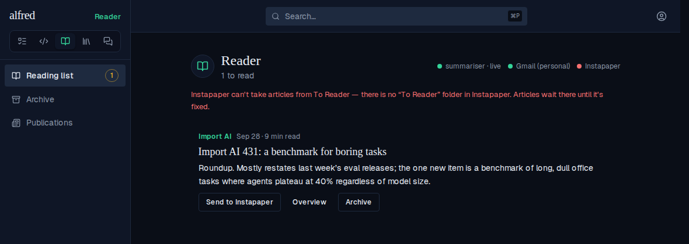
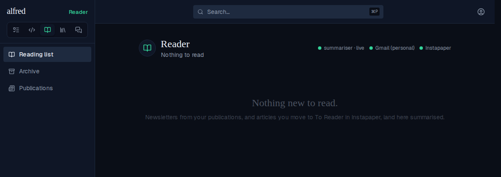

# ALF-272 — the To Reader folder: Instapaper articles in the Reader

*2026-09-28T18:02:11.405Z*

Move an article into an Instapaper folder named **To Reader** and, within one five-minute Reader tick, it is a Reader post — summarised by the same summariser and prompt as a newsletter, and archived in Instapaper. Its row names the site it is from and says it came *via Instapaper*; **Send to Instapaper** moves the owner's own bookmark back to Unread. A third header dot says when Instapaper is refusing alfred, without blaming the summariser.

## The reading list, with articles in it (live app)

The app on the mock backend, seeded with three articles in the three states they reach the list in, above a newsletter: one just taken in and waiting on its summary, one summarised, and one Instapaper could make no text of (error 1550, filed with the newsletter floor: its title and Original link). Each eyebrow is the article's site (`worksinprogress.co`, not `www.WorksInProgress.co`), each meta line ends `· via Instapaper`, and every verb is the one a newsletter row has. The newsletter at the bottom is unchanged. Dated by intake, so a bookmark saved months ago still lands at the top. The third dot, Instapaper, is green: the leg's last pass was clean.



## Send on an article moves its own bookmark back to Unread

Pressing **Send to Instapaper** on *Cities Are Getting Quieter* archives the row as it does for a newsletter (the list drops to 3) — but the route calls `bookmarks/unarchive` with the article's own bookmark id instead of saving a new bookmark, so the owner gets their bookmark back, with its progress and highlights, and no body is uploaded:



What the stand-in Instapaper recorded for that press, and the post as the mock database held it afterwards (written by the capture run):

```bash
cat docs/demos/alf-272-to-reader/send-recorded.json
```

```output
{
  "instapaperRequests": [
    {
      "path": "/api/1/bookmarks/unarchive",
      "params": {
        "bookmark_id": "1900042"
      }
    }
  ],
  "post": {
    "source": "instapaper",
    "instapaper_bookmark_id": 1900042,
    "instapaper_sent": true,
    "archived": true
  }
}
```

If the owner has deleted that bookmark, Instapaper answers `1241` and the route saves the article again by URL with no content — pinned in `route.test.ts` and `bookmark.test.ts`, alongside newsletter sends, which are unchanged (`bookmarks/add` with the email body).

## The Instapaper dot when Instapaper refuses alfred (live app)

After a success: the dot goes red with the time since that last success (a failing leg re-stamps its error every tick, so the error's own age would always read "just now"), and one red line says what waits where. The summariser stays green — newsletters are still flowing.



Before any success — here, no folder named To Reader: red, no time on the dot, and the line says Instapaper *can't* take articles. On a deployment without the four secrets there is no dot at all (the list screenshot above minus the third dot — see the `Healthy` baseline).



## The empty list names the new source



That copy change moved the committed `Reader/ReadingListView › Empty` baseline; the snapshot gate's diff (baseline | changed pixels | new), approved with `test:storybook:update`:


## The Worker's To Reader leg (the real tick, stand-in services)

There is no screen for the tick, so the evidence is its traffic. `to-reader-harness.mjs` bundles the REAL `runReaderTick` from `workers/src/reader/scheduled.ts` and hands it a `fetch` that plays Instapaper, PostgREST, Google's token endpoint and the model in memory; it prints every subrequest in order, the `reader_posts` rows written and the health columns left. Cloud sessions can't reach instapaper.com, so this is what stands in for a live run until the owner's first `eval:reader -- --instapaper`.

**Three bookmarks in To Reader.** The leg runs last, in the slots the (empty) newsletter worklist left; it lists before the Gmail token is minted; bookmarks are taken oldest first. Each is read (`get_text`), INSERTed as `source = instapaper` (the claim and the floor), archived in Instapaper, then summarised with its site as `Publication:` — a Substack app link is stored as `harborline.substack.com`. The 1550 page is filed `failed / no readable body` in the insert itself, archived, and costs no model call. The mail identity stays null; `received_at` is the tick's instant. The leg's success rides the tick's closing health write.

```bash
node docs/demos/alf-272-to-reader/to-reader-harness.mjs take
```

```output
runReaderTick → summarised 2, failures []
  instapaper {"listed":3,"taken":3,"archived":3,"restored":0,"failures":[]}
subrequests 24
  GET    reader_posts (ceiling count)
  PATCH  reader_health last_run_at
  GET    v_reader_discovery
  GET    reader_publications
  GET    reader_posts (retries)
  GET    v_reader_worklist
  Instapaper folders/list (signed)
  Instapaper bookmarks/list folder 77 (signed)
  GET    reader_posts where instapaper_bookmark_id in (502,503,501)
  Google token mint
  Instapaper bookmarks/get_text #502 (signed)
  POST   reader_posts (bookmark #502)
  Instapaper bookmarks/archive #502 (signed)
  Anthropic messages (Publication: harborline.substack.com)
  PATCH  reader_posts post-1 gist, summary_state, summarized_at, model_called_at, last_error, summarizing_since
  Instapaper bookmarks/get_text #503 (signed)
  POST   reader_posts (bookmark #503)
  Instapaper bookmarks/archive #503 (signed)
  Instapaper bookmarks/get_text #501 (signed)
  POST   reader_posts (bookmark #501)
  Instapaper bookmarks/archive #501 (signed)
  Anthropic messages (Publication: worksinprogress.co)
  PATCH  reader_posts post-3 gist, summary_state, summarized_at, model_called_at, last_error, summarizing_since
  PATCH  reader_health last_success_at, instapaper_last_success_at
reader_posts (3)
  post-1  source instapaper  bookmark #502
    title "The Grain Ledger"  site "harborline.substack.com"
    url "https://open.substack.com/pub/harborline/p/the-grain-ledger"  received 2026-09-28T15:00:00.000Z  words 14
    publication_id null  account_key null  gmail_message_id null
    summary_state done  archived_at null
  post-2  source instapaper  bookmark #503
    title "example.org"  site "example.org"
    url "https://example.org/interactive/a-page"  received 2026-09-28T15:00:00.000Z  words 0
    publication_id null  account_key null  gmail_message_id null
    summary_state failed (no readable body)  archived_at null
  post-3  source instapaper  bookmark #501
    title "Cities Are Getting Quieter"  site "worksinprogress.co"
    url "https://www.WorksInProgress.co/issue/quiet-cities"  received 2026-09-28T15:00:00.000Z  words 14
    publication_id null  account_key null  gmail_message_id null
    summary_state done  archived_at null
reader_health {"last_run_at":"2026-09-28T15:00:00.000Z","last_success_at":"2026-09-28T15:00:00.000Z","instapaper_last_success_at":"2026-09-28T15:00:00.000Z"}
```

**A failed archive.** The post stays and is still summarised; `instapaper_last_error` is stamped in the owner's words while `last_success_at` (the summariser's) is stamped as usual. Next tick the "already a post?" read finds it, so the bookmark is only archived — no second post, no second model call — and the leg is green again.

```bash
node docs/demos/alf-272-to-reader/to-reader-harness.mjs archive-fails
```

```output
— tick 1: the archive fails
runReaderTick → summarised 1, failures []
  instapaper {"listed":1,"taken":1,"archived":0,"restored":0,"failures":["bookmark 501: bookmarks/archive: unavailable (HTTP 500)"]}
subrequests 16
  GET    reader_posts (ceiling count)
  PATCH  reader_health last_run_at
  GET    v_reader_discovery
  GET    reader_publications
  GET    reader_posts (retries)
  GET    v_reader_worklist
  Instapaper folders/list (signed)
  Instapaper bookmarks/list folder 77 (signed)
  GET    reader_posts where instapaper_bookmark_id in (501)
  Google token mint
  Instapaper bookmarks/get_text #501 (signed)
  POST   reader_posts (bookmark #501)
  Instapaper bookmarks/archive #501 (signed)
  Anthropic messages (Publication: worksinprogress.co)
  PATCH  reader_posts post-1 gist, summary_state, summarized_at, model_called_at, last_error, summarizing_since
  PATCH  reader_health last_success_at, instapaper_last_error, instapaper_last_error_at
reader_posts (1)
  post-1  source instapaper  bookmark #501
    title "Cities Are Getting Quieter"  site "worksinprogress.co"
    url "https://www.WorksInProgress.co/issue/quiet-cities"  received 2026-09-28T15:00:00.000Z  words 14
    publication_id null  account_key null  gmail_message_id null
    summary_state done  archived_at null
reader_health {"last_run_at":"2026-09-28T15:00:00.000Z","last_success_at":"2026-09-28T15:00:00.000Z","instapaper_last_error":"Instapaper didn't answer","instapaper_last_error_at":"2026-09-28T15:00:00.000Z"}

— tick 2: Instapaper answers again; the bookmark is still in To Reader
runReaderTick → summarised 0, failures []
  instapaper {"listed":1,"taken":0,"archived":1,"restored":0,"failures":[]}
subrequests 12
  GET    reader_posts (ceiling count)
  PATCH  reader_health last_run_at
  GET    v_reader_discovery
  GET    reader_publications
  GET    reader_posts (retries)
  GET    v_reader_worklist
  Instapaper folders/list (signed)
  Instapaper bookmarks/list folder 77 (signed)
  GET    reader_posts where instapaper_bookmark_id in (501)
  Google token mint
  Instapaper bookmarks/archive #501 (signed)
  PATCH  reader_health last_success_at, instapaper_last_success_at
reader_posts (1)
  post-1  source instapaper  bookmark #501
    title "Cities Are Getting Quieter"  site "worksinprogress.co"
    url "https://www.WorksInProgress.co/issue/quiet-cities"  received 2026-09-28T15:00:00.000Z  words 14
    publication_id null  account_key null  gmail_message_id null
    summary_state done  archived_at null
reader_health {"last_run_at":"2026-09-28T15:00:00.000Z","last_success_at":"2026-09-28T15:00:00.000Z","instapaper_last_success_at":"2026-09-28T15:00:00.000Z"}
```

**A newsletter the owner sent to Instapaper, archived in the Reader, then moved into To Reader.** Its bookmark id is already a post's, so there is no new post: the newsletter comes back to the list (`archived_at` cleared) with the summary it had, and the bookmark is archived.

```bash
node docs/demos/alf-272-to-reader/to-reader-harness.mjs restore
```

```output
runReaderTick → summarised 0, failures []
  instapaper {"listed":1,"taken":0,"archived":1,"restored":1,"failures":[]}
subrequests 13
  GET    reader_posts (ceiling count)
  PATCH  reader_health last_run_at
  GET    v_reader_discovery
  GET    reader_publications
  GET    reader_posts (retries)
  GET    v_reader_worklist
  Instapaper folders/list (signed)
  Instapaper bookmarks/list folder 77 (signed)
  GET    reader_posts where instapaper_bookmark_id in (9001)
  Google token mint
  PATCH  reader_posts post-newsletter archived_at
  Instapaper bookmarks/archive #9001 (signed)
  PATCH  reader_health last_success_at, instapaper_last_success_at
reader_posts (1)
  post-newsletter  source gmail  bookmark #9001
    title "The Grain Ledger"  site null
    summary_state done  archived_at null
```

**Instapaper rejects the credentials.** Only the leg stops: `failures` stays empty, `last_success_at` is stamped, and the refusal lands in `instapaper_last_error` — what turns the third dot red.

```bash
node docs/demos/alf-272-to-reader/to-reader-harness.mjs refused
```

```output
runReaderTick → summarised 0, failures []
  instapaper {"listed":0,"taken":0,"archived":0,"restored":0,"failures":["folders/list: credentials"]}
subrequests 9
  GET    reader_posts (ceiling count)
  PATCH  reader_health last_run_at
  GET    v_reader_discovery
  GET    reader_publications
  GET    reader_posts (retries)
  GET    v_reader_worklist
  Instapaper folders/list (signed)
  Google token mint
  PATCH  reader_health last_success_at, instapaper_last_error, instapaper_last_error_at
reader_health {"last_run_at":"2026-09-28T15:00:00.000Z","last_success_at":"2026-09-28T15:00:00.000Z","instapaper_last_error":"Instapaper rejected alfred's credentials","instapaper_last_error_at":"2026-09-28T15:00:00.000Z"}
```

**A capped day** (30 of 30 model calls spent): the leg makes no Instapaper call at all, so nothing leaves To Reader. **No secrets:** the leg is off — no call, no stamp, no dot — and `GET /` on the Worker says `instapaper unconfigured`.

```bash
node docs/demos/alf-272-to-reader/to-reader-harness.mjs capped
```

```output
runReaderTick → summarised 0, failures []
  instapaper {"skipped":"capped"}
subrequests 7
  GET    reader_posts (ceiling count)
  PATCH  reader_health last_run_at
  GET    v_reader_discovery
  GET    reader_publications
  GET    v_reader_worklist
  Google token mint
  PATCH  reader_health last_success_at
```

```bash
node docs/demos/alf-272-to-reader/to-reader-harness.mjs unconfigured
```

```output
runReaderTick → summarised 0, failures []
  instapaper {"skipped":"unconfigured"}
subrequests 8
  GET    reader_posts (ceiling count)
  PATCH  reader_health last_run_at
  GET    v_reader_discovery
  GET    reader_publications
  GET    reader_posts (retries)
  GET    v_reader_worklist
  Google token mint
  PATCH  reader_health last_success_at
```

## `eval:reader -- --instapaper` reads To Reader and never writes

The owner's first live check. Run here against a stand-in Instapaper and model (`INSTAPAPER_API_URL` and the SDK's own `ANTHROPIC_BASE_URL`): it lists the folder, reads the oldest bookmark's text and prints its gist — and the stand-in's log shows no `archive` call; it inserts nothing and writes no results file.

```bash
node docs/demos/alf-272-to-reader/eval-with-stand-in.mjs
```

```output
reader eval — Instapaper To Reader, model claude-sonnet-5
2 in To Reader; reading 1, oldest first

bookmark 501
  publication    worksinprogress.co
  title          Cities Are Getting Quieter
  site           worksinprogress.co
  URL            https://worksinprogress.co/issue/quiet-cities
  word count     14
  headline       Quieter downtowns are emptier downtowns.
  gist           Street noise tracks lost foot traffic, not new ordinances; the sensor data is the new part.
  novel ideas
    - Noise sensors as a proxy for foot traffic.
  evidence
    - Six downtowns, 2019–2026.
  argument       The quiet is a symptom of fewer people.
  who should readAnyone who works on downtown recovery.
  usage          in 900 · out 300 · $0.0048

every call the stand-ins received (4):
  Instapaper folders/list
  Instapaper bookmarks/list
  Instapaper bookmarks/get_text #501
  model  summarise "Cities Are Getting Quieter"
```

## After it ships (the owner's steps)

**An article Instapaper can't read.** `get_text` fails on the oldest bookmark (#502): nothing is written, it stays in To Reader, and the failure is stamped and logged with its bookmark id — then the tick carries on and takes #501. Bookmarks are taken oldest first, so stopping here would leave one unreadable article holding the whole folder back every tick. Only a refusal every later call would get too (rejected credentials, a lapsed Premium, a rate limit) still stops the leg.

```bash
node docs/demos/alf-272-to-reader/to-reader-harness.mjs bad-article
```

```output
runReaderTick → summarised 1, failures []
  instapaper {"listed":2,"taken":1,"archived":1,"restored":0,"failures":["bookmark 502: bookmarks/get_text: unavailable (HTTP 500)"]}
subrequests 17
  GET    reader_posts (ceiling count)
  PATCH  reader_health last_run_at
  GET    v_reader_discovery
  GET    reader_publications
  GET    reader_posts (retries)
  GET    v_reader_worklist
  Instapaper folders/list (signed)
  Instapaper bookmarks/list folder 77 (signed)
  GET    reader_posts where instapaper_bookmark_id in (502,501)
  Google token mint
  Instapaper bookmarks/get_text #502 (signed)
  Instapaper bookmarks/get_text #501 (signed)
  POST   reader_posts (bookmark #501)
  Instapaper bookmarks/archive #501 (signed)
  Anthropic messages (Publication: worksinprogress.co)
  PATCH  reader_posts post-1 gist, summary_state, summarized_at, model_called_at, last_error, summarizing_since
  PATCH  reader_health last_success_at, instapaper_last_error, instapaper_last_error_at
reader_posts (1)
  post-1  source instapaper  bookmark #501
    title "Cities Are Getting Quieter"  site "worksinprogress.co"
    url "https://www.WorksInProgress.co/issue/quiet-cities"  received 2026-09-28T15:00:00.000Z  words 14
    publication_id null  account_key null  gmail_message_id null
    summary_state done  archived_at null
reader_health {"last_run_at":"2026-09-28T15:00:00.000Z","last_success_at":"2026-09-28T15:00:00.000Z","instapaper_last_error":"Instapaper didn't answer","instapaper_last_error_at":"2026-09-28T15:00:00.000Z"}
```

## After it ships (the owner's steps)

1. In Instapaper, create a folder named exactly **To Reader**.
2. `npx wrangler secret put` for `INSTAPAPER_CONSUMER_KEY`, `_CONSUMER_SECRET`, `_ACCESS_TOKEN`, `_ACCESS_TOKEN_SECRET`, with Vercel's values.
3. With one article in To Reader, a local Anthropic key and the four values exported: `npm run eval:reader -w workers -- --instapaper --limit 1` — expect its title, site and gist, with nothing archived. This is also the first live check of the `/api/1.1/` paths and the 1241 code.
4. After deploy: `curl` the Worker's `/` for `instapaper configured`; move an article into To Reader; within about five minutes it is in the Reader "via Instapaper", archived in Instapaper, with a green dot. Press Send: it is back at the top of Unread.
