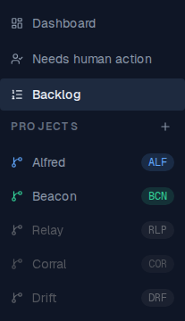
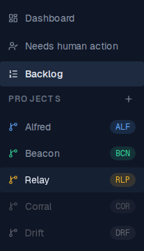
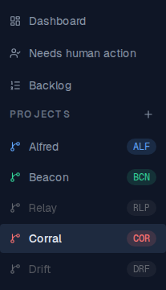

# Code sidebar grays out projects with no active items

*2026-09-29T19:43:10.624Z*

A project in the Code sidebar whose stories are all `done` or `abandoned` — or that has no stories at all — is dimmed and desaturated. Any other state (`blocked` included) counts as active work. Seed used below: **Alfred** has an in-development and a done story, **Beacon** one blocked story, **Relay** only a done story, **Corral** no stories, **Drift** only an abandoned story.

Resting state on the Backlog. Alfred and Beacon keep their project colour; Relay (only done), Corral (no stories) and Drift (only abandoned) are grayed out.

Hovering a grayed-out project brings its colour back at full strength (keyboard focus does the same), so it still reads as clickable.

Clicking through to an idle project's board: the row you're on keeps its full-strength highlight even though Corral has no active items, while the other idle projects stay grayed.

