# Exclude projects from the PR ratio

*2026-09-30T05:06:21.337Z*

The Dashboard's PR-ratio card gains a ⋯ menu listing every Code project; ticking one sets `projects.exclude_from_pr_ratio` (a new column, default false). An excluded project's PRs leave the bar, the legend, the total **and** Other, while the lines-changed chart keeps measuring it. Migration 0042 ships `ac3charland/knowledge` ticked — a no-op wherever that project doesn't exist (proven by the database integration suite's replay assertion).

## The journey in the app

The real app against the E2E suite's in-memory Supabase, with three projects seeded unticked. The browser's `/api/code/pr-ratio` answer is stubbed from fixed counts (Alfred 6, RealPlay 2, Knowledge 4, Other 1) that honour each saved exclusion; the real route is exercised in the next section. Every PATCH is the real one.

**Before** — Knowledge counts, and the ⋯ ends the header.

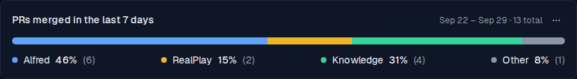

**The menu** — every project in creation order with its colour dot, under a muted "Exclude from PR ratio" heading.

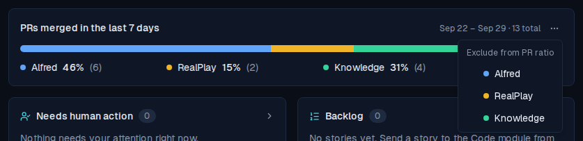

**Knowledge ticked** — the PATCH lands, the card refetches, and the bar redraws behind a menu that stays open for the next pick. Alfred and RealPlay keep their colours.

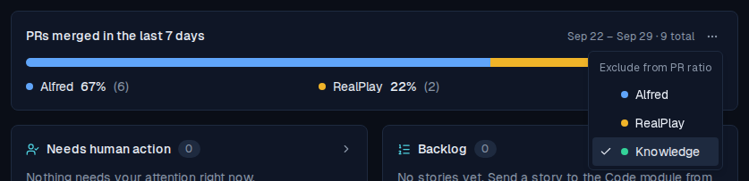

**After** — 9 total: Knowledge's four PRs are gone from the bar, the legend and the total, and Other stays at one. Nothing on the card says anything was excluded.

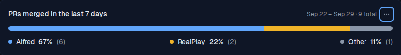

**After a reload** — the tick came back from the database.

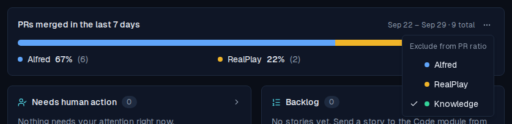

**Every project ticked** — one muted line replaces the range, bar and legend, even though Other still has a PR; the ⋯ stays so a project can be unticked.

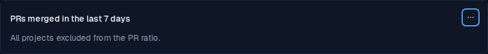

## The real routes

`with-app.sh` boots the real Next app against the same in-memory Supabase, with only `api.github.com` stubbed inside the server (`github-stub.mjs`: alfred 6, realplay 2, knowledge 4, Other 1) and every search query logged. `measure.mjs` flips the flag through the real, session-gated `PATCH /api/projects/:id` and reads `GET /api/code/pr-ratio` and `GET /api/code/loc-velocity` back with the ingest key, as the weekly-review skill does. Only clock-independent fields are printed.

```bash
docs/demos/alf-276-pr-ratio-exclude/with-app.sh
```

```output
--- three projects; the owner ticks Knowledge in the card’s ⋯ menu
PATCH Knowledge {"exclude_from_pr_ratio":true}  →  200 {"name":"Knowledge","exclude_from_pr_ratio":true}
pr-ratio     200  total 9
                   {"repo":"ac3charland/alfred","label":"Alfred","count":6,"percentage":67}
                   {"repo":"ac3charland/realplay","label":"RealPlay","count":2,"percentage":22}
                   other {"count":1,"percentage":11}

--- what GitHub was asked for that split: nothing about knowledge, except to subtract it from Other
search repo:ac3charland/alfred
search repo:ac3charland/realplay
search Other: is:pr is:merged merged:<window> author:ac3charland -repo:ac3charland/alfred -repo:ac3charland/realplay -repo:ac3charland/knowledge

--- the lines-changed chart still measures Knowledge
loc-velocity 200  {"repos":["ac3charland/alfred","ac3charland/realplay","ac3charland/knowledge"]}

--- a non-boolean flag is refused
PATCH Knowledge {"exclude_from_pr_ratio":"yes"}  →  400 {"error":"Invalid request body","details":[{"expected":"boolean","code":"invalid_type","path":["exclude_from_pr_ratio"],"message":"Invalid input: expected boolean, received string"}]}

--- unticked again: Knowledge is back in the split
PATCH Knowledge {"exclude_from_pr_ratio":false}  →  200 {"name":"Knowledge","exclude_from_pr_ratio":false}
pr-ratio     200  total 13
                   {"repo":"ac3charland/alfred","label":"Alfred","count":6,"percentage":46}
                   {"repo":"ac3charland/realplay","label":"RealPlay","count":2,"percentage":15}
                   {"repo":"ac3charland/knowledge","label":"Knowledge","count":4,"percentage":31}
                   other {"count":1,"percentage":8}

--- every project ticked: no repos, only what Other counts (the card shows its muted line instead)
PATCH Alfred {"exclude_from_pr_ratio":true}  →  200 {"name":"Alfred","exclude_from_pr_ratio":true}
PATCH RealPlay {"exclude_from_pr_ratio":true}  →  200 {"name":"RealPlay","exclude_from_pr_ratio":true}
PATCH Knowledge {"exclude_from_pr_ratio":true}  →  200 {"name":"Knowledge","exclude_from_pr_ratio":true}
pr-ratio     200  total 1
                   repos []
                   other {"count":1,"percentage":100}

--- two projects, one excluded: still configured (never a 501), a one-project split
pr-ratio     200  total 7
                   {"repo":"ac3charland/alfred","label":"Alfred","count":6,"percentage":86}
                   other {"count":1,"percentage":14}
```

## Visual snapshots

The card's Storybook baselines move on purpose: the ⋯ now ends the header in every state (loading, failed, quiet week, ready, with and without Other). Each diff reads baseline | changed pixels | new render. The keyboard-focus story's ring stays on the first legend row: the ⋯ now comes first in tab order, so the story parks focus on it and the test-runner's Tab moves on to the row.


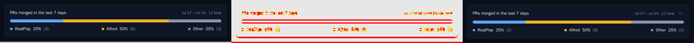

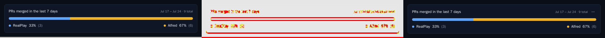

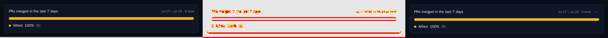

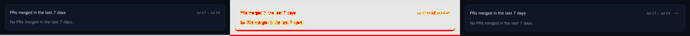

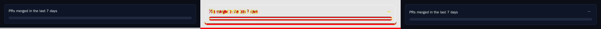

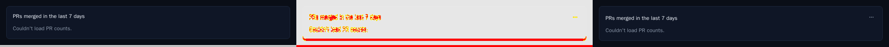

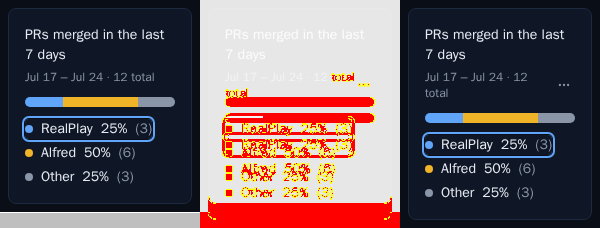
