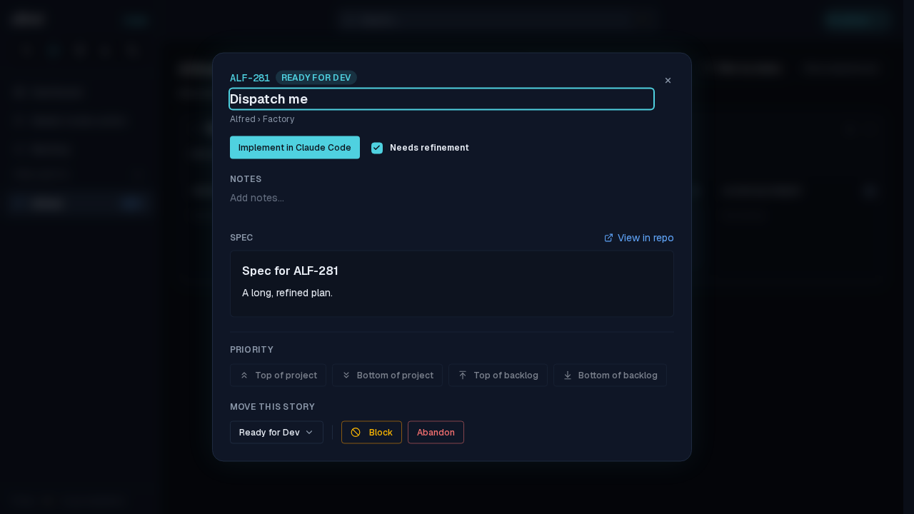
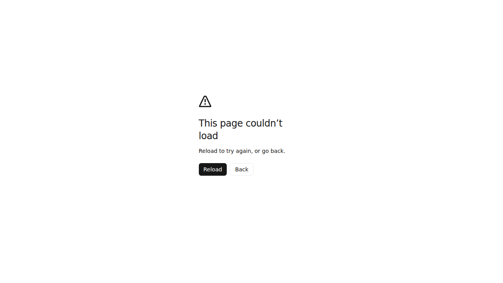
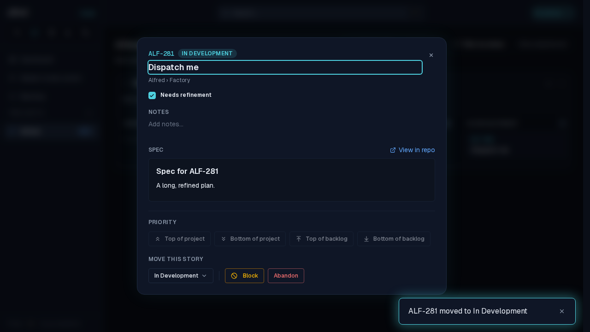

# ALF-277: a launch's realtime echo no longer crashes the story modal

*2026-10-04T18:37:26.222Z*

**Bug.** Launching a code story from its detail modal (`/code/<project>?story=ALF-281`) and coming back to the alfred tab showed Next's "This page couldn't load — Reload to try again, or go back." with `TypeError: Cannot read properties of undefined (reading 'trim')` in the console. It wasn't a Vercel deploy. The launch writes only `code_items.factory_state`. Postgres hands a large text column that an UPDATE left untouched to logical decoding as an *unchanged TOAST datum*, so Supabase Realtime leaves `spec_markdown` **out** of `payload.new`. The code store spread that missing column onto the story as `spec_markdown: undefined`, and `SpecView` crashed on `spec.trim()`.

The decoding fact, from a local Postgres 16 with `test_decoding` (an UPDATE that only sets `factory_state` on a row with a ~13 KB spec):

> `table public.code_items: UPDATE: item_id[text]:'i1' factory_state[text]:'in_development' spec_markdown[text]:unchanged-toast-datum`

**Fix.** Both realtime handlers in the code store (`code_items` → story, `epics` → epic spec) now patch through `presentColumns` (`lib/supabase/realtime.ts`), which drops the columns the payload left out, so the store keeps the value it already holds.

The journey below runs the real app through the Playwright mock backend and the faked realtime socket (`e2e/support/realtime.ts`). Step 1: the story modal is open on ALF-281, with its spec, in Ready for Dev.

Step 2, **before the fix**: the launch's echo arrives (`factory_state: in_development`, no `spec_markdown` key) and the whole page falls over, matching the screen in the report.

Step 2, **after the fix**: the same echo moves the story to In Development (chip, move control and toast), and the spec the payload omitted is still shown.

