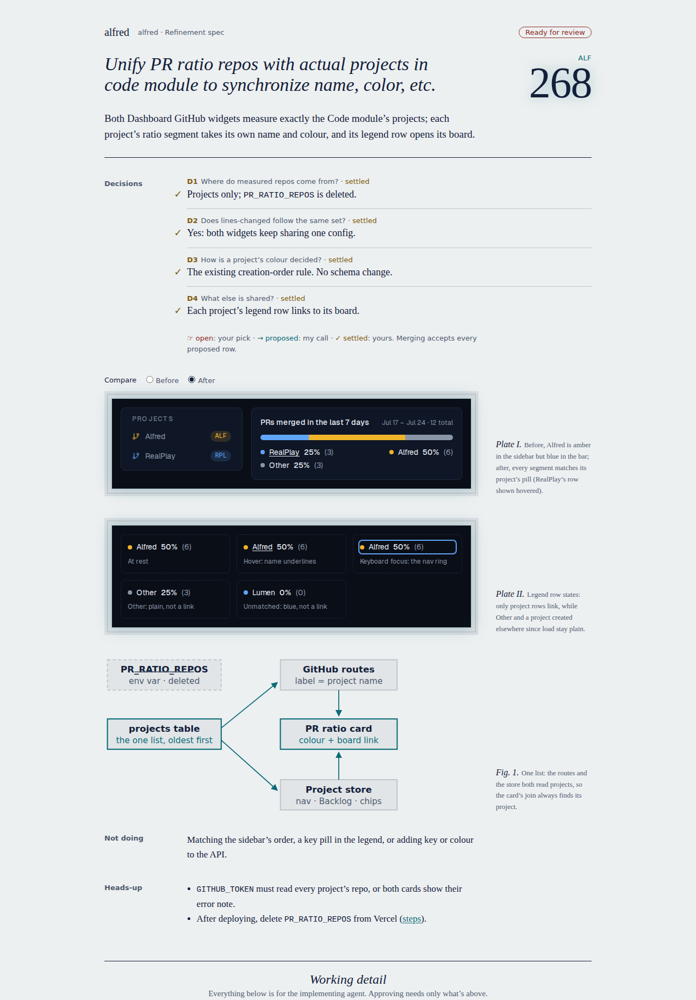
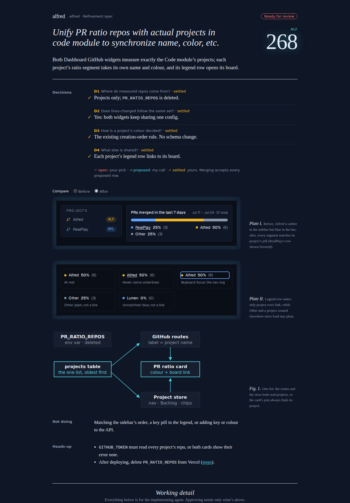
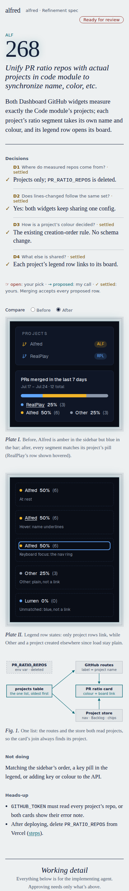
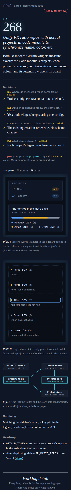
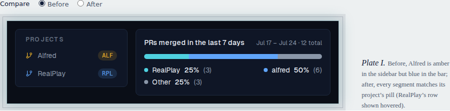
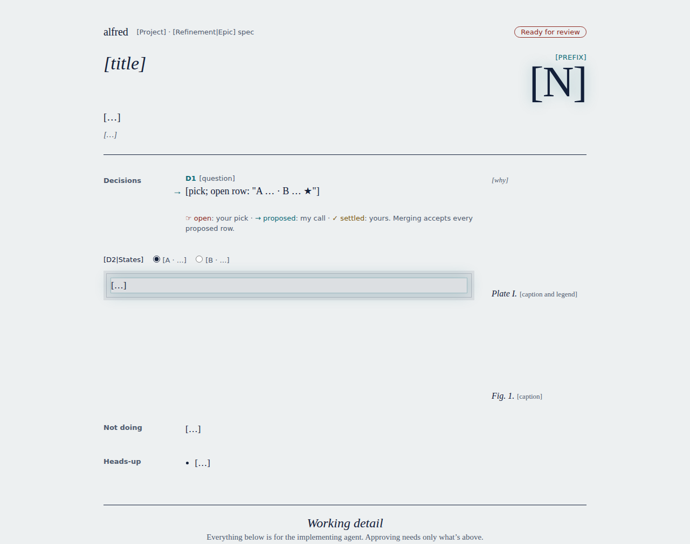

# ALF-281: every spec opens with a brief, then a fold, then the implementer's detail

*2026-09-28T15:40:26.489Z*

Refinement sessions now copy `.claude/skills/refinement/assets/spec-template.html`. The template splits every story and epic spec at a fold. Above it is **the brief**: the change in one sentence, the decisions the human must see (each marked open, proposed or settled), and plates of everything they will see. Below it is **the working detail** for the implementer. It ships one house stylesheet, so no session hand-writes CSS any more.

To prove the template carries a real spec, `alf-268-brief.html` (in this folder) rebuilds ALF-268 (unify PR-ratio repos with projects) in it. Every shot below is rendered the way the app’s SpecView renders a spec: inside `<iframe sandbox="" srcdoc>`, with scripting off. `capture.mjs` is the harness.

## The brief, day and night, at 1280px





## The same brief on a phone (390px): margin notes and captions drop under what they explain





Neither width scrolls sideways in either edition, and the plate’s Geist loads from its raw GitHub URL inside the sandboxed frame. The capture serves that URL from the committed, byte-identical font, with the headers the real response carries (`access-control-allow-origin: *`, `application/octet-stream`, `nosniff`, checked with curl while building), because this sandbox’s browser can’t verify the egress proxy’s certificate.

```bash
node docs/demos/alf-281-spec-template/capture.mjs docs/demos/alf-281-spec-template/alf-268-brief.html - layout
```

```output
390px light  no horizontal scroll; mockup font Geist: loaded
390px dark   no horizontal scroll; mockup font Geist: loaded
1280px light  no horizontal scroll; mockup font Geist: loaded
1280px dark   no horizontal scroll; mockup font Geist: loaded
```

## The brief is a minute of reading, not ten

Today ALF-268 asks for about 1,700 words before the reviewer reaches its mockup. Rebuilt, the brief is about 150 words of prose, plus two plates and one figure, which the budget doesn’t count. The template caps it at 300.

```bash
node docs/demos/alf-281-spec-template/wordcount.mjs docs/specs/archive/ALF-268.html docs/demos/alf-281-spec-template/alf-268-brief.html
```

```output
ALF-268 today, words before its mockup: 1691
ALF-268 rebuilt, brief prose (plates and figure uncounted): 156
```

## Switchers work without script

An option or state switcher is a set of radio inputs. CSS reads the choice with `:has(:checked)`, so it still works in the app’s script-less sandbox. An open row’s switcher is labelled with its id (`D2: A | B`). This one only compares before and after, so it takes a plain word. It rests on “After”, and picking “Before” swaps the card with scripting off. The switcher’s ink is neutral: it claims no decision state.

```bash
node docs/demos/alf-281-spec-template/capture.mjs docs/demos/alf-281-spec-template/alf-268-brief.html - switcher
```

```output
switcher at rest: after shown
after picking Before (no script): before shown
```



## Only a decision row moves the stamp

The masthead stamp and each row’s mark and state word are CSS reading `data-state`, scoped to `#decisions`. A mockup of Radix-built UI carries its own `data-state="open"` (menus, dialogs), and it no longer flips the stamp to “Your call needed” or marks its own headings as an open row. A real open row still flips it:

```bash
node docs/demos/alf-281-spec-template/capture.mjs docs/demos/alf-281-spec-template/alf-268-brief.html - stamp
```

```output
as written: stamp "Ready for review"
with a data-state="open" menu drawn in a plate: stamp "Ready for review", the mockup's own heading gains none
with its first decision row open: stamp "Your call needed"
```

## The template itself

The blank template, with a `[bracketed]` placeholder in every slot and no sample content, rendered the same way:



Its ids, in order: the brief, the fold, then the detail. Story-only and epic-only sections carry `data-kind`, and a session deletes the kind it isn’t writing.

```bash
grep -oE ' id="[a-z0-9-]+"' .claude/skills/refinement/assets/spec-template.html | sed -E 's/ id="(.*)"/\1/' | tr '\n' ' '; echo; grep -oE 'id="[a-z-]+" data-kind="[a-z]+"' .claude/skills/refinement/assets/spec-template.html
```

```output
brief head change revised decisions plates p1 diagram not-doing heads-up fold detail context decision-records d1 behavior contracts architecture constraints split plan ac tests demo out after-merge 
id="behavior" data-kind="story"
id="contracts" data-kind="story"
id="architecture" data-kind="epic"
id="constraints" data-kind="epic"
id="split" data-kind="epic"
id="plan" data-kind="story"
id="ac" data-kind="story"
id="tests" data-kind="story"
id="demo" data-kind="story"
```

Each fillable section has a `guide:` comment naming it, with what it holds, whether it is required, and its budget. The first line of each:

```bash
grep -oE 'guide: #[a-z-]+.*' .claude/skills/refinement/assets/spec-template.html | sed -E 's/ *(-->)?$//'
```

```output
guide: #head, required. The imprint bar names the project and the spec's kind; the stamp fills itself
guide: #change, required. What changes for the human, in their words: one sentence, ≤ 30 words. A
guide: #revised, after a review round (required on an epic re-refine); delete it on a first draft.
guide: #decisions; delete it when no call passes this filter. A decision gets a row only if (a) the
guide: #plates, required when anything the human sees changes (epic: only when the epic asserts what a
guide: #diagram. Story: optional, usually absent; epic: expected. One figure when a flow crosses a
guide: #not-doing, optional. Only what the ticket's wording might lead the human to expect: ≤ 3
guide: #heads-up, optional. Manual steps for the human (link #after-merge), irreversible effects,
guide: #context, required. The problem — what we're solving and why, from the ticket, its notes and
guide: #decision-records, required if there are any decisions. One section.rec#dN per brief row:
guide: #behavior (story), required unless the change is purely structural. Rules, states, edge cases,
guide: #contracts (story), optional. Schema, route and API shapes, types, events. Never pin a
guide: #architecture (epic), required. The architecture and data model later stories build against;
guide: #constraints (epic), required. Constraints and non-goals in full, including what's deliberately
guide: #split (epic), required. How the work splits into stories: a sketch of the slices and why, not
guide: #plan (story), required. Files to touch, key snippets (annotated where a reviewer would want to
guide: #ac (story), required. A checklist a reviewer and the implementing session can verify. Each
guide: #tests (story), required. Which test tier pins each criterion, red → green.
guide: #demo (story), required if anything visible changes. Point at the repo's demo-evidence rules;
guide: #out, optional. Why each #not-doing item is out; implementation risks; facts to confirm while
guide: #after-merge, optional. The human's manual steps in full; #heads-up links here.
```

The template is project-agnostic: it has no ticket refs, app paths, app token values or embedded data URIs. The `alfred` imprint and the house palette are the exception, because the palette’s night edition is alfred’s own look. The house stylesheet (sections 1–3) stays under the ~10 KB budget.

```bash
echo "ALF- / frontend/ / globals.css / data-URI hits: $(grep -cE 'ALF-|frontend/|globals\.css|;base64,' .claude/skills/refinement/assets/spec-template.html)"; echo "stylesheet sections 1-3: $(sed -n '/TEMPLATE · 1/,/TEMPLATE · 4/p' .claude/skills/refinement/assets/spec-template.html | wc -c) bytes"
```

```output
ALF- / frontend/ / globals.css / data-URI hits: 0
stylesheet sections 1-3: 9259 bytes
```

Stylesheet sections 1–3 are the settled look from the ALF-281 spec, and every property is unchanged. Two comments drop references to that spec’s own decision ids, which would mean something else in a new spec. The row-state selectors gain a `#decisions` scope (above). The last hunk is just the range’s end marker, where section 4, the generic per-spec plate section, begins:

```bash
sed -n '/TEMPLATE · 1/,/TEMPLATE · 4/p' docs/specs/archive/ALF-281.html > /tmp/alf-281-css; sed -n '/TEMPLATE · 1/,/TEMPLATE · 4/p' .claude/skills/refinement/assets/spec-template.html > /tmp/template-css; diff /tmp/alf-281-css /tmp/template-css; sed -n '/TEMPLATE · 1/,/TEMPLATE · 4/p' docs/demos/alf-281-spec-template/alf-268-brief.html | cmp -s - /tmp/template-css && echo 'the ALF-268 rebuild carries the same sections 1-3 byte for byte'
```

```output
4c4
<    tokens. Sections 1–4 are the template stylesheet, every D1 pick settled.
---
>    tokens. Sections 1–3 are the house stylesheet: keep them verbatim.
16c16
<   /* Ink roles (D1, "whose move"): colour says who holds the decision */
---
>   /* Ink roles ("whose move"): colour says who holds the decision */
48c48
< body:has([data-state=open]) .stamp::after{content:"Your call needed"}
---
> body:has(#decisions [data-state=open]) .stamp::after{content:"Your call needed"}
69,71c69,71
< [data-state=open] h3::after{content:" · open — your pick";color:var(--c-open)}
< [data-state=proposed] h3::after{content:" · proposed";color:var(--c-prop)}
< [data-state=settled] h3::after{content:" · settled";color:var(--c-set)}
---
> #decisions [data-state=open] h3::after{content:" · open — your pick";color:var(--c-open)}
> #decisions [data-state=proposed] h3::after{content:" · proposed";color:var(--c-prop)}
> #decisions [data-state=settled] h3::after{content:" · settled";color:var(--c-set)}
73,74c73,74
< [data-state=settled] .tag{color:var(--c-set)}
< [data-state=open] .tag{color:var(--c-open)}
---
> #decisions [data-state=settled] .tag{color:var(--c-set)}
> #decisions [data-state=open] .tag{color:var(--c-open)}
77,79c77,79
< [data-state=open] .pick{color:var(--c-open)}
< [data-state=open] .pick::before{content:"\261E\FE0E";left:-1.5em;top:-.05em;color:var(--c-open)}
< [data-state=settled] .pick::before{content:"\2713\FE0E";color:var(--c-set)}
---
> #decisions [data-state=open] .pick{color:var(--c-open)}
> #decisions [data-state=open] .pick::before{content:"\261E\FE0E";left:-1.5em;top:-.05em;color:var(--c-open)}
> #decisions [data-state=settled] .pick::before{content:"\2713\FE0E";color:var(--c-set)}
143c143
< /* ═══ TEMPLATE · 4 · PLATE — the app's own tokens, scoped (this spec: frontend/app/globals.css,
---
> /* ═══ TEMPLATE · 4 · PLATE — the switcher, then the app's own tokens scoped to .app ═══ */
the ALF-268 rebuild carries the same sections 1-3 byte for byte
```

## The skills point at it

The refinement skill’s “What to produce” now starts from the template. It carries the fold, the filter for which decisions reach the brief, the three row states, each-fact-once, and scripting-off. The PR item is renumbered 1–2, and its Iterate rule has sessions answer review comments by id and fold them back into the spec. The epic-refinement skill copies the same template. The repo-setup README copies the whole `refinement/` folder, `assets/` included. With `assets/` present, `compound-toc` requires a Contents section, and the skill now has one:

```bash
npm run -s lint:skills -w tools/skill-lint -- "$PWD/.claude/skills/refinement" "$PWD/.claude/skills/epic-refinement" 2>&1 | tail -1
```

```output
skill-lint: 2 skill(s), 0 error(s), 0 warning(s).
```

## Confirmed while building

The spec asked whether a row’s `#dN` link scrolls inside SpecView’s `sandbox="" srcdoc` frame. It doesn’t. The fragment resolves against the parent page’s URL, so clicking it navigates the frame to the app route instead of the record. Existing specs have the same problem. Injecting `<base href="about:srcdoc">` into the snapshot fixes it. That is an app change, out of scope here:

```bash
node docs/demos/alf-281-spec-template/capture.mjs docs/demos/alf-281-spec-template/alf-268-brief.html - jump
```

```output
#d2 click, as written: frame at https://alfred.test/code#d2, not scrolled
#d2 click, with <base href="about:srcdoc">: frame at about:srcdoc#d2, scrolled to the record
```
