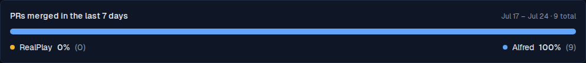
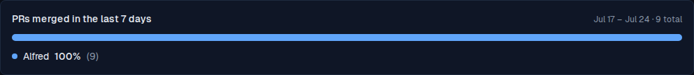

# PR ratio widget hides projects with zero merged PRs

*2026-09-28T18:12:10.512Z*

The Dashboard's PR-ratio card lists every Code module project in its legend, even one that merged zero PRs this window — a zero row added noise without adding information. ALF-284: a project's legend row (and its bar segment, which was already dropped at zero — see `RatioBar`) is now hidden entirely when its merged-PR count is 0. Only the projects that actually shipped this week, plus the Other bucket when populated, appear.

Before: a two-project window where RealPlay merged nothing this week (Alfred merged all 9 PRs). RealPlay still earns a legend row at 0%(0).

After: same window, same data. RealPlay's legend row is gone — only Alfred, the one project that actually shipped, shows.

