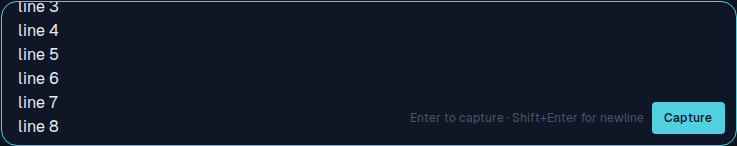
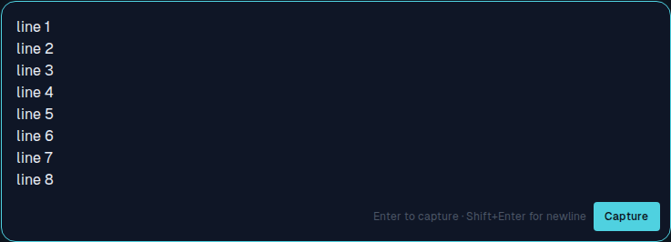
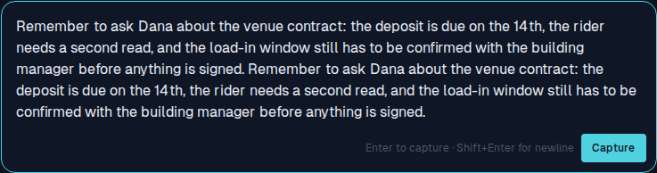
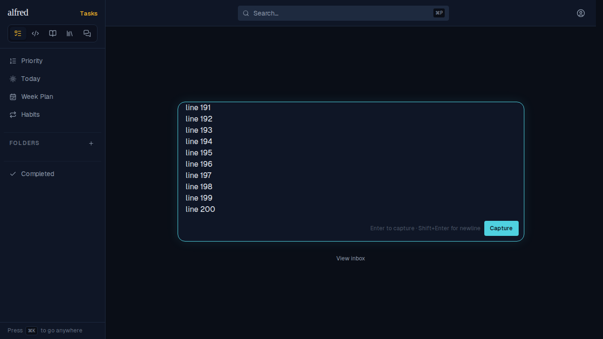

# ALF-285: the inbox capture box expands to fit what you type

*2026-09-30T03:04:00.485Z*

Bug: the capture box was a fixed three rows. A fourth line (or a long thought that wraps) scrolled *inside* the box, so the earliest lines slid out of sight and the newest ran alongside the hint and Capture button. Below, the same eight typed lines in the live app (Playwright against the mock backend), before and after the fix.

**Before** - eight lines typed; the box stays three rows tall and lines 1-2 are scrolled out of view:

**After** - the same eight lines; the box grew to show every one of them, with the hint and Capture button still clear of the text:

A long thought that wraps onto several lines grows the box too (no newlines typed):

Growth is capped at 40% of the visible viewport (`max-h-[40dvh]`), so a 200-line paste scrolls inside the box (it is showing lines 191-200 here, the end of the paste, where the caret is) rather than pushing the Capture button and the landing screen off-screen:

Capturing sends the thought and the box settles back to its resting three rows:

