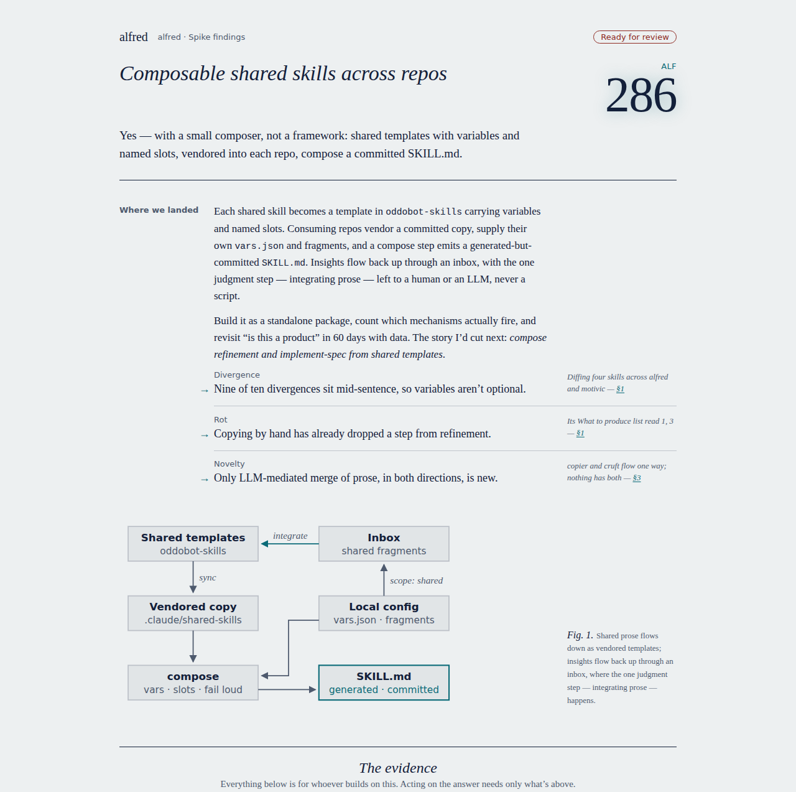
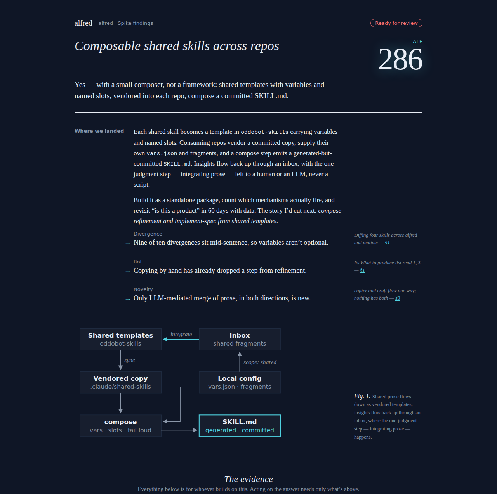
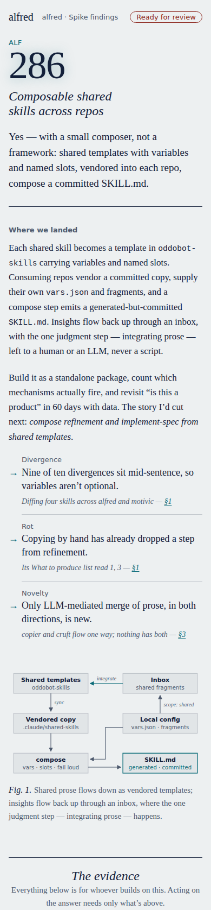
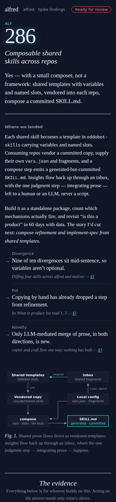
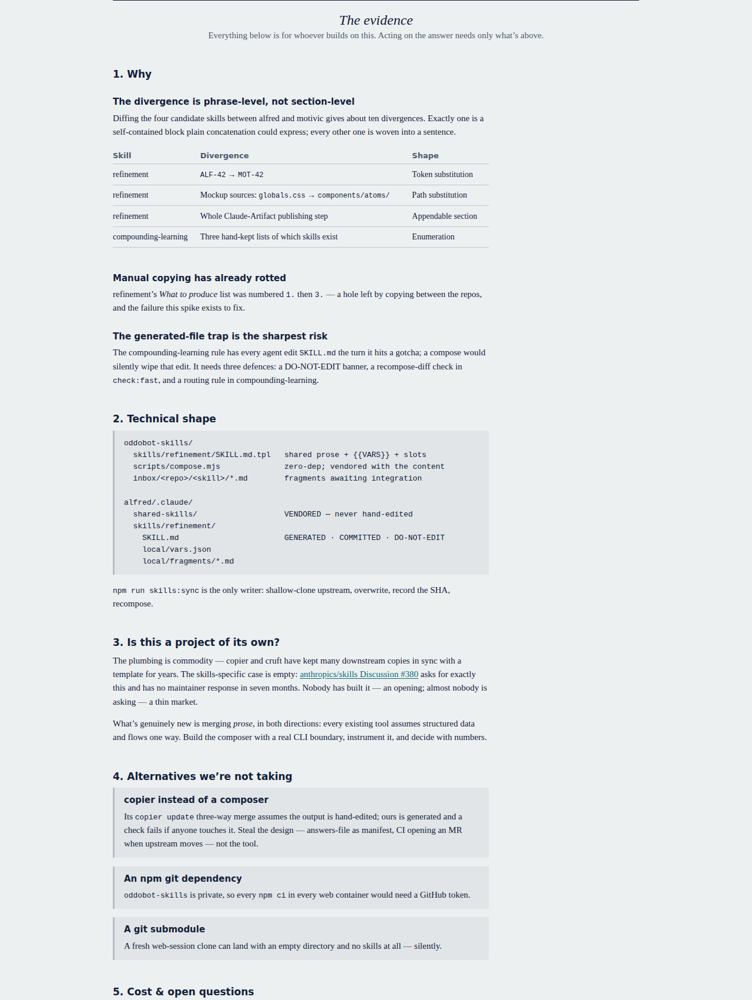

# ALF-286: spike findings wear the spec's house style and fold, with a freeform body

*2026-09-28T18:38:20.186Z*

Spike sessions now copy `.claude/skills/spike/assets/findings-template.html`. It uses the refinement spec template's house stylesheet, byte for byte, and splits at the same fold. Above it is **the brief**: the answer in one sentence, then *Where we landed* (the recommendation first, key findings with their evidence in the margin, ≤ 300 words of prose), plus one optional figure. Below it is **the evidence**, and that part is freeform. Only a closing *Sources* is required. The *Why / Technical shape / Alternatives / Cost* scaffold is there to rename, reorder or drop. There are no decision rows, plates or acceptance criteria.

To prove the template carries a real spike, `composable-shared-skills.html` (in this folder) rebuilds `docs/spikes/composable-shared-skills.html` in it. That spike predates the spike phase and never had a ref, so its masthead carries this ticket's. `docs/spikes/` itself is untouched. Every shot is rendered the way the app shows findings: inside `<iframe sandbox="" srcdoc>`, with scripting off. `capture.mjs` is the harness.

## The brief, day and night, at 1280px





## The same brief on a phone (390px): margin notes drop under what they explain





Neither width scrolls sideways in either scheme. The brief is 174 words of prose, inside its 300-word budget. The body below the fold keeps the spike's own shape, including a section the scaffold never suggested (*Is this a project of its own?*).

```bash
node docs/demos/alf-286-spike-findings/capture.mjs docs/demos/alf-286-spike-findings/composable-shared-skills.html -
```

```output
390px light  no horizontal scroll
390px dark   no horizontal scroll
1280px light  no horizontal scroll
1280px dark   no horizontal scroll
brief prose: 174 words (#answer 23, #landed 151); the figure is uncounted
below the fold, in the author's own order:
  Why
  Technical shape
  Is this a project of its own?
  Alternatives we’re not taking
  Cost & open questions
  Sources
```

## Below the fold: the evidence, freeform, numbering itself



## The shared stylesheet can't drift: skill-lint's new `house-stylesheet` rule

Two skills now carry the house stylesheet: sections 1–3 of the spec template, from its `TEMPLATE · 1` line to section 4. skill-lint compares every copy against the copies in all its sibling skills, not just the changed ones. As committed, the two copies agree:

```bash
npm run -s lint:skills -w tools/skill-lint -- "$PWD/.claude/skills/spike" "$PWD/.claude/skills/refinement" 2>&1 | tail -1
```

```output
skill-lint: 2 skill(s), 0 error(s), 0 warning(s).
```

Now edit one byte of refinement's copy only, in a throwaway copy of the two skills, and lint just that skill, the way the pre-commit gate lints only what changed. The untouched spike copy catches it. The error names both files and the first line that differs:

```bash
T=$(mktemp -d) && cp -r .claude/skills/refinement .claude/skills/spike "$T/" && sed -i "s/--oxblood:#8e2a22/--oxblood:#8e2a23/" "$T/refinement/assets/spec-template.html" && npm run -s lint:skills -w tools/skill-lint -- "$T/refinement" > "$T/out" 2>&1; echo "exit $?"; grep -E "✗|^skill-lint:" "$T/out"; rm -rf "$T"
```

```output
exit 1
  ✗ error [house-stylesheet] refinement/assets/spec-template.html:28 — its house stylesheet (sections 1–3) differs from spike/assets/findings-template.html. The copies are shared verbatim: make the same edit to every copy.
skill-lint: 1 skill(s), 1 error(s), 0 warning(s).
```

It works from either side. The same edit to only the spike's copy fails there:

```bash
T=$(mktemp -d) && cp -r .claude/skills/refinement .claude/skills/spike "$T/" && sed -i "s/--oxblood:#8e2a22/--oxblood:#8e2a23/" "$T/spike/assets/findings-template.html" && npm run -s lint:skills -w tools/skill-lint -- "$T/spike" > "$T/out" 2>&1; echo "exit $?"; grep -E "✗|^skill-lint:" "$T/out"; rm -rf "$T"
```

```output
exit 1
  ✗ error [house-stylesheet] spike/assets/findings-template.html:25 — its house stylesheet (sections 1–3) differs from refinement/assets/spec-template.html. The copies are shared verbatim: make the same edit to every copy.
skill-lint: 1 skill(s), 1 error(s), 0 warning(s).
```

Making the same edit to every copy clears it:

```bash
T=$(mktemp -d) && cp -r .claude/skills/refinement .claude/skills/spike "$T/" && sed -i "s/--oxblood:#8e2a22/--oxblood:#8e2a23/" "$T/refinement/assets/spec-template.html" "$T/spike/assets/findings-template.html" && npm run -s lint:skills -w tools/skill-lint -- "$T/refinement" "$T/spike" > "$T/out" 2>&1; echo "exit $?"; grep -E "✗|^skill-lint:" "$T/out"; rm -rf "$T"
```

```output
exit 0
skill-lint: 2 skill(s), 0 error(s), 0 warning(s).
```
