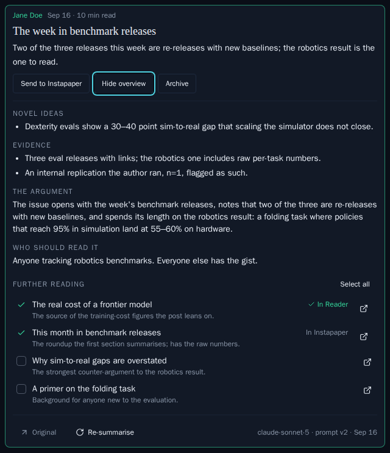
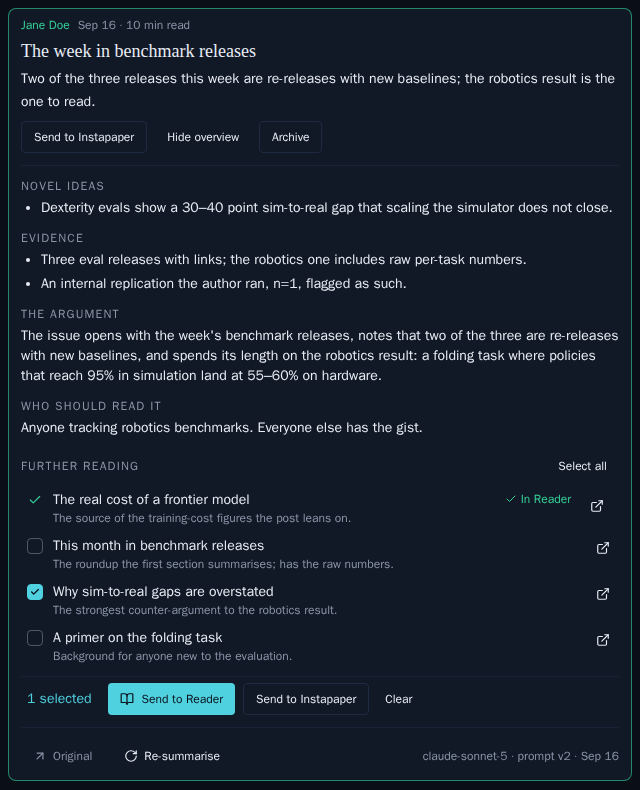
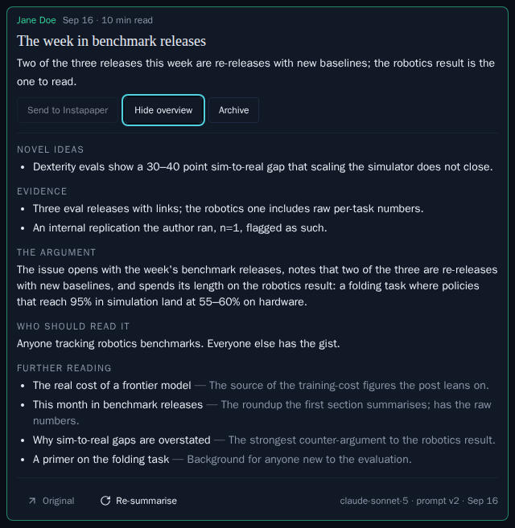

# ALF-289: Further reading — the articles a post links to, sent to the Reader or to Instapaper

*2026-10-01T02:50:44.176Z*

A summarised post's overview closes with a **Further reading** checklist: the linked sources the model judged worth reading in full — the piece an essay's argument rests on, or the few items of a link roundup with real substance — each with the model's title for the linked piece and a note on what the post uses it for. Tick some, then **Send to Reader** (a save into Instapaper's "To Reader" folder, which the Worker's existing leg summarises within a tick or two) or **Send to Instapaper** (a save into Unread). A sent link reads **In Reader** (green) or **In Instapaper** (muted) and can't be ticked again. The Worker's prompt moves to version 2: the model sees each candidate link numbered inline in the post's text and listed in a numbered block, and answers only by number, so every stored URL is one the post really carried.

## 1. The summariser: numbered links in, URLs out

The Worker builds the model's input from the post's stored HTML: every candidate anchor gets a number in document order, a `[n]` marker lands after its text so the stripped prose reads "the honest barrage costing [2]", and a numbered block lists the URLs after the text. The pre-filter is mechanical and minimal — the post's own address, Substack's bylines, app links and `redirect/2/` chrome wrappers are dropped, a repeated URL shares one number, and the list stops at 150 — and the model does the judging. A new committed fixture, a link roundup in the live Substack template, shows the numbering on the eval script's dry run (no key, no bill): the subscribe wrapper, the app link, the byline and the post's own link are out, and the roundup's repeated barrage link appears once, as `[2]`.

```bash
npm run eval:reader -w workers -- --fixtures --dry-run 2>/dev/null | awk '/^roundup/{p=1} p{print} /^$/{if(p){exit}}'
```

```output
roundup
  publication    Odelia Hart from Tideline
  title          Slow Links, Fast Takes
  author         Odelia Hart from Tideline
  canonical URL  https://open.substack.com/pub/tideline/p/slow-links-fast-takes
  word count     270
  html_extracted true
  links
    [1] https://substack.com/redirect/3d7a91c2-6b04-4e58-a1f3-0c52de9b7e10
    [2] https://substack.com/redirect/b82e4f10-93ac-4d6e-8c17-5a0e61f3d2b9
    [3] https://substack.com/redirect/f4c06d3e-1a85-47b2-9e60-b7d3c8a15f24
    [4] https://substack.com/redirect/0e9b5a77-c2d1-4f38-b64a-3187ad5c9e02
    [5] https://substack.com/redirect/6a1d38f9-47b0-4c25-93e8-d2f70b4c1a66
    [6] https://tideline.substack.com/p/the-quiet-berth
    [7] https://substack.com/redirect/c71f20ab-85e3-4d96-b0c4-9e1a3f6d8b57
    [8] https://substack.com/redirect/1fd84c06-2b9e-4a73-85d1-e60c97a3b2f8
```

The model answers by number only. `summariser-stand-in.mjs` runs the real eval script, summariser, prompt and normalisation against a local stand-in for the Anthropic API that records what the model was shown and answers with five picks: link 2 twice, link 1, a link 99 the post never offered, and link 7, in that order. The stored list is what the row's overview gets: URLs from the post, deduped, in link order, the invented number gone.

```bash
node docs/demos/alf-289-further-reading/summariser-stand-in.mjs
```

```output
── the model’s input for the roundup fixture ──
  The tariff that taxed the wrong thing [1]
  A tidal barrage costed honestly [2]
  The quarterly review is a ritual, not a control [3]
  Thirty years of the same pier [4]
  Why the ferry timetable is the way it is [5]
  the honest barrage costing [2] .
  start with my own piece on the quiet berth [6] .
  Bargewise freight insurance [7] ,
  Manage your subscription [8] or
  --- links ---
  [1] https://substack.com/redirect/3d7a91c2-6b04-4e58-a1f3-0c52de9b7e10
  [2] https://substack.com/redirect/b82e4f10-93ac-4d6e-8c17-5a0e61f3d2b9
  [3] https://substack.com/redirect/f4c06d3e-1a85-47b2-9e60-b7d3c8a15f24
  [4] https://substack.com/redirect/0e9b5a77-c2d1-4f38-b64a-3187ad5c9e02
  [5] https://substack.com/redirect/6a1d38f9-47b0-4c25-93e8-d2f70b4c1a66
  [6] https://tideline.substack.com/p/the-quiet-berth
  [7] https://substack.com/redirect/c71f20ab-85e3-4d96-b0c4-9e1a3f6d8b57
  [8] https://substack.com/redirect/1fd84c06-2b9e-4a73-85d1-e60c97a3b2f8

── the stand-in’s picks, as the model would send them ──
  { link: 2 } A barrage of benchmark releases, sorted
  { link: 2 } The same link again
  { link: 1 } The quiet berth, revisited
  { link: 99 } A link that does not exist
  { link: 7 } A sponsor-adjacent explainer

── what the eval prints for the roundup: the picks normalised into the stored list ──
roundup
  links
    [1] https://substack.com/redirect/3d7a91c2-6b04-4e58-a1f3-0c52de9b7e10
    [2] https://substack.com/redirect/b82e4f10-93ac-4d6e-8c17-5a0e61f3d2b9
    [3] https://substack.com/redirect/f4c06d3e-1a85-47b2-9e60-b7d3c8a15f24
    [4] https://substack.com/redirect/0e9b5a77-c2d1-4f38-b64a-3187ad5c9e02
    [5] https://substack.com/redirect/6a1d38f9-47b0-4c25-93e8-d2f70b4c1a66
    [6] https://tideline.substack.com/p/the-quiet-berth
    [7] https://substack.com/redirect/c71f20ab-85e3-4d96-b0c4-9e1a3f6d8b57
    [8] https://substack.com/redirect/1fd84c06-2b9e-4a73-85d1-e60c97a3b2f8
  headline       A link roundup with one item worth the click.
  gist           Mostly restated releases; the lead link is the substance.
  novel ideas
    (none — a restatement)
  evidence
    (none)
  argument       Eight links, one argument.
  who should readNobody needs the issue; one link is worth it.
  further reading
    [1] The quiet berth, revisited — The essay the opening paragraph argues with.
        https://substack.com/redirect/3d7a91c2-6b04-4e58-a1f3-0c52de9b7e10
    [2] A barrage of benchmark releases, sorted — The roundup’s lead item; the post calls it the one worth reading in full.
        https://substack.com/redirect/b82e4f10-93ac-4d6e-8c17-5a0e61f3d2b9
    [3] A sponsor-adjacent explainer — The post leans on it for its closing numbers.
        https://substack.com/redirect/c71f20ab-85e3-4d96-b0c4-9e1a3f6d8b57
  usage          in 900 · out 300 · $0.0048

wrote workers/eval-results/<timestamp>.json
```

## 2. The journey, in the running app

The real app against the E2E harness's mock Supabase and stand-in Instapaper, driven by Playwright (`with-app.sh journey journey-unconfigured` runs `journey.mjs`, which took every shot below). Every send goes through the real route, the real signed Instapaper calls (`folders/list`, then `bookmarks/add` into folder 7, "To Reader") and the real append of the sent marks. The post is a roundup with four further-reading items.

**Picking.** The section closes the overview, last, after "Who should read it". Two links ticked: each row is its own checkbox (title, then the model's note), with a separate open-in-new-tab icon beside it that is not inside the checkbox. The bar counts them and offers **Send to Reader** (accent) and **Send to Instapaper** (outline), with **Clear**.


**Sent to Reader.** Both links were saved into the "To Reader" folder one at a time, the marks were appended in one write, and the rows now read **In Reader** in the module's green with a check in the tick slot. The selection emptied and the bar folded away; the two unsent links are still tickable, and every sent link still opens.


**Sent to Instapaper.** The second link, ticked and sent with the bar's **Send to Instapaper**: saved by URL with no folder, so it landed in Unread, and it reads **In Instapaper**, muted. The journey's log of the stand-in's calls so far: `folders/list`, `bookmarks/add folder 7`, `bookmarks/add folder 7`, `bookmarks/add` — the Reader sends carried the folder, the Instapaper send did not.


**One send failed.** Two ticked, and the stand-in answers the second `bookmarks/add` with an outage. The link that landed is marked **In Reader**; the other stays ticked, so the retry is one press; and the toast says *Sent 1 of 2 to Reader — Instapaper didn't answer for the other*.


**No "To Reader" folder.** The owner's Instapaper has no folder of that name: the route answers 409 before saving anything (the stand-in recorded no `bookmarks/add`), the tick is kept, and the toast quotes the sentence.


**No Instapaper on this deployment** (the app restarted without the four credentials): the section is a plain bulleted list — each title is the link, the note follows — with no ticks and no bar, as the row's own disabled Send verb shows. This is independent of whether the wiki is writable.


## 3. The send route's contract, against the stand-in Instapaper

`with-app.sh` builds the app against the E2E harness's mock, boots both on this demo's own ports, signs in with `@supabase/ssr`, and runs sections of `send-contract.mjs` — each on a freshly reset mock, which records every Instapaper call it was handed.

**Two links to the Reader**, then **one to Instapaper**: each link is one signed `bookmarks/add` carrying the URL, the model's title and its note as the description, the "To Reader" folder for the Reader and no folder for Instapaper — and no `content`, so Instapaper fetches the page itself. The answer is the list row (no `text` key) with the destination's column extended by exactly what landed.

```bash
docs/demos/alf-289-further-reading/with-app.sh reader instapaper 2>/dev/null
```

```output
════ reader ════
Two links to the Reader — saved one at a time into the "To Reader" folder (id 7 in the mock):

POST /api/reader/posts/55555555-5555-4555-8555-555555555589/further-reading
{
  "destination": "reader",
  "urls": [
    "https://substack.com/redirect/3d7a91c2-6b04-4e58-a1f3-0c52de9b7e10",
    "https://example.org/foldbench-v2"
  ]
}

→ 200
further_sent_reader     ["https://substack.com/redirect/3d7a91c2-6b04-4e58-a1f3-0c52de9b7e10","https://example.org/foldbench-v2"]
further_sent_instapaper []
unsent                  []
has "text" key          false

Instapaper calls: 3
  /api/1.1/folders/list  (signed)
  /api/1/bookmarks/add  (signed)
    url          https://substack.com/redirect/3d7a91c2-6b04-4e58-a1f3-0c52de9b7e10
    title        The sim-to-real gap in dexterous manipulation
    description  The paper behind the lead item — per-task numbers for the folding benchmark.
    folder_id    7
    content      (none — Instapaper fetches the page)
  /api/1/bookmarks/add  (signed)
    url          https://example.org/foldbench-v2
    title        FoldBench v2 release notes
    description  The eval itself; skim it for the task list.
    folder_id    7
    content      (none — Instapaper fetches the page)

════ instapaper ════
One link straight to Instapaper — no folder, so it lands in Unread, and no folders/list call:

POST /api/reader/posts/55555555-5555-4555-8555-555555555589/further-reading
{
  "destination": "instapaper",
  "urls": [
    "https://substack.com/redirect/b82e4f10-93ac-4d6e-8c17-5a0e61f3d2b9"
  ]
}

→ 200
further_sent_reader     []
further_sent_instapaper ["https://substack.com/redirect/b82e4f10-93ac-4d6e-8c17-5a0e61f3d2b9"]
unsent                  []
has "text" key          false

Instapaper calls: 1
  /api/1/bookmarks/add  (signed)
    url          https://substack.com/redirect/b82e4f10-93ac-4d6e-8c17-5a0e61f3d2b9
    title        Why most robotics evals don’t transfer
    description  An essay arguing the suite measures the simulator, not the policy.
    folder_id    (none — Unread)
    content      (none — Instapaper fetches the page)
```

**The refusals and the no-ops.** An account with no "To Reader" folder is a 409 with its sentence and no save at all. A URL already sent, beside one the overview never offered, answers 200 with the row unchanged and makes no Instapaper call. A bad body is a 400. And Instapaper rejecting alfred's credentials on the first save answers 502 with that sentence, nothing landed and nothing marked.

```bash
docs/demos/alf-289-further-reading/with-app.sh no-folder nothing-left refused 2>/dev/null
```

```output
════ no-folder ════
The owner’s Instapaper has no "To Reader" folder:

POST /api/reader/posts/55555555-5555-4555-8555-555555555589/further-reading
{
  "destination": "reader",
  "urls": [
    "https://substack.com/redirect/3d7a91c2-6b04-4e58-a1f3-0c52de9b7e10"
  ]
}

→ 409  {"error":"There is no “To Reader” folder in Instapaper"}

Instapaper calls: 1
  /api/1.1/folders/list  (signed)

════ nothing-left ════
A URL already sent to the Reader, sent again to Instapaper, beside one the overview never offered:

POST /api/reader/posts/55555555-5555-4555-8555-555555555589/further-reading
{
  "destination": "instapaper",
  "urls": [
    "https://substack.com/redirect/3d7a91c2-6b04-4e58-a1f3-0c52de9b7e10",
    "https://example.org/not-in-this-post"
  ]
}

→ 200
further_sent_reader     ["https://substack.com/redirect/3d7a91c2-6b04-4e58-a1f3-0c52de9b7e10"]
further_sent_instapaper []
unsent                  []
has "text" key          false

Instapaper calls: 0

════ refused ════
no urls: → 400  {"error":"Invalid request body","details":[{"origin":"array","code":"too_small","minimum":1,"inclusive":true,"path":["urls"],"message":"Too small: expected array to have >=1 items"}]}
eleven urls: → 400  {"error":"Invalid request body","details":[{"origin":"array","code":"too_big","maximum":10,"inclusive":true,"path":["urls"],"message":"Too big: expected array to have <=10 items"}]}
a javascript: link: → 400  {"error":"Invalid request body","details":[{"code":"custom","path":["urls",0],"message":"Not a web link"}]}
an unknown destination: → 400  {"error":"Invalid request body","details":[{"code":"invalid_value","values":["reader","instapaper"],"path":["destination"],"message":"Invalid option: expected one of \"reader\"|\"instapaper\""}]}

Instapaper rejecting alfred’s credentials (error 1042) on the first save: nothing lands, nothing is marked.
POST /api/reader/posts/55555555-5555-4555-8555-555555555589/further-reading
{
  "destination": "instapaper",
  "urls": [
    "https://substack.com/redirect/3d7a91c2-6b04-4e58-a1f3-0c52de9b7e10",
    "https://substack.com/redirect/b82e4f10-93ac-4d6e-8c17-5a0e61f3d2b9"
  ]
}

→ 502  {"error":"Instapaper rejected alfred's credentials"}

Instapaper calls: 2
  /api/1/bookmarks/add  (signed)
    url          https://substack.com/redirect/3d7a91c2-6b04-4e58-a1f3-0c52de9b7e10
    title        The sim-to-real gap in dexterous manipulation
    description  The paper behind the lead item — per-task numbers for the folding benchmark.
    folder_id    (none — Unread)
    content      (none — Instapaper fetches the page)
  /api/1/bookmarks/add  (signed)
    url          https://substack.com/redirect/b82e4f10-93ac-4d6e-8c17-5a0e61f3d2b9
    title        Why most robotics evals don’t transfer
    description  An essay arguing the suite measures the simulator, not the policy.
    folder_id    (none — Unread)
    content      (none — Instapaper fetches the page)
```

## 4. Storybook baselines

Four new `Reader/FurtherReading` baselines, one per state the section draws; WikiPicks' own baselines did not move (its class strings are now exported for reuse, and its rendering is byte-identical). Each story renders the row from the Reader store, so a send's answer reaches it the way the list's rows get theirs.

**Picking** — two links ticked, the bar with its count and both sends:


**AfterSends** — one link In Reader (green), one In Instapaper (muted), the rest still tickable, every open link kept:



**OneSendFailed** — the story stubs the route to answer a partial result and presses Send to Reader: the link that landed wears its mark, the other stays ticked, and the play function asserts the toast (drawn in the fixed viewport, outside the captured frame):



**NoInstapaper** — the plain list of links:


