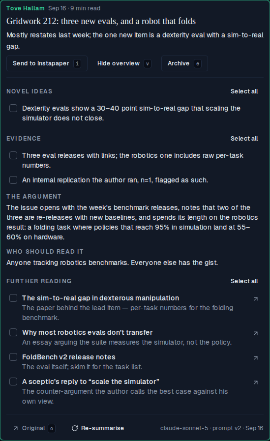
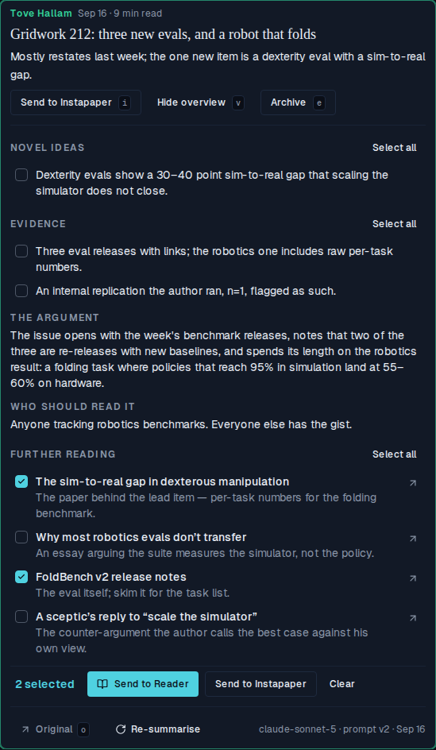
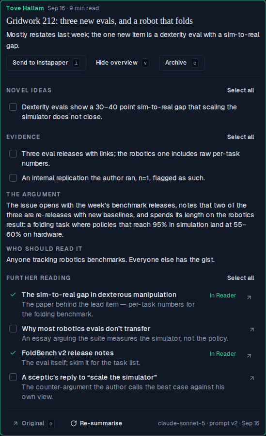
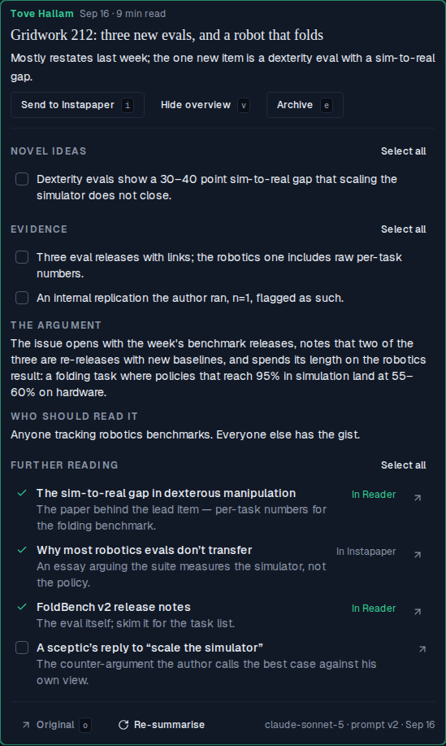
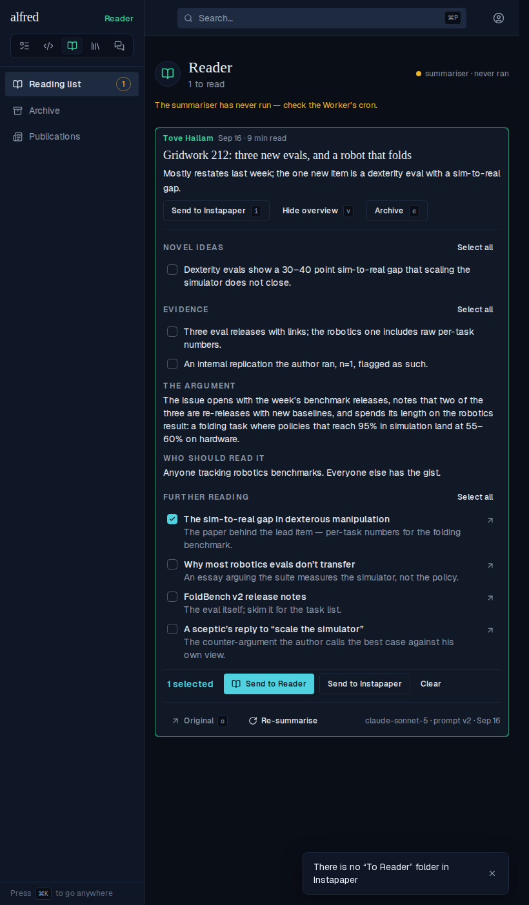
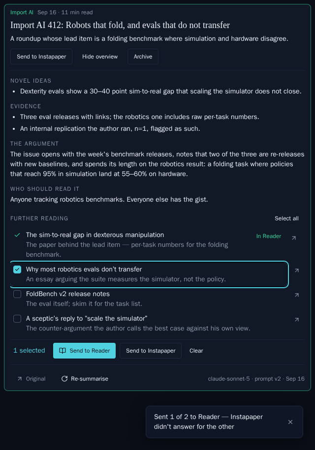
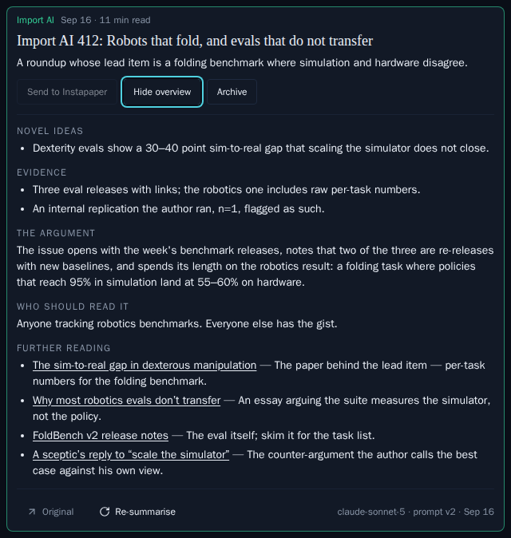

# Reader: a Further reading section for the articles a post links to

*2026-09-30T17:24:14.816Z*

A summarised post's overview gains a **Further reading** checklist: the linked sources worth reading in full, as the model judges them. Tick some, then send them to the Reader (saved into Instapaper's "To Reader" folder, which the Worker already summarises from) or straight to Instapaper's Unread.

## Tick, send, marked — in the running app

Driven through the Playwright harness against the whole app: the real send route on the Next server, a stand-in Instapaper in the mock process (answering `folders/list` with a "To Reader" folder, id 7700001), and the atomic append that records the marks. **1 — the overview open.** Further reading is the last section, after "Who should read it": each link a checkbox row (title over note) with its own ↗ open link beside it.



**2 — two links ticked.** The bar folds in with the count and the two sends.



**3 — Send to Reader.** Both read "In Reader" in the module green, can't be ticked again, and the bar folds away.



**4 — then one more, Send to Instapaper.** It reads "In Instapaper", muted.



What the stand-in Instapaper received across those two presses, recorded by the capture run. The send to the Reader lists the folders first, then saves each link by URL — titled with the model's name for the piece, described with its note — into the To Reader folder. The send to Instapaper saves to Unread: no `folder_id`, and no folder listing.

```bash
cat docs/demos/alf-289-further-reading/send-recorded.json
```

```output
{
  "sendToReader": [
    {
      "path": "/api/1.1/folders/list",
      "params": {}
    },
    {
      "path": "/api/1/bookmarks/add",
      "params": {
        "url": "https://example.com/sim-to-real-gap",
        "title": "The sim-to-real gap in dexterous manipulation",
        "description": "The paper behind the lead item — per-task numbers for the folding benchmark.",
        "folder_id": "7700001"
      }
    },
    {
      "path": "/api/1/bookmarks/add",
      "params": {
        "url": "https://example.com/foldbench-v2",
        "title": "FoldBench v2 release notes",
        "description": "The eval itself; skim it for the task list.",
        "folder_id": "7700001"
      }
    }
  ],
  "sendToInstapaper": [
    {
      "path": "/api/1/bookmarks/add",
      "params": {
        "url": "https://example.com/evals-dont-transfer",
        "title": "Why most robotics evals don’t transfer",
        "description": "An essay arguing the suite measures the simulator, not the policy."
      }
    }
  ]
}
```

**5 — an account with no "To Reader" folder.** The route answers 409 in the owner's words, saves nothing, and the tick stays for a retry once the folder exists.



## The other states, as committed Storybook baselines

Secondary evidence — the snapshot gate diffs these on every push. **One send failed:** a partial send marks what Instapaper confirmed, keeps the rest ticked for a one-press retry, and toasts how many went and what stopped the rest.



**No Instapaper:** a deployment without Instapaper credentials gets a plain list of links — no ticks, no bar.



## The summariser: links by number, stored as the post's own URLs

The stored text has no URLs, so the model can't name a link without inventing one. Instead the post's candidate links are numbered where they sit in the prose and listed after it; the model answers with numbers, and normalisation maps them back to URLs the post contains. Below, the REAL extractor and summariser run on the committed link-roundup fixture (every body link an opaque `substack.com/redirect/<uuid>`, among a sponsor, a repeat, a byline, the app link and the `redirect/2/` chrome). Only the model is a stand-in, and its answer is fixed: it picks `5`, `1`, a number the post doesn't have (`42`), `1` again, and `2`. What is stored is three items, in link order, each a URL the post really contains — the unknown number and the repeat are gone. The byline, app link, `redirect/2/` wrappers and the post's own link are never numbered at all.

```bash
node docs/demos/alf-289-further-reading/summarise-roundup.mjs
```

```output
WHAT THE MODEL IS SHOWN
  prose lines carrying a link marker:
    The sim-to-real gap in dexterous manipulation [1] ,
    Why most robotics evals don&rsquo;t transfer [2] .
    Try Quillhook free for 30 days [3] .
    FoldBench v2 release notes [4]
    A sceptic&rsquo;s reply to &ldquo;scale the simulator&rdquo; [5]
    Yet another leaderboard [6]
    the sim-to-real paper [1] .
    Manage your subscription [7] or
    unsubscribe [8] .
  links block:
    [1] https://substack.com/redirect/3d1f6a52-8b0e-4c7a-9e21-0a4f5c6d7e81
    [2] https://substack.com/redirect/7a2e9c14-5b3d-4f60-8a19-2c7d0e1b6f93
    [3] https://substack.com/redirect/c4b8e2f0-1a6d-4e97-b3c5-8d2f0a9e7c16
    [4] https://substack.com/redirect/e9d0c3b7-6f24-4a8e-9b51-3c7f2d8a0e44
    [5] https://substack.com/redirect/1f7b3e9a-0c52-4d86-a4e1-9b2c6d3f8a07
    [6] https://substack.com/redirect/5a0c8d2e-7b41-4f93-8e6a-1d9b3c5f2e70
    [7] https://substack.com/redirect/0b6e4d1c-9a37-4f25-8c80-5e2a7d9f1b36
    [8] https://substack.com/redirect/8e3a5f2d-4c19-4b70-9d68-7f1e0c2b5a93

WHAT THE MODEL ANSWERS (further_reading)
  link  5  A sceptic’s reply to “scale the simulator”
  link  1  The sim-to-real gap in dexterous manipulation
  link 42  An invented source
  link  1  The same paper again
  link  2  Why most robotics evals don’t transfer

WHAT IS STORED (outcome: done)
  https://substack.com/redirect/3d1f6a52-8b0e-4c7a-9e21-0a4f5c6d7e81
    The sim-to-real gap in dexterous manipulation — The paper behind the lead item — per-task numbers.
  https://substack.com/redirect/7a2e9c14-5b3d-4f60-8a19-2c7d0e1b6f93
    Why most robotics evals don’t transfer — Argues the suite measures the simulator, not the policy.
  https://substack.com/redirect/1f7b3e9a-0c52-4d86-a4e1-9b2c6d3f8a07
    A sceptic’s reply to “scale the simulator” — The best case against the author’s own view.
```

The eval script's dry run prints the same numbered list for every committed fixture — what the model would be shown — with no key and no bill. A post with no stored HTML gets `none`, and the prompt tells the model that means an empty list.

```bash
npm run --silent eval:reader -w workers -- --fixtures --dry-run 2>/dev/null | sed -n '/^plain-text-only/,/links/p;/^link-roundup/,$p'
```

```output
plain-text-only
  publication    tallowfield
  title          Notes from the third week
  author         tallowfield
  canonical URL  none → mailbox
  word count     190
  html_extracted false
  links          none
link-roundup
  publication    Tove Hallam from Gridwork
  title          Gridwork 212: three new evals, and a robot that folds
  author         Tove Hallam from Gridwork
  canonical URL  https://open.substack.com/pub/gridwork/p/gridwork-212
  word count     195
  html_extracted true
  links          8
    [1] https://substack.com/redirect/3d1f6a52-8b0e-4c7a-9e21-0a4f5c6d7e81
    [2] https://substack.com/redirect/7a2e9c14-5b3d-4f60-8a19-2c7d0e1b6f93
    [3] https://substack.com/redirect/c4b8e2f0-1a6d-4e97-b3c5-8d2f0a9e7c16
    [4] https://substack.com/redirect/e9d0c3b7-6f24-4a8e-9b51-3c7f2d8a0e44
    [5] https://substack.com/redirect/1f7b3e9a-0c52-4d86-a4e1-9b2c6d3f8a07
    [6] https://substack.com/redirect/5a0c8d2e-7b41-4f93-8e6a-1d9b3c5f2e70
    [7] https://substack.com/redirect/0b6e4d1c-9a37-4f25-8c80-5e2a7d9f1b36
    [8] https://substack.com/redirect/8e3a5f2d-4c19-4b70-9d68-7f1e0c2b5a93
```
