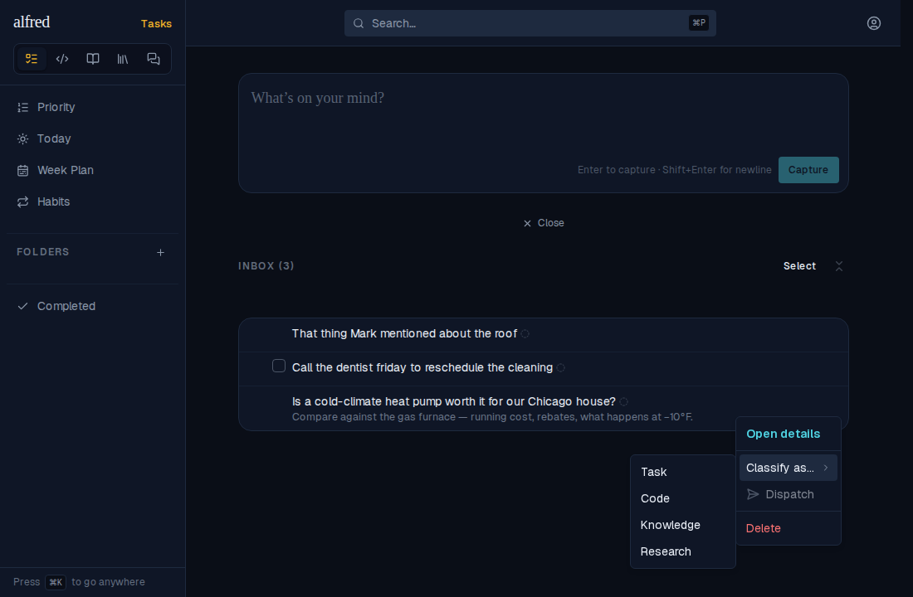
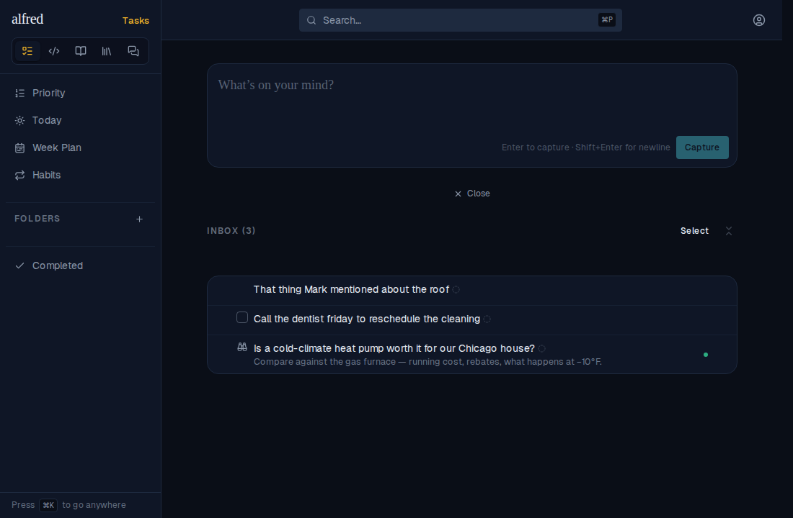
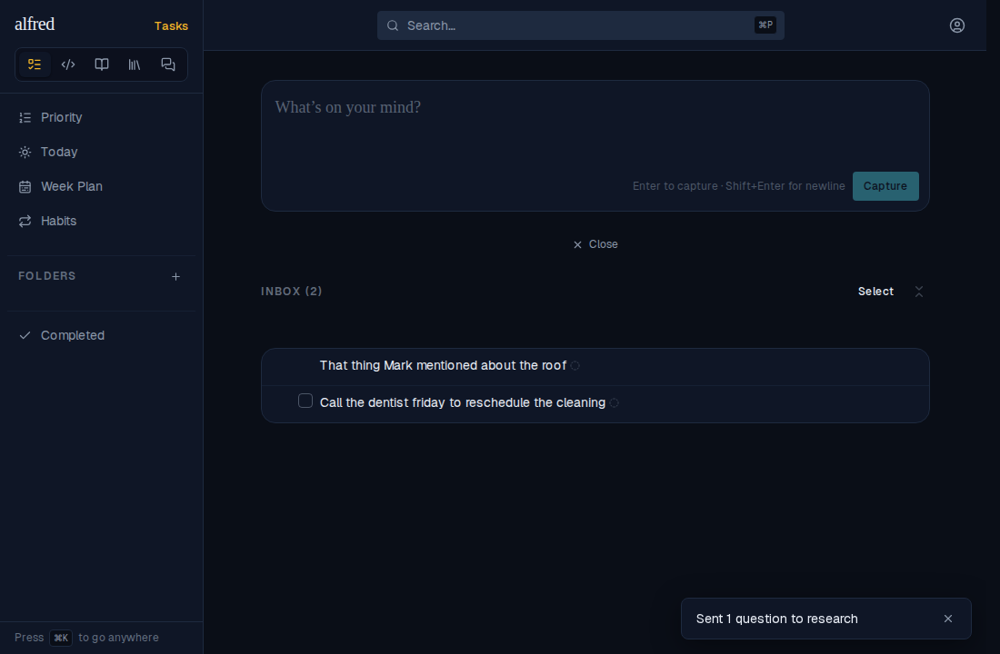
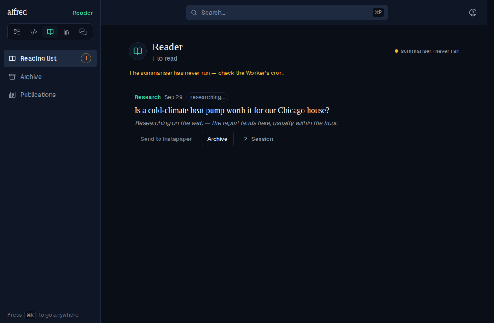
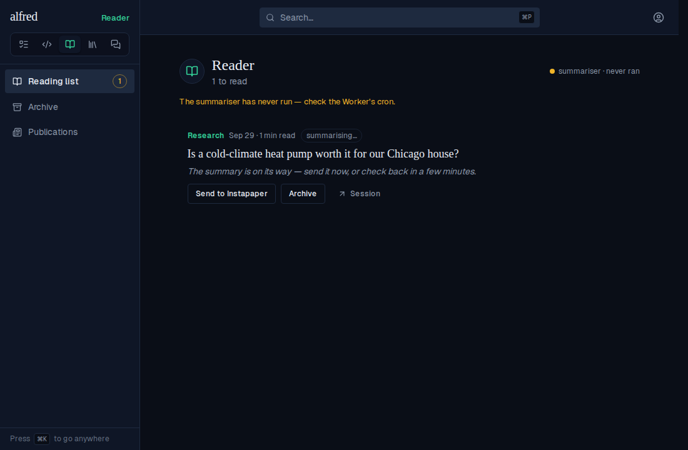
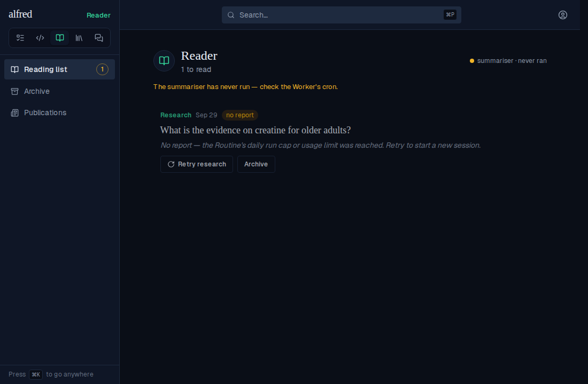
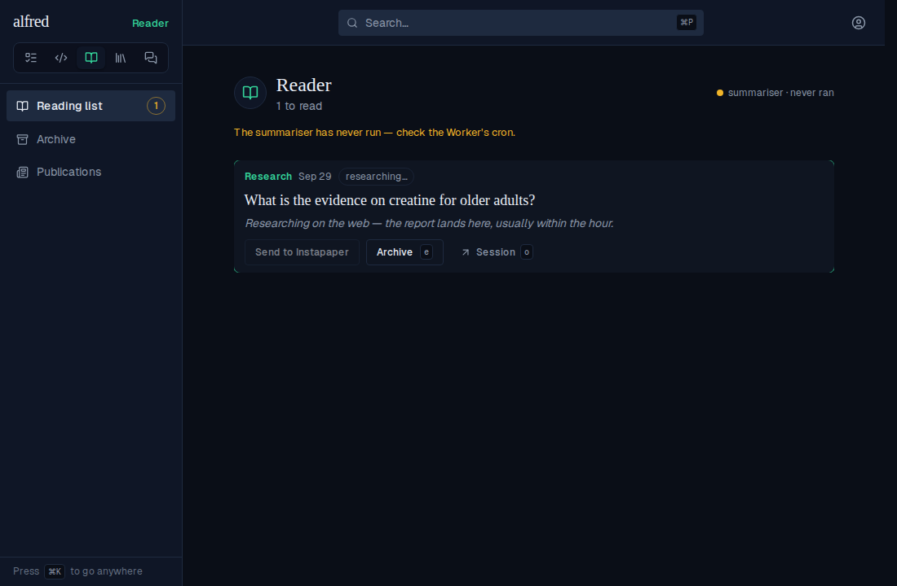

# ALF-298 — Research as an Inbox item type

*2026-09-29T05:42:08.417Z*

A capture can now be classified as **Research**: an open question alfred hands to a Claude Code Routine, which researches it on the web and delivers a cited report into the Reader. This doc walks the whole journey in the running app (against the E2E suite's in-memory backend, with the Routine's API trigger stood in by the mock), then exercises the delivery route that the Routine's session calls.

**1. Classify as… gains Research** (shown only when the deployment has the three research env vars set).



**2. The row wears the binoculars** in the checkbox slot, like a Knowledge row, and is ready to dispatch (the green pip): a childless research root needs nothing else.



**3. Dispatch** consumes the item into a queued Reader post (one transaction: stamp, insert, delete) and fires the Routine. The row leaves the Inbox and the toast — a link to the Reader — says where it went.



**4. The Reader shows the question researching.** The eyebrow reads *Research*, Send waits for the report, and *Session* (in Original's slot) opens the Claude Code run the fire started.



**5. The session delivers its report** (a keyed PUT — see section 7). On the next load the post is an ordinary one: a read time, Send live, and the Worker's summariser picks it up like any post (*summarising…*).



**6. A refused fire is visible and retryable.** Here the stand-in Routine answered 429 (the daily run cap). The question still left the Inbox — it is in the Reader, dimmed, saying why, with *Retry research* in Send's place. After the cap lifts, Retry fires again and the row is researching.





**7. The delivery route's contract.** `PUT /api/reader/research/<id>` accepts only `RESEARCH_DELIVERY_KEY` — never the ingest key — and answers 401 / 422 / 404 / 409 / 200. The report it stores is rendered to HTML once, with raw HTML and `javascript:` links dropped, because the session that wrote it reads arbitrary web pages. The block boots the real app against the mock and replays each case.

```bash
docs/demos/alf-298-research/with-app.sh
```

```output
no key                                           → 401 "Unauthorized"
the ingest key (it can create items, not this)   → 401 "Unauthorized"
the research key, a blank report                 → 422 "Invalid report"
the research key, not JSON                       → 422 "Invalid JSON body"
the research key, an unknown post                → 404 "Post not found"
the research key, a newsletter                   → 404 "Post not found"
the research key, the report                     → 200 {"id":"5e5e5e5e-5e5e-4e5e-8e5e-5e5e5e5e5e5e"}
the research key, a second report                → 409 "already delivered"

stored post:
  research_state: "done"
  summary_state: "pending"
  word_count: 45
  summarize_attempts: 0
  delivered_at set, received_at moved to it: true
  text is the markdown as sent: true
  html contains <script>: false
  html contains javascript:: false
  html keeps the real link: true
```
