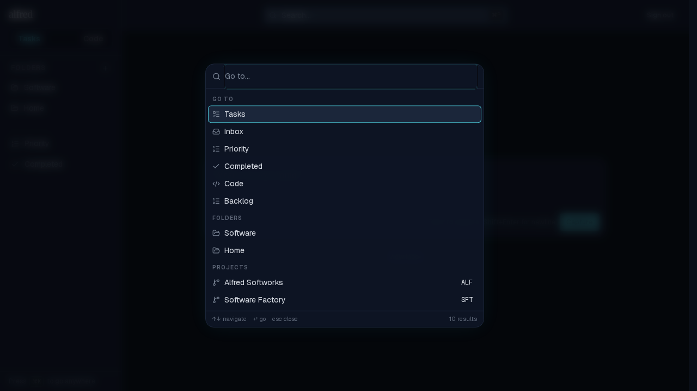
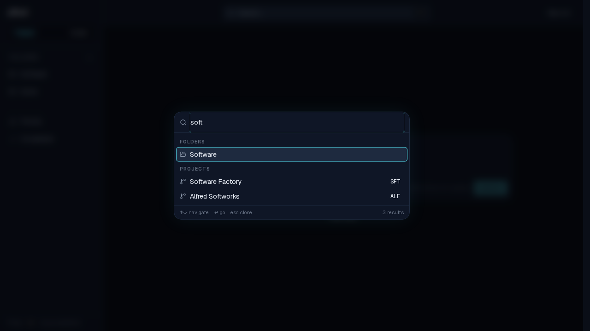
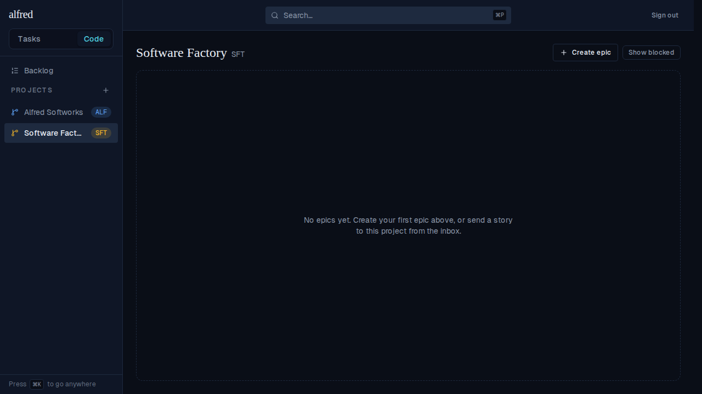

# ⌘K to navigate — the command palette

*2026-07-01T04:03:37.933Z*

Pressing ⌘K (Ctrl K on Windows/Linux) from anywhere in the shell opens a centered command palette listing every navigation *destination* — the two modules, the cross-cutting views (Priority, Completed, Backlog, Inbox), every folder, and every project. It's a **destination navigator**, distinct from the ⌘P content search (which finds individual task/story rows and is left untouched).

**1. Open (⌘K).** The input is focused and empty, and the full destination set is shown grouped *Go to → Folders → Projects*. Each row carries the same lucide icon as its sidebar entry; project rows show their KEY pill (ALF, SFT). The footer shows keyboard hints and the live result count.

**2. Filter.** Typing `soft` filters case-insensitively across every group; any group with ≥1 match keeps its header (here Go-to drops out entirely). Ranking reuses the ⌘P ladder: label-prefix beats label-substring, so *Software Factory* (prefix) sorts above *Alfred Softworks* (substring). A project matches on its **key** too, so typing a ref prefix like `ALF` also surfaces its project.

**3. Navigate.** ↑/↓ move the active row across the flattened list (hover agrees with the keyboard); ↵ performs a client-side `history.pushState` to the active destination and closes the palette — no reload, no RSC round-trip. Here it lands on the *Software Factory* board: the Code module renders and its sidebar highlights the project. The quiet **⌘K** discoverability hint sits in the sidebar chrome (bottom-left). Esc / overlay-click close without navigating.

