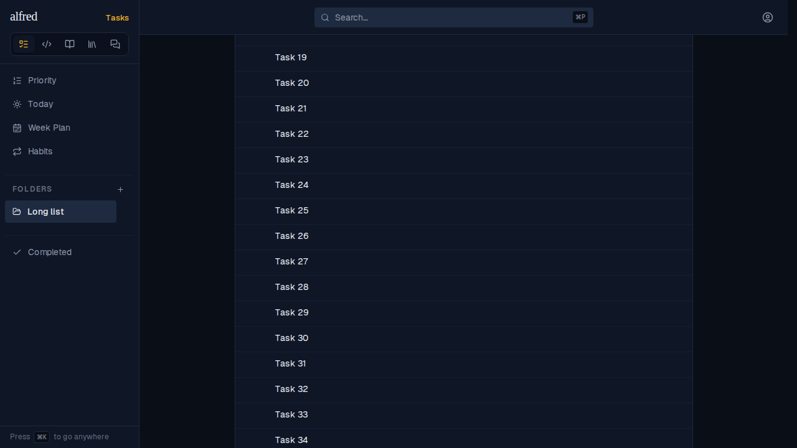
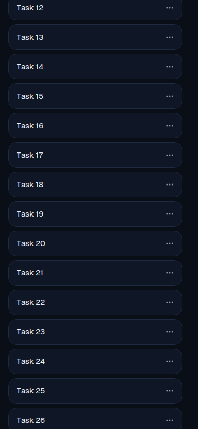
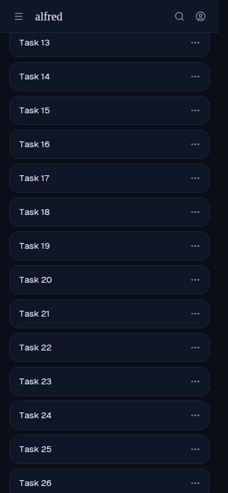

# ALF-304: sidebar and top bar stay put while module content scrolls

*2026-09-30T02:53:42.184Z*

A folder with 60 tasks, scrolled 900px down. **Before**, the page scrolled the whole shell: the top bar (search, account menu) and the sidebar's wordmark, module switcher and nav all scrolled off, leaving an empty sidebar column.

**After**, the same scroll position: the top bar and the sidebar stay pinned; only the task list moved. The sidebar is exactly one viewport tall, so its nav scrolls on its own and the ⌘K hint sits at its bottom.

Phone, **before**: the hamburger / search / account bar scrolled away with the list.

Phone, **after**: the top bar stays pinned. The document is still what scrolls (not an inner pane), so the mobile address bar still collapses and swipe-scrolling over the list behaves as before.

