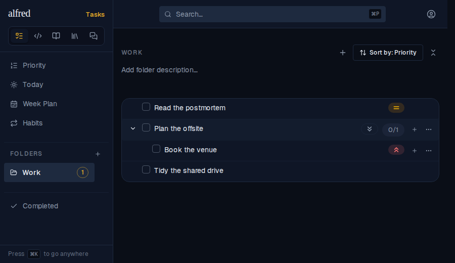
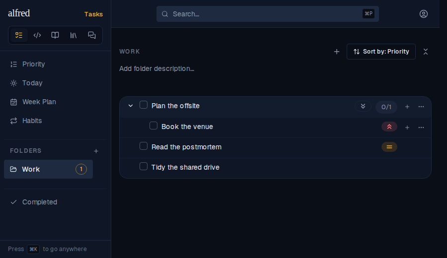
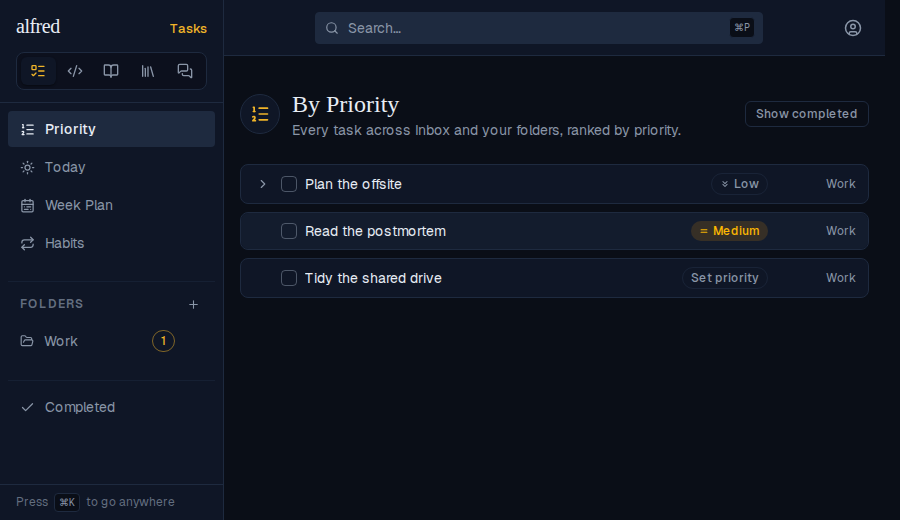
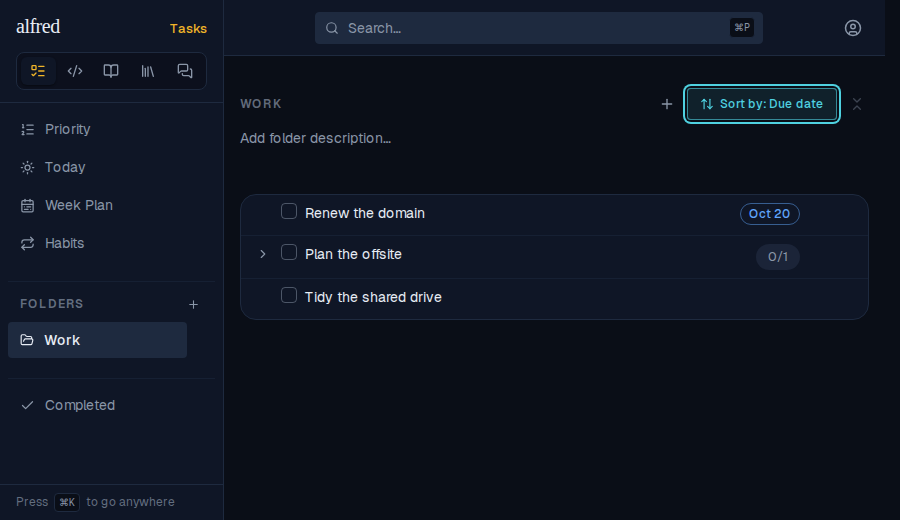
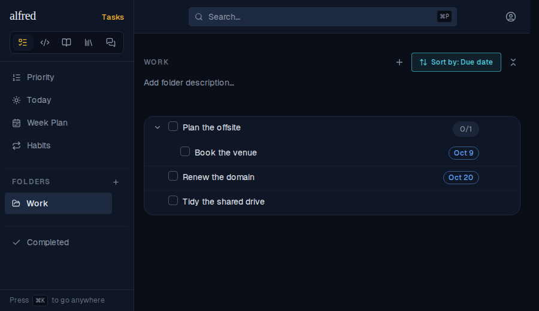

# A folder ranks a task by its most urgent subtask

*2026-10-02T18:48:51.995Z*

The By-Priority screen has always ranked a task by the best of itself and its active subtasks — a Low task hiding a High subtask floats up. A folder's Priority sort didn't: it ranked each task by its own level alone, so the same task landed in a different place depending on which screen you opened. Here the Work folder holds Plan the offsite (Low) with an active High subtask, Book the venue, next to Read the postmortem (Medium).

Before: the folder ranks Plan the offsite by its own Low, so it sits below the Medium task even though the High subtask under it is the most important thing in the folder.

After: the folder rolls the subtree up, so Plan the offsite ranks as its High subtask would and leads the list. The row's own badge still reads Low — the rollup moves the row, it doesn't relabel it.

The By-Priority screen, unchanged, ranks the same three tasks the same way — the folder now mirrors it. Both (and the Today view, and a folder's Due-date sort, which rolls up the soonest active due date) go through one shared ranking, rankNodes in frontend/lib/priority.ts.

The same rollup applies to a folder's Due-date sort, which leads with the soonest deadline in each task's active subtree. Before: Plan the offsite has no date of its own, so it sinks below Renew the domain (Oct 20), even though its subtask Book the venue is due sooner.

After: Plan the offsite ranks by Book the venue's Oct 9 and leads the folder — the same urgency rollup the Today view applies.

