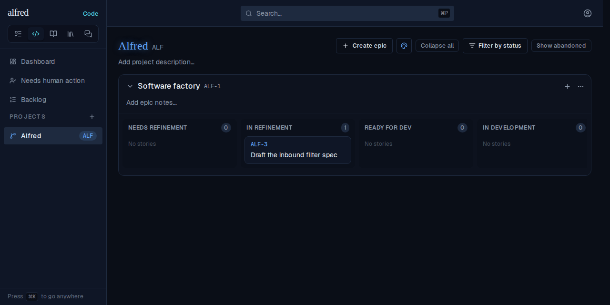
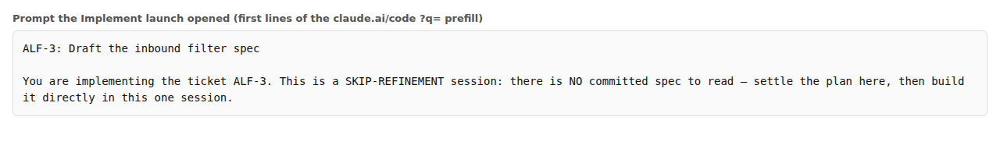
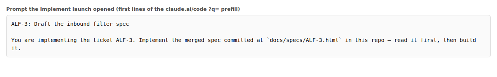

# Implement after a live refinement merge opens the spec-reading prompt

*2026-10-04T15:19:13.709Z*

ALF-317: a story whose refinement PR merged while the board was open moved into Ready for Dev live, but its Implement launch opened the SKIP-REFINEMENT prompt. The Worker records the merged spec's spec_path in the same write that moves the story to ready_for_dev. That write reaches an open tab by one of two channels: the realtime push, or the navigation refetch (refreshStatuses, ALF-69) that catches a missed push when the tab was backgrounded or its socket went stale. The refetch moved factory_state but dropped spec_path, so buildDevelopmentUrl saw spec_path === null and routed to the bypass prompt. A page reload fixed it, because the seed carries the whole row.

The journey below runs in the real app through the Playwright mock harness. The mock backend has no realtime socket, so the merge reaches the open tab exactly as it does after a missed push: by the refetch. Steps: seed ALF-3 in In Refinement with no spec, apply the Worker's merge write out of band (PATCH code_items set factory_state = ready_for_dev, spec_path = docs/specs/ALF-3.html), navigate in-app (Backlog, then back to the board, both History pushes with no reload, which a window marker confirmed), then click Implement in Claude Code and read the prefilled claude.ai/code URL that window.open received.

1. The story sits in In Refinement while its spec PR is under review.

2. The PR merges (the out-of-band Worker write). After an in-app navigation, with no reload, the card has moved to Ready for Dev and offers Implement. The board looks like this before and after the fix; the difference is the spec_path the card now holds.

3. BEFORE the fix (status.ts reverted to the base commit): Implement opens a skip-refinement session that is told there is no committed spec.

4. AFTER the fix: the refetch carries spec_path, together with the spec snapshot and PR-link columns the Worker writes with a move, so the same click opens the implementation prompt pointing at the merged spec.

