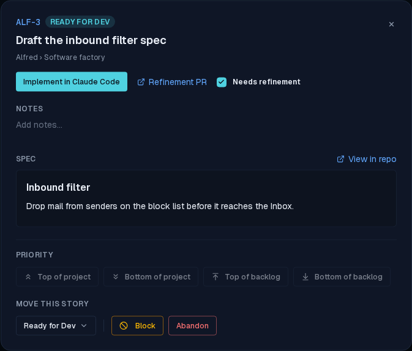
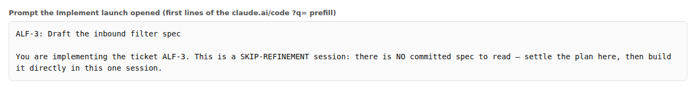
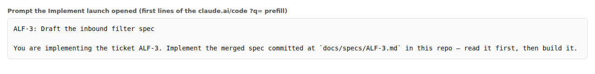

# Implement after a live refinement merge opens the spec-reading prompt

*2026-10-04T15:49:40.951Z*

ALF-317: a story whose refinement PR merged while the board was open moved into Ready for Dev live, but its Implement launch opened the SKIP-REFINEMENT prompt. The Worker records the merged spec's spec_path in the same write that moves the story to ready_for_dev. That write reaches an open tab by one of two channels: the realtime push, or the navigation refetch (refreshStatuses, ALF-69) that catches a missed push when the tab was backgrounded or its socket went stale. The refetch reconciled a narrower set of columns than the push, so it moved factory_state but dropped spec_path, and buildDevelopmentUrl, seeing spec_path === null, routed to the bypass prompt. A page reload fixed it, because the seed carries the whole row.

The fix makes the refetch reconcile every column the realtime UPDATE carries (bar priority, which waits out the pending priority writes, and the columns fixed at creation), and a parity test keeps the two projections from drifting again. The same gap had three other symptoms, and this demo shows all of them: the Refinement PR link and the spec snapshot were missing from the detail modal, and a story that finished elsewhere kept its old updated_at, so the Done lane's newest-first order (latest 3, ALF-81) hid it behind Show more.

Every shot below is the real app, driven through the Playwright mock harness by a throwaway capture spec, run once with the base status.ts (BEFORE) and once with the fix (AFTER). The mock backend has no realtime socket, so the Worker's writes reach the open tab exactly as they do after a missed push: by the refetch. The steps: seed the board, apply the Worker's writes out of band as PATCHes to code_items (ALF-3's refinement PR opening, merging with factory_state = ready_for_dev and spec_path = docs/specs/ALF-3.md, then its spec snapshot; ALF-7's implementation PR merging to done), navigate in-app (Backlog, then back to the board, both History pushes; a window marker confirmed the tab never reloaded), open ALF-3's detail modal, and click Implement in Claude Code to read the prefilled claude.ai/code URL that window.open received.

1. The board before the PRs merge: ALF-3 is In Refinement, ALF-7 is in Ready for Review, and three older stories sit in Done. This is identical before and after the fix.

2. After the in-app navigation, BEFORE the fix: ALF-3 has moved to Ready for Dev and ALF-7 to Done, but ALF-7 kept its February updated_at, so it sorts last and hides behind Show 1 more.

2. After the in-app navigation, AFTER the fix: the same moves, and ALF-7, which just finished, tops the Done lane.

3. ALF-3's detail modal, BEFORE the fix: the story is in Ready for Dev, but the modal has no Refinement PR link and says there is no spec yet.

3. ALF-3's detail modal, AFTER the fix: the Refinement PR link, View in repo (spec_path) and the snapshotted spec are all there.

4. Clicking Implement in Claude Code, BEFORE the fix: the launch opens a skip-refinement session that is told there is no committed spec.

4. Clicking Implement in Claude Code, AFTER the fix: the same click opens the implementation prompt pointing at the merged spec.

