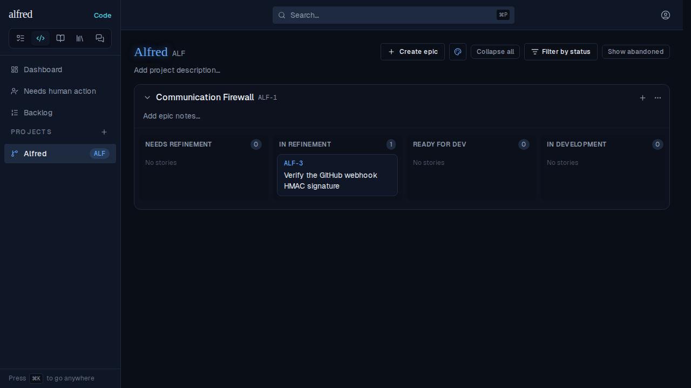
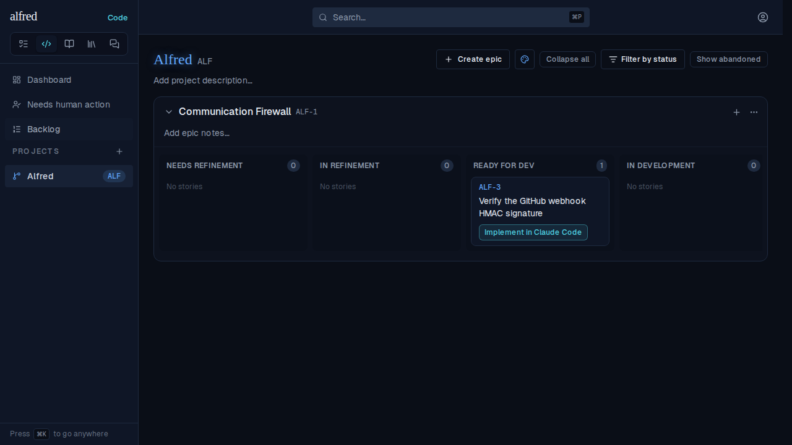
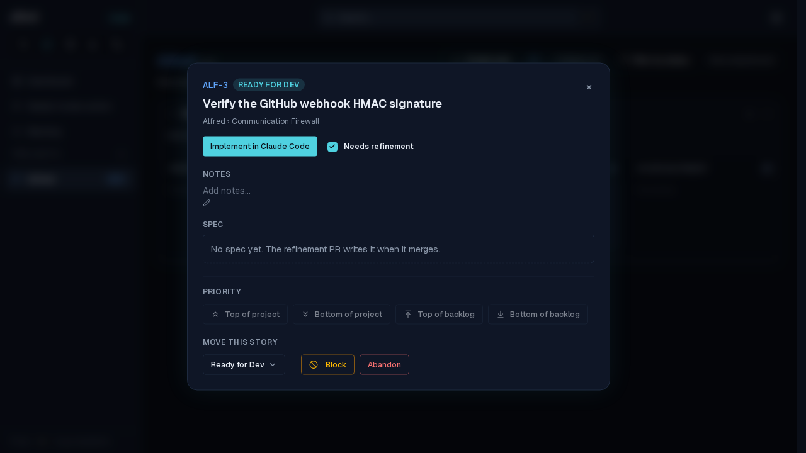
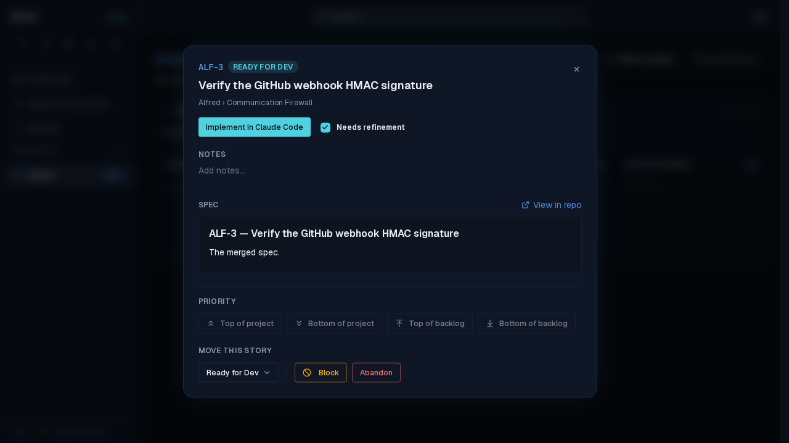
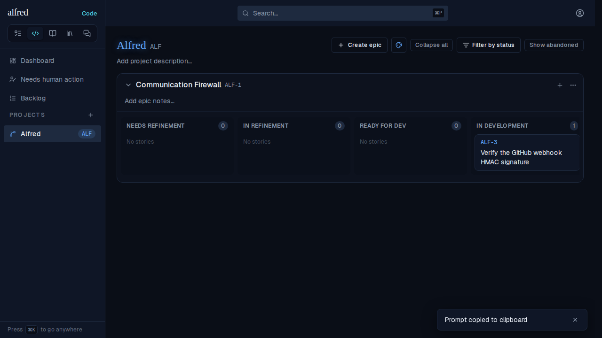

# ALF-317 — a story refined while the tab was open no longer launches as a skip-refinement

*2026-10-04T15:31:32.405Z*

A code story moves to Ready for Dev the moment its refinement PR merges — and the webhook Worker records the committed spec's path in that same write. The development launch reads that path, not the lane, to decide which session to open: a story with a spec gets the spec-reading implementation prompt, a story without one gets the SKIP-REFINEMENT prompt (ALF-137).

When the move reached an open tab through the board's live refetch, the card moved but the spec did not come with it. The story looked spec-less, so **Implement in Claude Code** opened a session told there was no committed spec to read — and the refinement that had just merged was thrown away.

## The journey on the live board

Every screenshot below is the real app driven through the Playwright mock backend, in the order the owner meets it. ALF-3 is where we start: a refinement session is running, and the card sits in **In Refinement** with no spec recorded.



The refinement PR now merges. The Worker writes `ready_for_dev` **and** `spec_path: docs/specs/ALF-3.md` onto the row, out of band. Usually the realtime channel pushes that straight into the open tab; when it doesn't — a dropped socket, a move that landed while the tab was asleep — the navigation refetch is the backstop, and that is the route this capture drives. The owner just moves around inside the module (to the Backlog and back), which is all it takes: every navigation refetches and reconciles the ticket statuses (ALF-69), so the card moves with no page reload.



## What the stale row looked like on screen

Open that card and the defect is visible without leaving the board. **Before** — the refetch carried the lane and left the spec columns behind, so a story whose refinement PR had just merged claimed none was ever written:



**After** — the same journey, same merge, same navigation: the spec the refinement produced is there, with its *View in repo* link.



## The session the launch actually opens

Clicking **Implement in Claude Code** on that card awaits the durable state write, moves the story to In Development, and hands the new tab a prefilled prompt. (`window.open` is stubbed in the capture, so the URL is recorded instead of navigating to claude.ai.)



Both prompts below are the genuine article — decoded from the URL the app handed `window.open` in the run above, not hand-written. **Before**: the merged spec exists, and the session is told it does not.

```bash
cat docs/demos/alf-317-refetch-drops-the-spec/launch-prompt-before.txt
```

````output
ALF-3: Verify the GitHub webhook HMAC signature

You are implementing the ticket ALF-3. This is a SKIP-REFINEMENT session: there is NO committed spec to read — settle the plan here, then build it directly in this one session.

1. Ground yourself first: skim the repo and honor its own conventions — read any CONTRIBUTING or CLAUDE.md — and base your work on the code that already exists.
2. If the title and context below don't pin down the scope, ASK ME HERE before building rather than guessing — you don't need to guess, I'm in this tab. Once the plan is settled, go ahead.
3. Implement the change directly, following the repo's own conventions (tests/TDD included) — pin each requirement with a test.
4. When done, open a pull request whose description carries this machine-readable block verbatim — a CI check enforces it, so reproduce the fence exactly:

```alfred
alfred-ticket: ALF-3
phase: implementation
```

5. Before opening the PR, confirm your changes satisfy the agreed plan and the block above is reproduced exactly.
6. Once the PR is open, run ONE round of adversarial review: spawn a subagent with its model set to Opus (e.g. the Agent tool's `model: "opus"` — left unset, it typically inherits yours), whatever model you are yourself, to review the PR antagonistically — briefed without your reasoning, and report-only (no edits, commits, or pushes). Run it in the foreground and wait for its report; that wait is your own work, not a check-in. Fix the in-scope findings you verify as legitimate and push; raise real but out-of-scope ones with me rather than widening the diff. Then add an "Adversarial review" section to the PR description listing each finding and what you did with it (fixed, declined and why, or raised with me), leaving the alfred block intact. Follow the adversarial-review skill at `.claude/skills/adversarial-review/SKILL.md` where present — it owns how to brief the reviewer and triage its findings. If the ticket context below says otherwise (more rounds, or none), follow it.
Once this PR is open, don't proactively schedule a check-in on it (a wakeup, timer, or recurring job polling it, its CI, or its deploy) — left running that's tokens spent finding nothing new. Do respond when a CI failure or comment actually reaches you, via an event subscription (e.g. subscribe_pr_activity) rather than a timer. (Pacing your own work before this PR exists — waiting out a slow check, say — is unaffected and fine.)
````

**After**: the same click on the same story names the merged spec, says to read it first, and carries the archive step and the `spec-path` the implementation PR's block needs.

```bash
cat docs/demos/alf-317-refetch-drops-the-spec/launch-prompt-after.txt
```

````output
ALF-3: Verify the GitHub webhook HMAC signature

You are implementing the ticket ALF-3. Implement the merged spec committed at `docs/specs/ALF-3.md` in this repo — read it first, then build it.

Ground yourself first: skim the repo and honor its own conventions (read any CONTRIBUTING or CLAUDE.md). If the merged spec is ambiguous or has drifted from the current code, ASK ME HERE before building rather than guessing — I'm in this tab. Follow the implement-spec skill at `.claude/skills/implement-spec/SKILL.md` where present — it owns the conventions for building from a spec, including how and where the consumed spec gets archived, and pinning each requirement with a test.

When the change is built, ARCHIVE the now-consumed spec in this same PR (keep the block's spec-path below pointing at the original path `docs/specs/ALF-3.md`). If the implement-spec skill is absent, git-move it to `docs/specs/archive/ALF-3.md`. A CI check fails the PR if `docs/specs/ALF-3.md` is still sitting un-archived in the active specs directory.

When done, open a pull request whose description carries this machine-readable block verbatim — a CI check enforces it, so reproduce the fence exactly:

```alfred
alfred-ticket: ALF-3
phase: implementation
spec-path: docs/specs/ALF-3.md
```

Before opening the PR, confirm your changes satisfy the spec's acceptance criteria, the spec has been archived out of the active specs directory, and the block above is reproduced exactly.
Once the PR is open, run ONE round of adversarial review: spawn a subagent with its model set to Opus (e.g. the Agent tool's `model: "opus"` — left unset, it typically inherits yours), whatever model you are yourself, to review the PR antagonistically — briefed without your reasoning, and report-only (no edits, commits, or pushes). Run it in the foreground and wait for its report; that wait is your own work, not a check-in. Fix the in-scope findings you verify as legitimate and push; raise real but out-of-scope ones with me rather than widening the diff. Then add an "Adversarial review" section to the PR description listing each finding and what you did with it (fixed, declined and why, or raised with me), leaving the alfred block intact. Follow the adversarial-review skill at `.claude/skills/adversarial-review/SKILL.md` where present — it owns how to brief the reviewer and triage its findings. If the ticket context below says otherwise (more rounds, or none), follow it.
Once this PR is open, don't proactively schedule a check-in on it (a wakeup, timer, or recurring job polling it, its CI, or its deploy) — left running that's tokens spent finding nothing new. Do respond when a CI failure or comment actually reaches you, via an event subscription (e.g. subscribe_pr_activity) rather than a timer. (Pacing your own work before this PR exists — waiting out a slow check, say — is unaffected and fine.)
````

## The root cause

`codeStoryStatusPatch` (`frontend/lib/code/status.ts`) is the one projection the navigation refetch reconciles onto a story the store already holds. It took the lane and its companions and stopped there, so the refetch moved a card to Ready for Dev while the row kept the `spec_path: null` it had been seeded with. `buildDevelopmentUrl` reads exactly that column, so the lane and the prompt disagreed.

The projection now carries the spec snapshot too. They belong there because a state is not self-describing without them — Ready for Dev means two different things depending on whether a spec was ever committed — and they are safe to carry for the same reason `title` and `priority` are not: nothing in the app writes them locally, so there is no edit in flight to clobber.

```bash
awk '/^export function codeStoryStatusPatch/,/^}/' frontend/lib/code/status.ts
```

```output
export function codeStoryStatusPatch(story: CodeStory): CodeStoryStatus {
  return {
    factory_state: story.factory_state,
    lane: story.lane,
    blocked_reason: story.blocked_reason,
    blocked_from: story.blocked_from,
    requires_refinement: story.requires_refinement,
    spec_path: story.spec_path,
    spec_sha: story.spec_sha,
    spec_markdown: story.spec_markdown,
  };
}
```

The **realtime** path was never broken: the `code_items` UPDATE handler feeds its payload through `codeItemToStoryPatch`, which has always projected all three spec columns. Only the refetch had the gap, which is why the bug came and went — a hard reload seeds the store from the view and always launched correctly.

## Adjacent, left alone

Two neighbours are left for their own stories rather than widening this fix. The same projection omits `refinement_pr_url` / `implementation_pr_url`, so a story whose PR url reaches the tab only through the refetch shows no **Review PR** chip until a reload. And a story's denormalized `epic_spec_path` goes stale the same way — the epics realtime handler patches the epic row, not the stories holding a copy — so an implementation prompt launched after an epic spec merges can lose its *Epic context* paragraph. That one is the closer relative (it is the same prompt coming out wrong), but it is stale through every live path, not just this projection, so carrying it here would only half-fix it.
