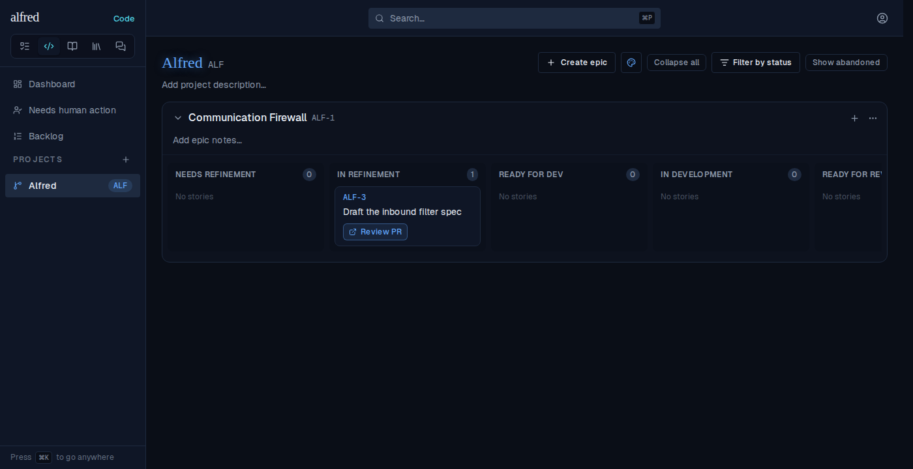
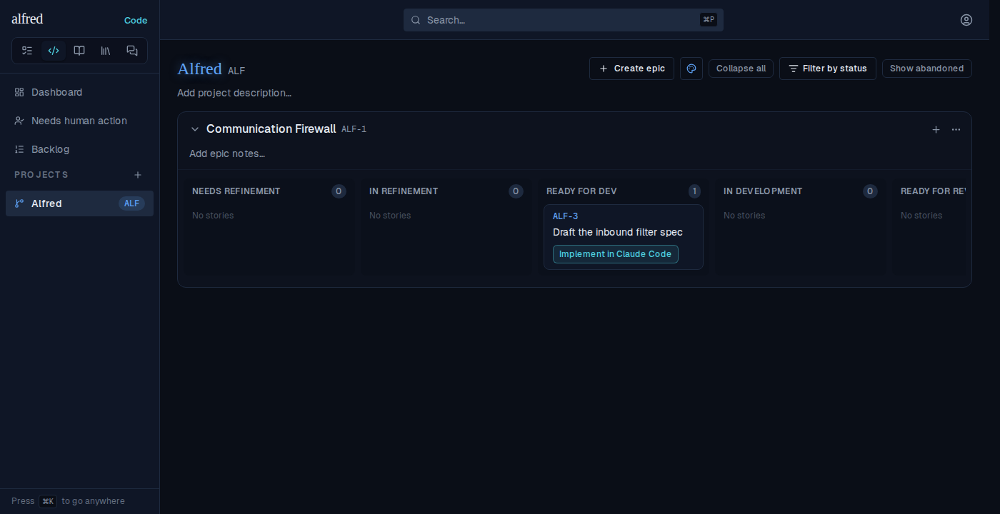
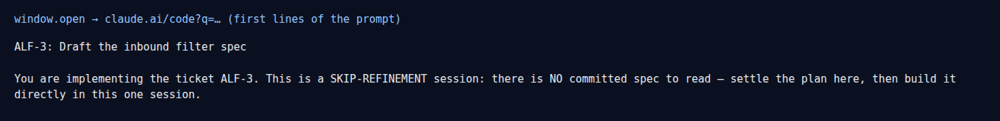
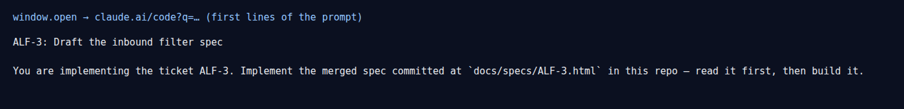

# ALF-317 — Implement reads the spec after a refetch-recovered move to Ready for Dev

*2026-10-02T18:42:17.003Z*

When a refinement PR merges, the Worker writes `factory_state: ready_for_dev` and the spec's `spec_path` in ONE PATCH. An open tab hears that write over realtime, but if the socket dropped (you were away in Claude Code, or on your phone), the move only reaches the board through the navigation refetch (`refreshStatuses`, ALF-69). That refetch copied the state and nothing the Worker wrote alongside it, so the card landed in Ready for Dev with `spec_path` still null. The Implement launch reads a null `spec_path` as "this story has no spec" and opens the SKIP-REFINEMENT prompt.

Shots 1 and 2 are the real app (Playwright against the in-memory Supabase mock, which has no realtime socket, so it stands in for a dropped connection). Shots 3 and 4 are not app UI: the launched claude.ai tab can't load in the sandbox, so they render the prompt the click actually handed to `window.open`, captured in the same run. **1.** The story sits In Refinement while its spec PR is open:

**2.** The test then sends the Worker's refinement-merge write exactly as the Worker does: `PATCH /rest/v1/code_items?ref=eq.ALF-3` with `{factory_state: 'ready_for_dev', spec_path: 'docs/specs/ALF-3.html'}`. The tab hears nothing. The user clicks **Backlog** and then **Alfred** in the sidebar (client-side navigation, no reload), the refetch runs, and the card is in Ready for Dev with **Implement in Claude Code** showing. This screen is identical before and after the fix, which is why the bug was easy to miss:

**3. Before the fix** (`frontend/lib/code/status.ts` reverted to `main`): clicking Implement passes `window.open` the skip-refinement prompt, even though the spec is committed:

**3. After the fix:** the same journey opens the implementation prompt, which names the merged spec. A full page reload always worked, because the seed read carries every column; the refetch now carries the Worker-written spec and PR columns too.

