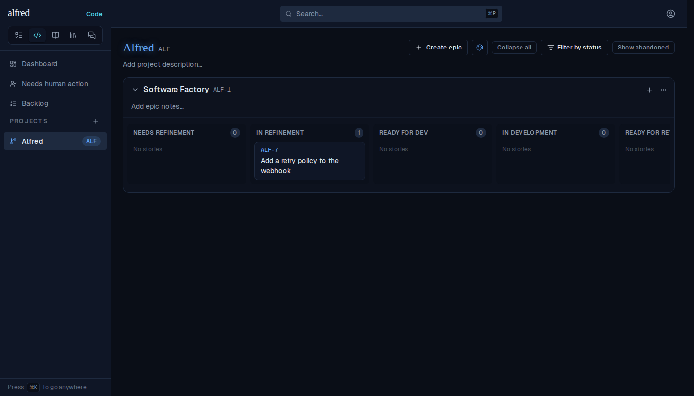
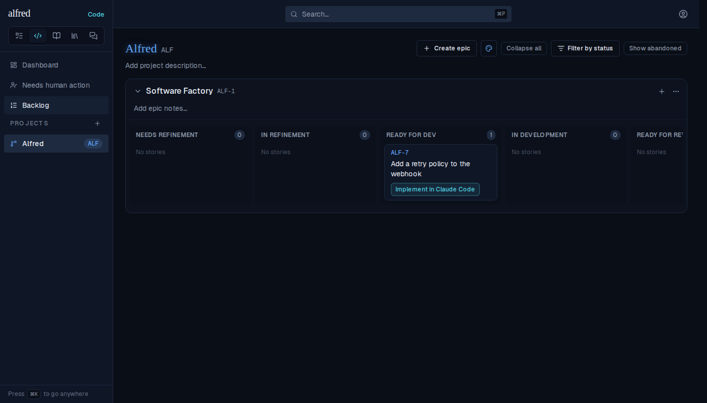

# A refinement merge the tab learns about on refetch still launches the spec

*2026-10-04T15:15:09.038Z*

**Bug (ALF-317):** a story whose refinement PR merged moved to Ready for Dev, but its **Implement in Claude Code** launch opened a SKIP-REFINEMENT prompt instead of the one that reads the merged spec.

**Root cause:** the Worker writes `factory_state = ready_for_dev` and `spec_path` in one PATCH. When the realtime UPDATE never reaches the tab (a backgrounded phone tab, a stale socket), the card moves on the next navigation via `refreshStatuses` — which reconciled only `codeStoryStatusPatch` (`frontend/lib/code/status.ts`): the state, but not `spec_path`. `buildDevelopmentUrl` keys on `spec_path === null`, so the card sat in Ready for Dev looking spec-less and launched a skip-refinement session. The fix adds `spec_path` to the status projection.

The journey below runs in the live app against the in-memory Supabase mock, which has no realtime socket — the exact condition of a missed UPDATE.

1. The story is In Refinement while its refinement PR is open.



2. The refinement PR merges: the Worker PATCHes `code_items` with `factory_state: ready_for_dev` and `spec_path: docs/specs/alf-7/SPEC.md`. The tab misses the realtime UPDATE; navigating to the Backlog and back runs the refetch, and the card lands in Ready for Dev.



3. Clicking **Implement in Claude Code**. **Before the fix**, the same journey opened:

> ALF-7: Add a retry policy to the webhook
>
> You are implementing the ticket ALF-7. This is a SKIP-REFINEMENT session: there is NO committed spec to read — settle the plan here, then build it directly in this one session.

**After the fix**, the launched prompt (captured from the opened claude.ai URL into `launch-prompt.txt`) reads the merged spec, and never says SKIP-REFINEMENT:

```bash
head -3 docs/demos/alf-317-refetch-keeps-spec/launch-prompt.txt; grep -c SKIP-REFINEMENT docs/demos/alf-317-refetch-keeps-spec/launch-prompt.txt || true
```

```output
ALF-7: Add a retry policy to the webhook

You are implementing the ticket ALF-7. Implement the merged spec committed at `docs/specs/alf-7/SPEC.md` in this repo — read it first, then build it.
0
```
