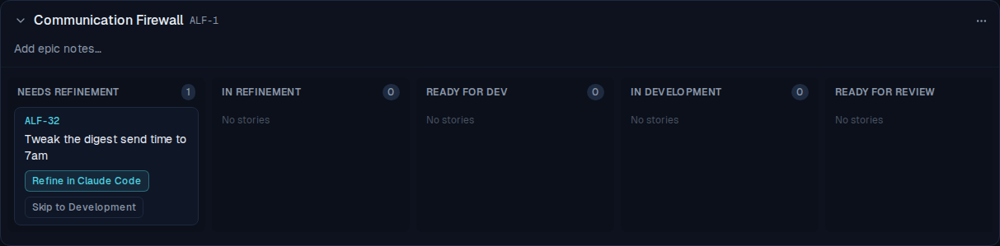
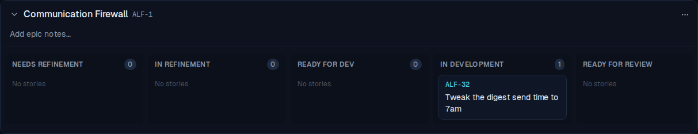
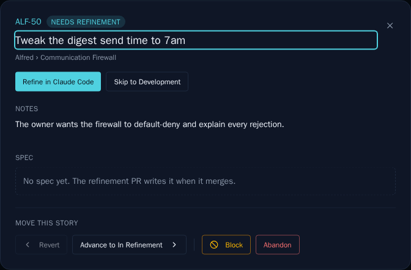

# ALF-32 — Skip to Development (bypass refinement)

*2026-06-23T17:58:49.037Z*

For a small, well-understood task the refinement phase is pure overhead. ALF-32 adds a **second launch button** beside *Refine in Claude Code*, offered only from `needs_refinement`: **Skip to Development**. It opens one Claude Code session whose prompt is a *blend* of the refinement and implementation prompts — ground in the repo, **ask clarifying questions if scope is unclear**, then once the plan is settled **implement directly** — and opens **one** implementation PR (`phase: implementation`). No spec file, no separate refinement PR.

## The user journey on the live board

The reviewer's flow, end to end. ALF-32 starts in **Needs Refinement** — the card now offers two chips, the teal primary **Refine in Claude Code** and the muted, subordinate **Skip to Development**:



Clicking **Skip to Development** awaits the durable state write, then the card **jumps straight to In Development** — skipping both *In Refinement* **and** *Ready for Dev* (each stays at 0), and Needs Refinement drops to 0. (Only after that write does `window.open` fire the prefilled tab; it's stubbed here so the capture never navigates to claude.ai.)



## The detail-modal header

The same two actions appear in the story-detail modal header — the solid-accent **Refine in Claude Code** and the subordinate outline **Skip to Development**. (A `needs_refinement` story has no spec yet, so the spec body reads "No spec yet".) The card chip and the modal button are the same committed Storybook visual snapshots that gate the visual subordination.



## The blended bypass prompt

This `exec` calls the **actual** `buildBypassUrl` builder in `frontend/lib/code/links.ts` (via Node's TS strip-types), so the decoded prompt below is the genuine one the launch opens — not a hand-copied sample. Note it: leads with `<ref>: <title>`; grounds in the repo and says **ASK ME HERE before building** if scope is unclear; tells the agent to **implement directly once the plan is settled**; **never** instructs reading a committed spec ("there is NO committed spec to read"); and ends by opening **one** PR carrying the verbatim `alfred` block with **`phase: implementation`**.

```bash
cd frontend && node --experimental-strip-types --input-type=module -e "
import { buildBypassUrl } from './lib/code/links.ts';
const project = { repo_owner: 'ac3charland', repo_name: 'alfred', name: 'Alfred', key: 'ALF', id: 'p1', github_url: null, ref_seq: 5, created_at: 'x' };
const story = { ref: 'ALF-50', title: 'Tweak the digest send time to 7am', notes: 'Owner wants 7am local, not 6am.', spec_path: null, factory_state: 'needs_refinement' };
const url = buildBypassUrl(project, story);
console.log('URL:', url);
console.log();
console.log('DECODED PROMPT:');
console.log(new URL(url).searchParams.get('q'));
" 2>/dev/null
```

````output
URL: https://claude.ai/code?repo=ac3charland%2Falfred&q=ALF-50%3A+Tweak+the+digest+send+time+to+7am%0A%0AYou+are+implementing+the+ticket+ALF-50.+This+is+a+SKIP-REFINEMENT+session%3A+there+is+NO+committed+spec+to+read+%E2%80%94+settle+the+plan+here%2C+then+build+it+directly+in+this+one+session.%0A%0A1.+Ground+yourself+first%3A+skim+the+repo+and+honor+its+own+conventions+%E2%80%94+read+any+CONTRIBUTING+or+CLAUDE.md+%E2%80%94+and+base+your+work+on+the+code+that+already+exists.%0A2.+If+the+title+and+context+below+don%27t+pin+down+the+scope%2C+ASK+ME+HERE+before+building+rather+than+guessing+%E2%80%94+you+don%27t+need+to+guess%2C+I%27m+in+this+tab.+Once+the+plan+is+settled%2C+go+ahead.%0A3.+Implement+the+change+directly%2C+following+the+repo%27s+own+conventions+%28tests%2FTDD+included%29.%0A4.+When+done%2C+open+a+pull+request+whose+description+carries+this+machine-readable+block+verbatim+%E2%80%94+a+CI+check+enforces+it%2C+so+reproduce+the+fence+exactly%3A%0A%0A%60%60%60alfred%0Aalfred-ticket%3A+ALF-50%0Aphase%3A+implementation%0Aspec-path%3A+docs%2Fspecs%2FALF-50.md%0A%60%60%60%0A%0A5.+Before+opening+the+PR%2C+confirm+your+changes+satisfy+the+agreed+plan+and+the+block+above+is+reproduced+exactly.%0A%0A%0AContext+%28from+the+ticket%29%3A%0AOwner+wants+7am+local%2C+not+6am.

DECODED PROMPT:
ALF-50: Tweak the digest send time to 7am

You are implementing the ticket ALF-50. This is a SKIP-REFINEMENT session: there is NO committed spec to read — settle the plan here, then build it directly in this one session.

1. Ground yourself first: skim the repo and honor its own conventions — read any CONTRIBUTING or CLAUDE.md — and base your work on the code that already exists.
2. If the title and context below don't pin down the scope, ASK ME HERE before building rather than guessing — you don't need to guess, I'm in this tab. Once the plan is settled, go ahead.
3. Implement the change directly, following the repo's own conventions (tests/TDD included).
4. When done, open a pull request whose description carries this machine-readable block verbatim — a CI check enforces it, so reproduce the fence exactly:

```alfred
alfred-ticket: ALF-50
phase: implementation
spec-path: docs/specs/ALF-50.md
```

5. Before opening the PR, confirm your changes satisfy the agreed plan and the block above is reproduced exactly.


Context (from the ticket):
Owner wants 7am local, not 6am.
````
