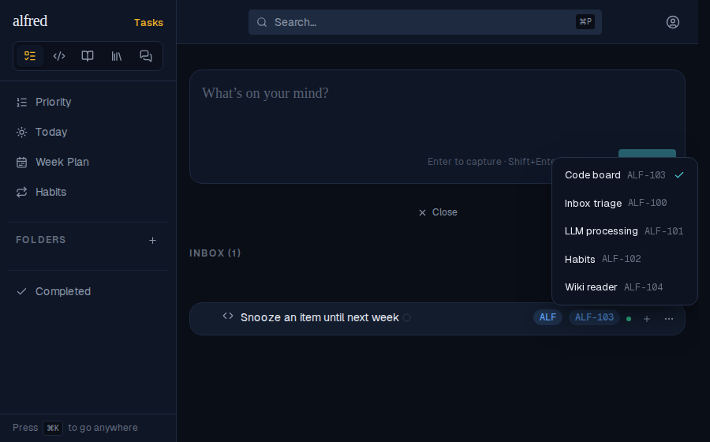
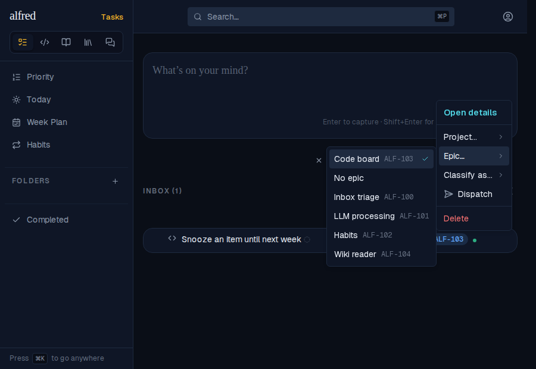
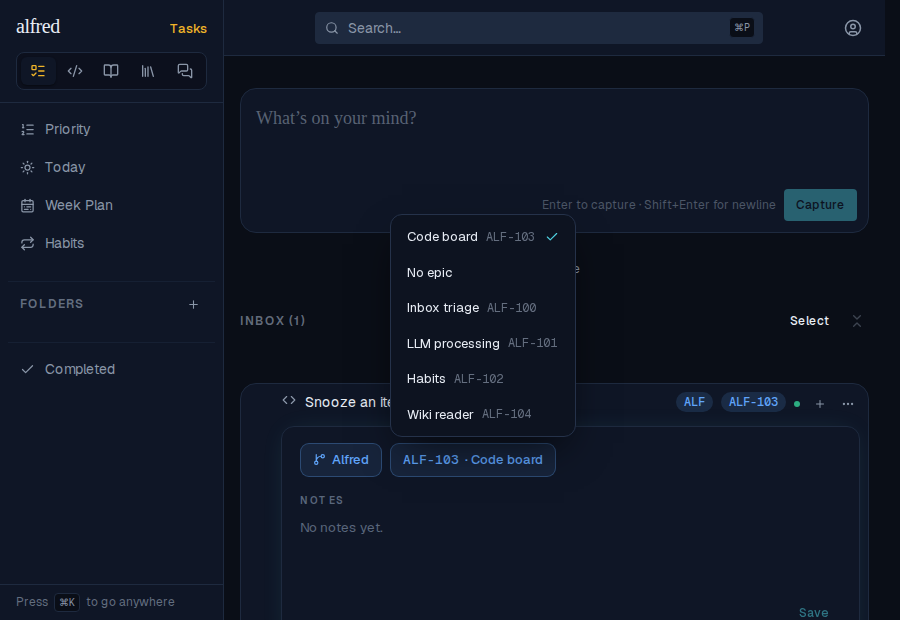

# ALF-323 — the epic badge's picker leads with the current epic

*2026-10-02T18:41:55.505Z*

Tapping an Inbox row's epic badge opens a picker of the project's epics. The list used to follow store order, so a long project buried the current choice somewhere down the list (its tick was the only clue). It now leads with the selected epic; the rest keep their order. The same shared option builder feeds the detail-panel Epic chip and the row menu's Epic… submenu, so all three agree.

Below: the live Inbox row (seeded with five epics) whose badge reads ALF-103. That epic is fourth in store order, yet the popover lists it first, ticked, with Inbox triage, LLM processing, Habits and Wiki reader following in their original order.

Store order for those five epics, which is how every picker listed them before this change: ALF-100 Inbox triage, ALF-101 LLM processing, ALF-102 Habits, ALF-103 Code board, ALF-104 Wiki reader. Code board (the current epic) was fourth.

The row's ⋯ menu → **Epic…** submenu shares the same option builder: the current epic leads, ticked, then No epic, then the rest in order.

And the detail panel's **Epic** chip, opened from ⋯ → Open details: same order.

