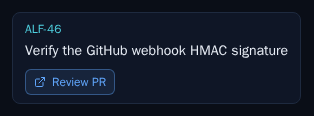
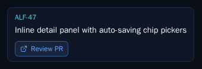

# ALF-61 — Review PR buttons on board cards

*2026-07-01T03:45:29.744Z*

ALF-61 surfaces a one-click **Review PR** chip on a board card while its work awaits human review, so a reviewer can jump straight to the open PR from the board — no detail modal needed. The chip renders only in the two review states, and only once the state's PR URL is recorded on the row:

- `in_refinement` → links to `refinement_pr_url` (the spec PR)
- `ready_for_review` → links to `implementation_pr_url` (the implementation PR)

Any other state — or a review state whose PR isn't recorded yet — renders no chip. The selector that encodes this is a small pure function, mirroring the existing `launchPhasesFor` pattern.

**The selector** (`frontend/lib/code/review-pr.ts`) is unit-tested for all three branches (in_refinement, ready_for_review, other) including the null-URL fallthrough:

```bash
cd frontend && npx jest lib/code/review-pr 2>&1 | grep -E 'Tests:|Test Suites:'
```

```output
Test Suites: 1 passed, 1 total
Tests:       11 passed, 11 total
```

**The card wiring + real-time behavior.** `story-card.test.tsx` proves the chip's href/target, that it hides when the PR URL is absent or the state isn't a review state, that clicking it does not fire the card's `onOpen`, and that it carries the accent focus ring. `code-store.test.tsx` adds a real-time regression test: a board card in `in_refinement` with no PR URL gains the **Review PR** chip live when a `code_items` UPDATE delivers the URL — no page refresh.

```bash
cd frontend && npx jest components/code/story-card lib/stores/code-store 2>&1 | grep -E 'Tests:|Test Suites:'
```

```output
Test Suites: 2 passed, 2 total
Tests:       123 passed, 123 total
```

**Visual evidence** — the two new Storybook snapshot baselines, driving the visual-regression gate. An `in_refinement` card whose spec PR is open, and a `ready_for_review` card whose implementation PR is open, each grow the **Review PR** chip (ExternalLink icon + label, blue card-chip chrome):




