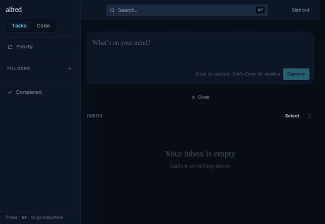

# ALF-62 — Project parsing in the Inbox capture box

*2026-07-07T21:31:32.392Z*

Prefixing an Inbox capture with a recognized `<project name|key>:` (case-insensitive) classifies it as **Code**, assigns that project, strips the prefix, and capitalizes the first letter of the remainder. Anything else is captured verbatim as an `unclassified` item, exactly as before. Every clip below is the live app driven end-to-end — you can watch the text being typed and the app respond.

### 1 · Typing into the Inbox box

Watch each capture typed in and submitted: `ALF: add dark mode` → **Code** "Add dark mode" (**ALF** chip); `alfred: refactor the auth flow` → **Code** (name match, case-insensitive); `Note: buy milk` → **unclassified**, captured verbatim (no such project).

The resulting Inbox after the full matrix — key match, name match (case-insensitive, rest-of-title case kept), a second project (**RLY**) with its own chip colour, first-colon-only splitting (`ALF: rename the : separator` → "Rename the : separator"), and the two verbatim non-matches:

### 2 · Gate pre-population — single item

Opening _Send to Code module…_ on a code inbox row pre-selects its assigned project (**Alfred**); the user only has to pick the epic.

### 3 · Gate pre-population — bulk, unanimous project

Selecting two items that both carry **Alfred** and sending them together pre-selects **and locks** the project to a read-only chip (no listbox).

### 4 · Gate pre-population — bulk, mixed projects

A selection whose projects differ (**Alfred** + **Relay**) falls back to the interactive picker with nothing pre-selected — no lock.

### 5 · Parsing is Inbox-only

The prefix grammar is opt-in to the main Inbox box. Typing `ALF: write the changelog` into the inline **subtask** box captures it verbatim as a plain task — prefix intact, no Code badge, no chip. (The Siri `POST /api/items` path is likewise untouched.)

