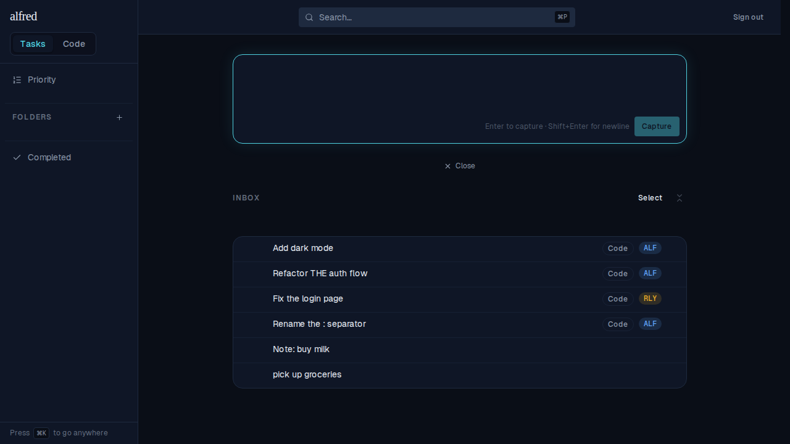
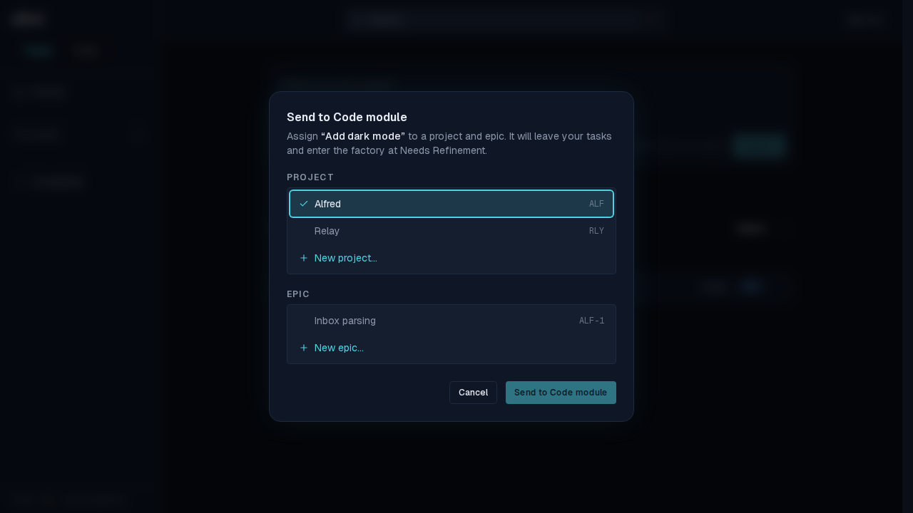
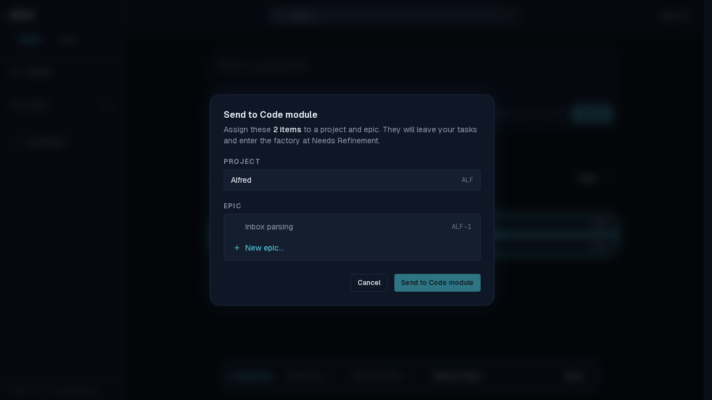
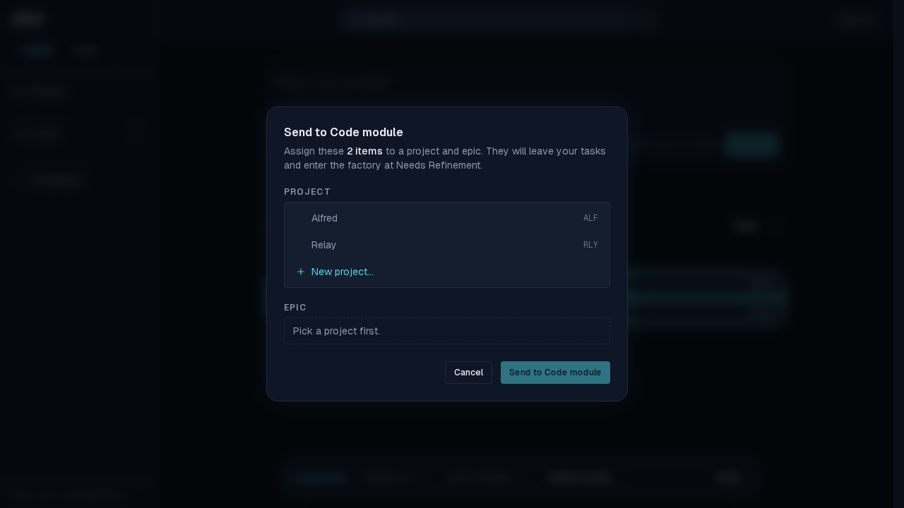
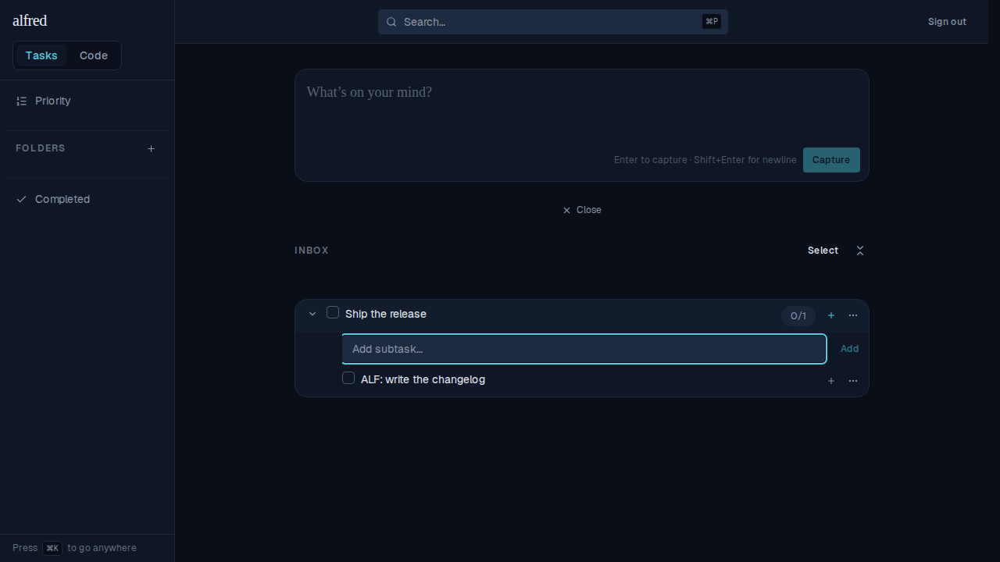

# ALF-62 — Project parsing in the Inbox capture box

*2026-07-07T04:25:00.161Z*

Prefixing an Inbox capture with a recognized `<project name|key>:` (case-insensitive) classifies it as **Code**, assigns that project, strips the prefix, and capitalizes the first letter of the remainder. Anything else is captured verbatim as an `unclassified` item, exactly as before. This walks the full journey: the parsing matrix, the gate pre-population (single + bulk), and the opt-in boundary.

### 1 · The parsing matrix — one Inbox, six captures

Typed top-to-bottom, newest lands on top:

- `ALF: add dark mode` → **Code**, project **ALF**, title "Add dark mode" (key match).
- `alfred: refactor THE auth flow` → **Code**, **ALF**, "Refactor THE auth flow" (name match, case-insensitive; only the first letter is capitalized, the rest is left as typed).
- `RLY: fix the login page` → **Code**, project **RLY** (a second project, its own chip colour).
- `ALF: rename the : separator` → **Code**, **ALF**, "Rename the : separator" (only the first colon splits; later colons stay in the title).
- `Note: buy milk` → **unclassified**, captured verbatim (unrecognized prefix — no classification, no stripping).
- `pick up groceries` → **unclassified**, verbatim (no colon).

### 2 · Gate pre-population — single item

Opening _Send to Code module…_ on a code inbox row pre-selects its assigned project (**Alfred**). The selection stays user-changeable; the epic still has to be picked.

### 3 · Gate pre-population — bulk, unanimous project (locked)

Selecting two code items that both carry **Alfred** and sending them together pre-selects **and locks** the project: it renders as a read-only chip (no interactive listbox), so the user only picks the epic.

### 4 · Gate pre-population — bulk, mixed projects (interactive)

When the selection's projects differ (one **Alfred**, one **Relay**), the gate falls back to today's interactive picker with nothing pre-selected — no lock.

### 5 · Parsing is Inbox-only

The prefix grammar is opt-in to the main Inbox capture box. The inline **subtask** capture box (and the Siri `POST /api/items` path) never parse: typing `ALF: write the changelog` as a subtask captures it verbatim as a plain task — prefix intact, no Code badge, no project chip.

