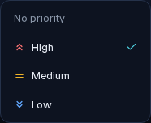

# ALF-67 — task detail menu & auto-saving inline detail

*2026-06-29T20:09:07.840Z*

The finalized "2a" task row & detail redesign, captured against the live app via the Playwright mock harness. The seeded task carries a due date, **High** priority, notes, and two subtasks (one done); the recurrence is set through the UI mid-demo.

### 1 · The scannable row (all badges populated)
Right cluster reads **Due → Repeat → Priority → Subtask count → ⋯**: a blue `Jul 2` due pill, a teal `Every 3 months` repeat pill, a **symbol-only** red priority chevron, and a `1/2` completed/total subtask count. A one-line notes preview sits under the title. There is **no "Task" pill** (only "Code" still earns one). Below the row is its open detail panel.

### 2 · The ⋯ menu
**"Open details" leads, highlighted teal** — it's how the detail is reached now. The per-field `Set due date / Set priority / Add notes` entries are gone; `Convert to Code Story… · Move to… · Delete` remain.

### 3 · The inline detail (decluttered, auto-saving)
One horizontal **chip row** — Due · Repeat · Priority, each carrying its current value (`Jul 2`, `Every 3 months`, `High`) — over a focused **Notes** area. There is **no Save / Cancel / Close**: every pick and every notes edit persists immediately. (The `Every 3 months` value here was set live via the Repeat picker below — it appeared on the chip and the row the instant it was chosen.)

### 4 · Due chip → month-grid calendar
A 7-column Sunday-first grid with S/M/T/W/T/F/S headers, prev/next month nav, **today (29) tinted blue** and the **selected day (2) filled blue**, out-of-month days dimmed, and a **Clear / Today** footer. Picking a day (or Today) auto-saves and closes; Clear removes the date.

### 5 · Repeat chip → preset list
Never, Daily, Weekdays, Weekends, Weekly, Biweekly, Monthly, Every 3 Months, Every 6 Months, Yearly, Custom… — the active cadence gets a **trailing teal ✓** (here on `Every 3 Months`). `Custom…` opens the full recurrence editor.

### 6 · Priority chip → level list
No priority + the three colour-coded levels, the active one (`High`) carrying the **trailing teal ✓**. Picking a level tints the chip and drops the symbol-only badge onto the row — immediately, no save step.

